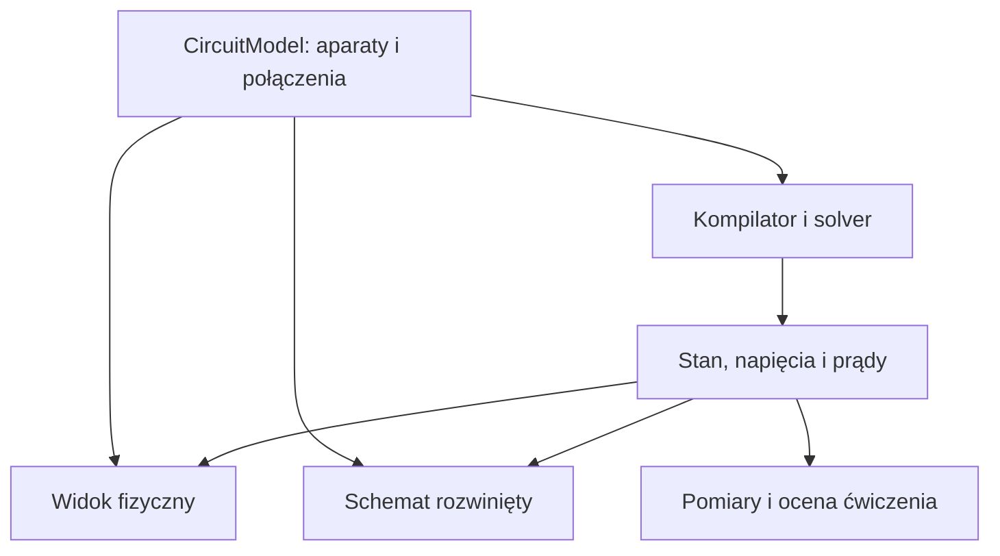

# Symulator instalacji elektrycznych — prompt wdrożeniowy dla Codexa

Data przygotowania: 2026-10-02. Język aplikacji: polski. Projekt roboczy: **Pracownia Elektryczna**.

## Jak użyć tego materiału

Uruchom Codexa w docelowym repozytorium. Przekaż mu ten plik oraz `catalog-research-seed.json` i `SOURCES.md` z pakietu. Polecenie startowe:

> Przeczytaj cały PROMPT_CODEX_Symulator_Elektryczny.md oraz dołączone pliki katalogu i źródeł. Zaimplementuj aplikację zgodnie z tym kontraktem. Zacznij od sprawdzenia repozytorium i działającego przekroju: realistyczny aparat, rzeczywiste zaciski, przewód, rozwiązanie obwodu i pomiar. Następnie kontynuuj przez kolejne etapy do kryteriów odbioru v1. Zachowuj postęp w dokumentacji projektu i sprawdzaj działanie w przeglądarce.

Ten materiał określa projekt i zleca implementację. Katalog badawczy jest punktem wejścia do walidacji, a nie gotową biblioteką zweryfikowanych cyfrowych modeli. Nie wszystkie wymiary, położenia zacisków, charakterystyki i ograniczenia montażowe zostały tu odtworzone. Codex ma uzupełnić je ze źródeł przed udostępnieniem danego produktu w edytorze. Realistyczny symulator szkoleniowy nie jest narzędziem do zatwierdzania bezpieczeństwa rzeczywistej instalacji.

---

## 1. Twoje zadanie i sposób pracy

Jesteś odpowiedzialny za implementację profesjonalnej aplikacji do budowania, uruchamiania i diagnozowania instalacji elektrycznych. Użytkownik jest doświadczonym programistą JS/React i uczy się elektrotechniki na poziomie ELE.02/ELE.05. Aplikacja ma umożliwić praktyczną naukę przez eksperymentowanie z rzeczywistymi aparatami.

Wykonuj pracę, uruchamiaj aplikację i usuwaj znalezione problemy. Nie kończ na planie, rusztowaniu projektu, statycznym mockupie ani listach TODO. Nie deklaruj ukończenia funkcji, jeśli nie działa w interfejsie i nie ma poprawnego zachowania domenowego.

1. Sprawdź `AGENTS.md`, strukturę repozytorium, menedżera pakietów, istniejące zależności i stan zmian. Zachowaj niezwiązane zmiany użytkownika.
2. Dla nowego repozytorium przyjmij stack i strukturę z punktu 3. W istniejącym projekcie dostosuj je bez niepotrzebnej migracji.
3. Przygotuj krótki plan, dokument architektury i listę kryteriów odbioru, po czym rozpocznij implementację.
4. Aktualizuj `docs/IMPLEMENTATION_STATUS.md`: działające funkcje, wykonane sprawdzenia, ograniczenia, brakujące dowody katalogowe, następny krok.
5. Podejmuj rutynowe decyzje samodzielnie. Nie pytaj o kolor przycisku, nazwy folderów czy biblioteki do zwykłych kontrolek.
6. Nie kupuj licencji, nie zakładaj płatnych kont, nie publikuj aplikacji i nie używaj prawdziwych urządzeń bez osobnej autoryzacji. Lokalna implementacja i weryfikacja są zlecone.
7. Jeśli źródło jest niedostępne, zapisz konkretną lukę i kontynuuj niezależne prace. Nie dopisuj wyobrażonej numeracji zacisków ani udawanego źródła.
8. Przy limicie kontekstu pozostaw działający etap i dokładny handoff w `docs/NEXT_TASK.md`. W kolejnym kontekście kontynuuj ten sam projekt, bez przebudowy od początku.
9. Na końcu podaj instrukcję uruchomienia, rzeczywisty stan v1 i wyniki sprawdzeń. Otwarcie nazwij niewykonane wymagania.

## 2. Cel produktu i zakres

Użytkownik ma przejść pełną ścieżkę: dobrać aparat → zamontować → podłączyć właściwe zaciski → sprawdzić → zasilić → obsługiwać → zmierzyć → znaleźć usterkę → naprawić → potwierdzić poprawność.

### Wymagania nadrzędne

- Bardzo czytelny widok tablicy montażowej 2D/2.5D, przypominający pracownię z szynami DIN i osprzętem, z subtelną głębią.
- Szybkie i intuicyjne dodawanie aparatów, prowadzenie przewodów, oznaczanie i organizacja instalacji.
- Rzeczywiste modele aparatów dostępne na polskim rynku, z numerami katalogowymi i danymi producentów.
- Przewody podłączane do rzeczywistych zacisków: np. cewka A1/A2 i oddzielne styki, a nie ogólne porty „input/output”.
- Działający silnik elektryczny i czasowy, niezależny od Reacta i biblioteki diagramów.
- Pomiary oraz fault injection wpływające na obwód i wyniki.
- Widok fizyczny i schemat z tego samego modelu instalacji.
- Zestaw praktycznych ćwiczeń dotyczących części zakresu ELE.02/ELE.05.
- Dane i interfejsy przygotowane do rozbudowy o tryb egzaminacyjny i AI tutora.

### v1 — obowiązkowy zakres funkcjonalny

Zaimplementuj lokalną aplikację przeglądarkową z:

1. Projektem, autosave, importem/eksportem i odzyskiwaniem po odświeżeniu.
2. Widokiem fizycznym, schematem rozwiniętym i opcjonalnym widokiem dzielonym.
3. Katalogiem 31 produktów z załącznika, publikowanych po przejściu kontroli danych i zachowania. Elementy dydaktyczne są osobną kategorią.
4. Obwodami jednofazowymi AC, DC i uproszczonymi obwodami trójfazowymi w zakresie opisanym w punkcie 9.
5. Aparatami łączeniowymi, MCB, RCCB/RCBO, stycznikami, przekaźnikiem, przekaźnikiem bistabilnym, czasowym i automatem schodowym.
6. Narzędziami pomiarowymi: napięcie, ciągłość/rezystancja, prąd przez wirtualne cęgi, rezystancja izolacji, pętla zwarcia i podstawowy test RCD.
7. Rejestrem zdarzeń, pomiarów i usterek.
8. Co najmniej 12 scenariuszami z punktu 13, w tym ćwiczeniami diagnozy.
9. Deterministycznymi wskazówkami dydaktycznymi oraz kontraktem przyszłego tutora. Działający LLM nie jest warunkiem v1.
10. Weryfikacją działania w przeglądarce, sensownymi testami silnika i zrzutami referencyjnych ekranów.

Nie zwiększaj sztucznie katalogu przez skopiowanie jednej ikony pod kilkadziesiąt nazw. Jeśli konkretnego produktu nie udało się zweryfikować, oznacz go jako oczekujący i podaj przyczynę; nie licz go jako ukończonego. Brak krytycznej pozycji oznacza niepełny odbiór katalogu v1, ale nie blokuje wdrażania pozostałych funkcji.

### Po v1

Rozbudowa: większy katalog ABB/Eaton/Legrand/Schneider/Hager/F&F/Relpol/Finder/WAGO, TT i diagnostyka historycznego TN-C, dodatkowe pomiary, szczegółowe modele silników i rozruchu, PLC, pełne sesje egzaminacyjne, import BIM/CAD, inwentaryzacja realnej tablicy, AI tutor i ewentualne dane z rzeczywistej instalacji. Nie dodawaj pustych ekranów tych funkcji do pierwszej wersji.

Na tym etapie budujemy **wirtualną instalację szkoleniową**. O cyfrowym bliźniaku konkretnego fizycznego obiektu można mówić po połączeniu modelu z jego rzeczywistą inwentaryzacją i stanem. Zaprojektuj możliwość tej rozbudowy, ale nie udawaj pomiarów z realnego sprzętu.

## 3. Stack i architektura

### Stack bazowy

- React + TypeScript w trybie strict + Vite; wybierz aktualne stabilne wersje zgodne z resztą stacku i zapisz lockfile.
- pnpm workspace, jeśli repozytorium nie narzuca innego menedżera.
- `@joint/react` + `@joint/core` jako domyślny silnik interakcji i diagramów; sprawdź aktualne API i peer dependencies.
- Własne parametryczne renderery SVG/React aparatów i symboli.
- Jeden store aplikacyjny, np. Zustand, oddzielony od czystych pakietów domeny; selektory ograniczające renderowanie.
- Zod do walidacji danych, importów i migracji; jawne typy jednostek SI.
- IndexedDB, np. Dexie, do lokalnej persystencji; localStorage tylko dla niewielkich preferencji.
- Web Worker dla solvera i cięższej walidacji.
- Vitest dla silnika i katalogu, React Testing Library dla istotnych zachowań UI, Playwright dla ścieżek użytkownika i zrzutów.
- Dostępne kontrolki Headless/Radix i Tailwind albo uporządkowany CSS, zależnie od repozytorium.
- ELK może pomagać w pierwszym układzie schematu; elektryczną czytelność zapewniają własne reguły układu i możliwość ręcznej korekty.

### JointJS — reguła licencji i integracji

Na dzień przygotowania materiału JointJS dla Reacta ma wersję otwartą; JointJS+ jest rozszerzeniem komercyjnym. Nie importuj API z dokumentacji Plus tak, jakby było dostępne w pakiecie darmowym. Nie zakładaj dostępności gotowych stencil, inspector, command manager, minimap, clipboard i innych dodatków Plus. Zaimplementuj wymagane funkcje aplikacyjne samodzielnie albo użyj posiadanej licencji, jeśli repozytorium już ją legalnie wykorzystuje. Zachowaj wymagane informacje licencyjne zależności.

Zrób krótki techniczny spike na prawdziwym aparacie: SVG, dokładny port, link, zoom, obsługa kliknięcia dźwigni, 100 instancji. Korzystaj z bieżącej dokumentacji `@joint/react`, nie z pamięci przykładowych nazw komponentów. Jeśli ujawnisz konkretną przeszkodę, dopuszczalny jest adapter do `@joint/core` z prawidłowym cleanup. Zmianę biblioteki uzasadnij w ADR i zachowaj niezależność domeny. Nie zamieniaj produktu w generyczny edytor kart.

### Podział pakietów

| Pakiet | Odpowiedzialność |
|---|---|
| `apps/web` | Shell, ekrany, tryby pracy, integracja worker/store/persystencja |
| `packages/circuit-model` | Typy, schematy, komendy, migracje, identyfikatory |
| `packages/device-catalog` | Dane produktów, topologie, źródła, walidacja i gotowość |
| `packages/simulation` | Kompilacja obwodu, solver, zegar, zachowania aparatów, usterki |
| `packages/measurements` | Modele przyrządów, sesje pomiarowe i interpretacja |
| `packages/renderers` | SVG aparatów, symboli, przewodów i warstw wizualnych |
| `packages/editor` | Adapter diagramu, gesty, routing, hit testing, komendy edytora |
| `packages/training` | Scenariusze, reguły oceny, wskazówki i progres |
| `packages/tutor-contracts` | Schemat narzędzi i odpowiedzi przyszłego tutora |

To podział logiczny. W małym repozytorium można zacząć od czytelnych modułów zamiast dziewięciu osobnych buildów, zachowując te granice. Nie wprowadzaj serwisów sieciowych do zwykłego lokalnego ćwiczenia. Backend będzie potrzebny dopiero przy kontach, synchronizacji lub kluczach usług AI.

### Jedno źródło prawdy

`CircuitModel` zawiera fakty o instalacji. `PhysicalLayout` i `SchematicLayout` zawierają położenia reprezentacji. `RuntimeState` zawiera chwilowe wyniki i stan symulacji. `TrainingSession` zawiera postęp ćwiczenia. Stan grafu JointJS jest projekcją/adaptacją, nie kanoniczną bazą obwodu.



Renderery nie mogą rozstrzygać, czy odbiornik działa. Odczytują wynik silnika. Solver nie może importować Reacta, JointJS, DOM ani store'a UI.

## 4. Kanoniczny model instalacji

Zaprojektuj i zwaliduj co najmniej poniższe struktury. Przykład określa granice, a nie wymusza dokładnej składni implementacji.

```ts
type TerminalRef = { deviceId: string; terminalId: string };

interface DeviceInstance {
  id: string;
  productId: string;
  productRevision: string;
  designation: string;                 // K1, QF1, S1, X1...
  settings: Record<string, unknown>;    // zgodne ze schematem konkretnego modelu
  assemblyId?: string;                  // np. przekaźnik w gnieździe
}

interface Conductor {
  id: string;
  from: TerminalRef;
  to: TerminalRef;
  cableId?: string;
  coreId?: string;
  marking?: string;
  declaredRole: 'L1'|'L2'|'L3'|'N'|'PE'|'PEN'|'CONTROL'|'DC_PLUS'|'DC_MINUS'|'UNSPECIFIED';
  insulationColor: string;
  material: 'Cu'|'Al';
  crossSectionMm2: number;
  electricalLengthM: number;             // nie długość na ekranie
  termination?: { from: string; to: string };
}

interface CircuitModel {
  schemaVersion: number;
  projectId: string;
  revision: number;
  catalogSnapshotId: string;
  devices: DeviceInstance[];
  conductors: Conductor[];
  bridges: BridgeInstance[];
  cables: CableInstance[];
  mechanicalCouplings: MechanicalCoupling[];
  supplySystems: SupplySystem[];
  installationConditions: InstallationConditions;
}

interface ProjectDocument {
  circuit: CircuitModel;
  physical: PhysicalLayout;
  schematic: SchematicLayout;
  scenarioId?: string;
  userMetadata: Record<string, unknown>;
}
```

### Niezmienniki

1. Identyfikator zacisku jest stabilny i nie zależy od jego położenia na SVG.
2. Numeracja na SVG, symbole, mapa wewnętrzna aparatu i importer odnoszą się do tych samych zacisków.
3. Przewód ma dwa końce elektryczne. Rozgałęzienie wymaga rzeczywistej złączki, listwy, dopuszczonego wspólnego zacisku albo jawnej konstrukcji połączenia.
4. Skrzyżowanie linii na ekranie nie tworzy połączenia.
5. Wspólny potencjał oblicza się z przewodów, mostków i połączeń wewnętrznych; nie z koloru izolacji.
6. Zacisk może mieć kilka fizycznych otworów należących do jednego połączenia. Rozdziel `terminalId`, `connectionPointId` i `testPointId`, gdy produkt tego wymaga.
7. Dopuszczalna liczba przewodów, przekroje, drut/linka i tulejki są cechami zacisku, nie arbitralnym limitem „1 kabel na port”.
8. Montaż aparatu na szynie nie uziemia go automatycznie. Złączka PE łącząca się elektrycznie z szyną musi mieć ten fakt w modelu.
9. Stan cewki, stan mechanizmu, stan styków i wskazanie na obudowie mogą się różnić przy usterce.
10. K1 może mieć jedną reprezentację fizyczną i kilka symboli schematu: cewkę, styki główne oraz pomocnicze. Wszystkie należą do tej samej instancji.
11. Położenie i trasa graficzna przewodu nie zmieniają jego długości elektrycznej bez osobnej akcji użytkownika.
12. Kolor nie ogranicza możliwości połączenia. Niewłaściwy kolor ma wywołać regułę diagnostyczną, nie „magicznie” zmienić potencjał.
13. Kopiowanie tworzy nowe ID i oznaczenia, nie współdzielony runtime oryginalnego aparatu.
14. Aktualizacja katalogu nie zmienia zachowania starego projektu bez migracji. Projekt zachowuje wersję definicji lub minimalny snapshot użytych produktów.

### Komendy i historia

Wszelkie modyfikacje instalacji przechodzą przez komendy: dodanie/usunięcie aparatu, podłączenie końcówki, rozłączenie, zmiana ustawień, mostek, kabel, przeniesienie, grupowanie. Jedna czynność użytkownika to jedna transakcja undo/redo. Drag nie dodaje setek wpisów historii. Zmiana widoku, selekcji lub wskazania miernika nie zmienia topologii.

Oddziel historię edycji od zdarzeń runtime. Undo nie może przypadkiem cofnąć tylko grafiki przy zachowaniu przewodu w solverze. Polecenie zmiany topologii podczas symulacji zatrzymuje sesję i unieważnia pomiary zależne od wcześniejszej rewizji.

## 5. Katalog aparatów — profesjonalny model danych

### Cztery oddzielne warstwy

1. **BehaviorDefinition**: logika MCB, stycznika, przełącznika, bistabilnego przekaźnika itd.
2. **TopologyDefinition**: rzeczywiste zaciski, ich role i wewnętrzne połączenia danego wykonania.
3. **ProductVariant**: producent, seria, dokładny SKU, nominalne parametry, wymiary, ograniczenia, akcesoria.
4. **VisualDefinition**: rodzina obudowy, położenia punktów, napisy, kontrolki, dźwignie i renderer.

Ta sama logika stycznika może obsłużyć kilka produktów, lecz nie wolno przez to utożsamiać ich cewek, kategorii użytkowania, styków pomocniczych i zacisków.

### Minimalne pola produktu gotowego do użycia

- `id`, `revision`, `manufacturer`, `family`, `manufacturerPartNumber`, `displayNamePl`, `category`, opcjonalny GTIN.
- Status katalogowy: aktualny/wycofany/historyczny/niezweryfikowany; rynek źródła i data weryfikacji.
- `behaviorId`, `topologyId`, `visualId`, `symbolGroupId` i zgodne wersje tych definicji.
- Wymiary obudowy w mm oraz osobno szerokość montażowa/liczba modułów, jeśli występuje.
- Parametry istotne dla zachowania, z jednostkami: AC/DC, Ue/Uc, In, IΔn, typ RCD, charakterystyka MCB, konfiguracja styków, moce i kategorie użycia.
- Lista rzeczywistych zacisków: drukowana etykieta, funkcja, grupa, typ połączenia, dozwolone przewody, ograniczenia, stan domyślny.
- Wewnętrzne połączenia: przewodzące, stykowe, cewka, elektronika, test RCD, połączenie PE z podstawą.
- Geometria zacisków i punktów testowych z określeniem widoku i źródła orientacji.
- Obsługiwane funkcje, pomiary i usterki, ograniczenia modelu symulacyjnego.
- Powiązania mechaniczne, kompatybilne gniazda, styki dodatkowe i adaptery, jeżeli używane.
- Źródła oraz prawa do użytych materiałów. `unknown` nie może oznaczać zera.

### Provenance na poziomie pola

```ts
interface Evidence {
  sourceId: string;
  locator?: string;                 // strona PDF, tabela, rysunek, sekcja
  retrievedAt: string;
  documentRevision?: string;
  verification: 'manufacturer'|'manual-diagram'|'derived'|'assumed'|'unknown';
  derivation?: string;
}

interface QualifiedValue<T> {
  value: T | null;
  evidence: Evidence[];
  confidence: 'high'|'medium'|'low'|'unknown';
}
```

Przykład: rezystancja zastępcza grzałki wyliczona z U²/P jest wartością `derived`. Czas mechanicznego przełączenia przyjęty dla celów ćwiczenia, którego nie podaje dokumentacja, jest `assumed` i należy do profilu symulacji, nie do danych producenta.

### Źródła i ich użycie

Hierarchia: instrukcja i karta producenta → rysunek techniczny producenta → dokumentacja katalogowa producenta → autoryzowany feed dystrybutora jako uzupełnienie → sklep jako wskazówka do wyszukania źródła. W przypadku sprzeczności sprawdź numer wariantu, datę i rynek. Nie wybieraj po prostu wygodniejszej wartości.

ETIM pomaga normalizować kategorie i parametry. **ETIM nie jest gotową bazą zachowania elektrycznego, numeracji zacisków ani grafiki produktów.** Wymiana BMEcat/ETIM xChange albo feed PIM może uzupełniać warianty, ale topologia i renderer nadal wymagają dokumentacji. Nie wymyślaj numerów klas ETIM. W v1 pole ETIM może pozostać puste.

Nie uzależniaj edytora od API sklepu. Dane katalogowe i oryginalne renderery są dostępne lokalnie; sieć służy aktualizacji danych podczas przygotowania katalogu. Nie wymagaj kont TIM/Onninen ani nie zakładaj istnienia publicznego API o nieweryfikowanych funkcjach.

### Import i utrzymanie katalogu

Zaimplementuj pipeline: źródło → surowy wpis → normalizacja jednostek → ręczne mapowanie topologii/visual → walidacja → testy zachowania → publikacja wersji.

- `pnpm catalog:validate` sprawdza referencje, jednostki, SKU, pokrycie zacisków i źródła wymaganych pól.
- `pnpm catalog:report` tworzy raport jakości i braków; raport nie powinien ukrywać pustych pól.
- Nowy produkt da się dodać przez dane i parametry rendererów, bez dopisywania switcha SKU w solverze.
- Zmiana PDF lub danych nie promuje automatycznie produktu do verified; potrzebny jest przegląd istotnych różnic.
- Import JSON jest wymagany w v1; CSV z jednoznacznym schematem jest przydatny do wariantów. Pełne BMEcat/API można odłożyć.
- Nie publikuj przetwarzanych plików producenta w repo, jeśli nie ustalono prawa do redystrybucji. Wystarczą link, wersja, wskazanie strony i własne ustrukturyzowane fakty.

### Bramki gotowości

| Stan | Co oznacza |
|---|---|
| `research-seed` | Ustalono tożsamość i część danych, produkt jeszcze poza edytorem |
| `topology-verified` | Zaciski i połączenia wewnętrzne sprawdzone na instrukcji/rysunku |
| `visual-verified` | Proporcje i porty zgodne z dokumentacją; renderer sprawdzony |
| `simulation-tested` | Obsługiwane zachowanie i ograniczenia mają testy |
| `published` | Wszystkie wymagane bramki spełnione, dostępny do ćwiczeń |

Pełny cyfrowy model nie wymaga wszystkich marketingowych parametrów produktu. Wymaga kompletności danych potrzebnych do jego deklarowanych funkcji. Nieznana masa nie blokuje obwodu. Nieznane wyjście przekaźnika blokuje jego publikację.

## 6. Katalog startowy: konkretne produkty

Wykorzystaj **31 wpisów** z `catalog-research-seed.json`. Źródła w załączniku są materiałem wejściowym, nie zwalniają z sprawdzenia orientacji zacisków i zachowania przy implementacji. Nie zastępuj SKU podobnym numerem bez wyraźnego wpisu migracji.

| Grupa | Produkty | Funkcja szkoleniowa |
|---|---|---|
| Hager MCB | MBN110E, MBN116E, MCN316E | B10, B16, trójfazowy C16 |
| Hager ochrona różnicowa | CDA240J, CDC440J, ADA916D | RCCB typu A 40 A/30 mA, 4P typu AC, RCBO B16/30 mA typu A |
| Hager łączenie | SBN240, ESC225 | Rozłącznik 2P 40 A; stycznik 2NO z cewką 230 V AC |
| Schneider zabezpieczenie | A9F03116 | Acti9 iC60N B16 1P; porównanie rodziny obudów |
| Schneider sterowanie mocy | LC1D09P7, LC1D09BD, LRD12 | Cewka 230 V AC / 24 V DC; 3 główne NO + 1NO/1NC; termik 5,5–8 A |
| Schneider Harmony | XB5AA31, XB5AA42, XB5AVM3 | Zielony chwilowy NO, czerwony chwilowy NC, lampka zielona 230–240 V AC |
| F&F | BIS-411 230 V, AS-212, PCU-510 DUO | Sterowanie impulsowe, schodowe, czasowe |
| WAGO złączki instalacyjne | 221-412, 221-413, 221-415 | Dwa/trzy/pięć miejsc na przewód w jednej złączce |
| WAGO złączki szynowe | 2002-1201, 2002-1207 | Przelotowa 2,5 mm²; ochronna PE |
| Kontakt-Simon 10 | CW1C.01/11, CW6C.01/11, CW7.01/X/11, CS1C.01/11, CGZ1C.01/11 | Jednobiegunowy, schodowy, krzyżowy, przycisk światło, gniazdo z bolcem |
| Finder | 40.52.9.024.0000, 95.05 | Przekaźnik 24 V DC z dwoma zestykami przełącznymi i jego gniazdo |
| Mean Well | HDR-60-24 | Zasilacz DIN, wejście AC, izolowane wyjście 24 V DC/2,5 A |

### Szczegóły, których nie wolno zgubić

- Nie utożsamiaj Hager MBN116E z MBN116, CDA240J z CDA240D ani różnych wersji BIS-411. Sufiks może oznaczać istotną różnicę.
- `In=40 A` dla RCCB nie oznacza zabezpieczenia nadprądowego wyzwalającego przy 40 A. RCCB potrzebuje odpowiednio zaprojektowanej ochrony nadprądowej; to osobna funkcja.
- ESC225 ma różne parametry zależnie od kategorii użycia. Nie traktuj wartości 25 A jako uniwersalnej dopuszczalnej wartości dla każdego silnika.
- LC1D09P7 i LC1D09BD nie mogą działać identycznie po podaniu dowolnego napięcia na cewkę.
- LRD12 nie otwiera automatycznie torów mocy tak jak stycznik. W typowym układzie stan przeciążenia przełącza styki pomocnicze, a przerwany tor sterowania powoduje odpadnięcie stycznika.
- Finder 40.52 sam nie ma zacisków śrubowych do przewodów. Modeluj zestaw przekaźnik + kompatybilne gniazdo, zachowując mapowanie pinów. Zestaw nie ma wyższej obciążalności od słabszego elementu.
- BIS-411 w podstawowej wersji nie zachowuje stanu po zaniku zasilania. Nie przenoś właściwości BIS-411M do BIS-411.
- AS-212 ma nieseparowane wyjście; nie przedstawiaj go jako dowolnego styku bezpotencjałowego.
- PCU-510 DUO ma własną numerację i funkcje czasowe. Jego tryb nazwany w instrukcji „opóźnione wyłączenie” zaczyna cykl po podaniu zasilania. Nie zastępuj go generycznym TOF sterowanym od zaniku sygnału.
- Gniazdo z bolcem ma punkty użytkowe i zaciski montażowe. Zachowaj ich połączenie, lecz nie zakładaj nieudokumentowanej numeracji L/N ani tego, że każda odwracalna wtyczka wymusza określoną orientację.
- WAGO 221-413 nie jest trzema odizolowanymi kanałami L/N/PE. To złączka do wspólnego połączenia przewodów. Nie rysuj obwodu, w którym trzy różne potencjały mają wejść do jednej 221-413.
- Nie kopiuj niezweryfikowanej informacji „liczba potencjałów” z feedu CAD, jeśli przeczy schematowi funkcjonalnemu produktu.
- HDR-60-24 ma izolowane wyjście. Nie zwieraj jego minusa z N/PE w ukrytej logice silnika.

### Sprawdzone mapy funkcjonalne F&F

Mapy dotyczą instrukcji podlinkowanych w załączniku. Rozmieszczenie fizycznych otworów ustal osobno ze zdjęcia/rysunku odpowiedniego wykonania.

| Aparat | Mapowanie funkcjonalne zacisków | Istotna cecha |
|---|---|---|
| BIS-411 230 V | 1: L; 3: N; 6: wejście impulsu; 10: COM; 11: NC; 12: NO | Impuls może być podawany według wariantów wskazanych przez producenta. Zanik zasilania resetuje stan |
| AS-212 | 1: N; 3: L; 6: wejście sterujące; 5: wyjście na odbiornik | Wyjście załączane z toru L; nie jest izolowanym COM/NO |
| PCU-510 DUO | AC: 1=N, 3=L; DC: 5=+, 6=−; zestyk 1: 8=COM, 7=NC, 9=NO; zestyk 2: 11=COM, 10=NC, 12=NO | Rozróżnij sposób zasilenia i dwa niezależne zestyki przełączne |

To nie są instrukcje montażu realnej instalacji. To dane do zweryfikowania i zastosowania w modelu szkoleniowym. Nie podawaj równocześnie dwóch alternatywnych zasilań PCU jako poprawnego ćwiczenia bez dowodu, że producent to dopuszcza.

### Elementy dydaktyczne

Dodaj osobno: źródło sieciowe, źródło DC, tablicę/szyny/korytka, listwy N/PE, puszki, grzałkę rezystancyjną, lampę o zadanej mocy, obciążenie trójfazowe, uproszczony silnik trójfazowy, model testowy NC/NO i punkt pomiarowy. Oznacz je jako „element dydaktyczny”, bez fikcyjnego logo/SKU i bez przypisywania im charakterystyk konkretnego producenta.

Przewody: oddzielne żyły i kable 3/5-żyłowe. Zdefiniuj przekroje i izolację; do obliczeń używaj jawnych parametrów materiału/temperatury. Obciążalność prądowa wymaga również sposobu ułożenia i warunków. Nie stwierdzaj, że każdy przewód 1,5 mm² „zawsze nadaje się pod B16”.

## 7. Warstwa wizualna

### Kierunek

Widok z przodu, tablica pracowni i rozdzielnica, detal urządzeń, oszczędna głębia, dobra typografia. Aparaty mają proporcje obudów, śruby/zaciski, dźwignie, pokrętła, napisy i diody zgodne z ich funkcją. UI ma spokojne kolory; barwa izolacji przewodów i stan instalacji mają najwyższą czytelność.

Nie używaj pełnego 3D w v1. Nie generuj ilustracji aparatów przez AI jako substytutu geometrii technicznej. Nie używaj zdjęcia jako jedynego interaktywnego aparatu — zdjęcia pomagają identyfikować produkt, ale zaciski i stany mają być edytowalne i wektorowe.

### Układ aplikacji

- Górny pasek: nazwa projektu, stan zapisu, przełącznik Tablica/Schemat/Dzielony, tryb pracy, zasilanie, pauza/krok/reset, undo/redo.
- Lewy panel około 260–300 px: wyszukiwanie i katalog z rzeczywistymi miniaturami SVG; kategorie i filtry; ulubione/ostatnio użyte.
- Środek: maksymalnie duża przestrzeń robocza, płynny zoom i przesuwanie, szyny i osprzęt.
- Prawy panel około 300–340 px: właściwości zaznaczonego obiektu, Zaciski/Dane/Źródła; w pomiarach panel przyrządu.
- Dolny panel zwijany: zdarzenia, pomiary, problemy i wykonanie ćwiczenia.
- Wszystkie panele da się schować. Przy 1366×768 środek pozostaje użyteczny. Przy mniejszym ekranie katalog i właściwości działają jako wysuwane panele.
- Ekran startowy daje trzy jasne wejścia: Nowa instalacja, Przykłady, Ćwiczenia. Nie zasłaniaj tablicy dashboardem statystyk.

### Parametryczne rodziny SVG

Wymagane rodziny: Hager MCB; Hager RCCB/RCBO/rozłącznik; Hager stycznik modułowy; Schneider Acti9; TeSys stycznik/termik; Harmony przyciski/lampka; F&F moduł z diodą/przyciskami; F&F moduł z pokrętłami; WAGO 221; WAGO szynowa; Kontakt-Simon osprzęt; Finder zestaw przekaźnik+gniazdo; Mean Well zasilacz; elementy dydaktyczne.

Współdziel bazowe prymitywy obudowy, śruby, clamp, dźwigni, nadruku i LED. Odmienna topologia lub inny układ otworów wymaga odmiennej konfiguracji. Nie rozciągaj jednego obrazka MCB na RCD/stycznik.

### Geometria i skala

- Wymiary modelowe w mm. Transformacja mm→jednostki sceny jest jawna.
- Wykorzystuj rzeczywistą szerokość korpusu i osobno szerokość miejsca montażowego. Produkty o szerokościach 17,5/17,85/18 mm nie stają się tą samą fizyczną bryłą przez zaokrąglenie.
- Szyna TH35: renderowana jako mechaniczny element montażowy. Snap do slotów ma respektować szerokość aparatu i zajęte miejsca.
- Standardowy moduł siatki może wynosić 18 mm, ale dane konkretnego korpusu nie są nadpisywane tą wartością.
- Port rysowany w miejscu rzeczywistego wejścia przewodu. Śruba, otwór na przewód i punkt testowy mogą być różnymi elementami.
- Dla osprzętu ściennego zapewnij widok połączeń/odsłoniętego mechanizmu z opisem orientacji, np. „widok zacisków od tyłu”. Nie umieszczaj tylnych zacisków jako rzekomo widocznych otworów z przodu klawisza.
- Powiększona nakładka dydaktyczna może odsłaniać zaciski, ale musi być nazwana jako nakładka; nie zmienia topologii.
- Własne napisy z nazwą producenta i SKU służą identyfikacji; nie dodawaj znaków certyfikacyjnych ani komunikatu o patronacie producenta.

### Interakcje i detal

- Dźwignia, pokrętło, przycisk i LED mają osobne regiony oraz zachowania.
- Kliknięcie dźwigni podczas testu przełącza aparat; przeciąganie korpusu w trybie budowy przesuwa go. Niech te gesty nie konkurują.
- Przycisk chwilowy pozostaje aktywny podczas naciśnięcia, także przy klawiaturze; puszczenie i utrata focusa kończą naciśnięcie.
- Stan OFF/ON/TRIPPED jest czytelny kształtem i opisem. Rzeczywisty aparat nie musi mieć mechanicznej pozycji pośredniej TRIPPED — jeśli brak takiej informacji, użyj odrębnej plakietki UI.
- Diody odpowiadają właściwemu stanowi aparatu. Nie świecą automatycznie dlatego, że „projekt ma włączone zasilanie”.
- Przy zweryfikowanym profilu aparat może mieć opóźnienie działania; animacja tylko ilustruje zdarzenie.
- Brak ostrych rozmyć, losowych cieni, intensywnych gradientów i ozdobników zasłaniających zaciski.

### Semantic zoom i dostępność

- Daleko: sylwetka, oznaczenie K1/QF1 i stan; drobny nadruk wygaszony.
- Normalnie: model, istotne parametry i numeracja zacisków.
- Blisko: detale zacisku, śruby, przewodu, ustawień i punktów pomiarowych.
- Hit area zacisku ma około 24 px w przestrzeni ekranu niezależnie od skali; nie zwiększaj fizycznego otworu na SVG. Gdy obszary się nakładają, wybór następuje po najbliższym środku lub w powiększonej lupie zacisków.
- Dźwignie/przyciski UI mają czytelne cele i focus. Zapewnij alternatywne połączenie z listy zacisków dla klawiatury.
- Tooltip „K1 / A1 — cewka, 230 V AC” pokazuje rzeczywistą rolę.
- Napięcie i usterka nie są oznaczane wyłącznie kolorem.
- Uwzględnij reduced motion i przyciski zoom/fit bez gestów wymagających myszy.

### Galeria QA

Utwórz developerską galerię produktów z trybami OFF/ON/FAULT/SELECTED oraz kontrolą zacisków. Dla każdej rodziny zachowaj referencyjny zrzut, listę źródeł geometrii i sprawdzenie na trzech poziomach zoomu. Galeria służy QA i nie musi występować w głównej nawigacji ucznia.

## 8. Edytor instalacji i przewodów

### Budowanie

- Drag & drop z katalogu i dodawanie przez kliknięcie + kliknięcie na scenie.
- Snap aparatów do szyny, zachowanie odstępów i wykrywanie kolizji; nie nakładaj dwóch urządzeń na ten sam slot.
- Podgląd miejsca przed umieszczeniem, szybkie powielenie, multi-select, grupowanie, wyrównanie i przenoszenie grup.
- Automatyczne unikalne oznaczenia; możliwość edycji i kontrola duplikatów.
- Katalog filtruje po funkcji, producentach, napięciu cewki, konfiguracji styków i parametrach ochrony.
- Dane/źródła w szczegółach produktu, nie w głównym przepływie dodawania.
- Przełącznik „pokaż zaciski” i lista zacisków; zaznaczenie listy podświetla właściwe miejsce na urządzeniu.

### Łączenie

- Podstawowy gest: kliknij zacisk → prowadź podgląd → kliknij drugi zacisk. Drag-to-connect może być dodatkowy.
- Esc anuluje; Backspace usuwa ostatni waypoint podczas prowadzenia.
- Koniec przewodu snapuje do poprawnego punktu, nie do korpusu. Podgląd jasno pokazuje wybrany zacisk.
- Powody blokady: nieistniejący zacisk, niemożliwa końcówka, brak fizycznego miejsca przy zweryfikowanych ograniczeniach; nie blokuj błędów elektrycznych potrzebnych do ćwiczenia.
- Pozwól zbudować niepoprawny obwód, np. wyłącznik w N, a następnie wykryj go w diagnostyce. Edytor nie może chronić ucznia przed wszystkimi błędami przez ukryte „smart wiring”.
- Połączenia automatyczne/mostki wymagają jawnej akcji i tworzą elementy domenowe. „Ułóż przewody” zmienia tylko trasę graficzną.
- Pokaż bieżące ustawienia koloru, przekroju i żyły podczas prowadzenia.
- Drugi przewód w zacisku jest dopuszczany tylko w zakresie udokumentowanej konfiguracji. Przy braku dowodu nie zgaduj możliwości montażu; zaproponuj złączkę.

### Prowadzenie i czytelność

- Widok fizyczny: łagodne łuki, sensowne wyjście z otworu, kilka segmentów, routing przez korytka, manualne waypointy.
- Schemat: linie ortogonalne, klarowne mostki/przecięcia i węzły tam, gdzie jest połączenie elektryczne.
- Kliknięcie przewodu podświetla oba końce, oznaczenie i ciągłość konkretnej żyły.
- Kolor izolacji zostaje zachowany przy opcjonalnej nakładce potencjałów; nakładka ma legendę i daje się wyłączyć.
- PE jest dwubarwny, N niebieski. Reguły oznaczeń są walidowane, lecz potencjał liczy solver.
- Skrzyżowania pokazuj małym mostkiem/odstępem, nie kropką połączenia.
- Zagnieżdżone przewody w korytku można pokazać uproszczonym wiązkowaniem, ale zaznaczenie ujawnia konkretną żyłę.
- Przesunięcie urządzenia aktualizuje końce tras; ręczne waypointy nie znikają bez uzasadnienia.
- Minimalizuj ponowne wyznaczanie tras; cache zależny od geometrii i przeszkód, nie od każdego odczytu miernika.

### Tryby

| Tryb | Zachowanie |
|---|---|
| Budowa | Edycja montażu, topologii, ustawień i przewodów; główne źródło wyłączone |
| Test | Włączenie źródeł, przełączanie aparatów, przyciski, zegar, prąd i reakcje |
| Pomiary | Sondy/cęgi, dobór funkcji; wymagane warunki pomiaru egzekwowane |
| Diagnoza | Usterki i poszukiwanie przyczyny; ujawnienie zależy od scenariusza |
| Ćwiczenie | Opis zadania, dostępne elementy, przebieg i kryteria oceny |

W projekcie mogą istnieć dodatkowe źródła. „Wyłącz główne zasilanie” nie oznacza automatycznie braku wszystkich napięć. Pomiar musi oceniać rzeczywisty stan wybranego obwodu.

## 9. Silnik symulacji

### Poziom wierności

v1 to model quasi-statyczny: obwody rezystancyjne i liniowe impedancje AC, stany aparatów oraz deterministyczne zdarzenia czasowe. Nie deklaruj pełnego SPICE, przebiegów łuku, udarów, harmonicznych, elektromagnetyzmu silnika czy rzeczywistej koordynacji zabezpieczeń, jeśli ich nie implementujesz.

Zachowania są użyteczne w zadanym zakresie. Profil każdego aparatu pokazuje, co jest modelowane, co przybliżone i czego nie można wiarygodnie zbadać. Prawdziwy numer SKU nie oznacza automatycznie dokładnej reprodukcji każdego fizycznego zjawiska.

### Dwie warstwy rozwiązania

1. **Kompilator topologii** buduje połączenia, elementy, gałęzie i wyspy. Mapy, źródła, mostki, styki i przewody przechodzą przez jedną ścieżkę.
2. **Solver obwodu** oblicza napięcia i prądy z impedancji oraz źródeł; wykorzystaj MNA albo równoważny algorytm z udokumentowanymi ograniczeniami. Same BFS i kolorowanie ścieżek nie wystarczą do pomiarów, zwarć i prądu.

Nie zwieraj numerycznie wszystkich przewodów do idealnych netów: mają rezystancję i trzeba znać ich prąd. Idealne mostki można łączyć union-find; przewody/gałęzie pomiarowe muszą zachować semantykę i możliwość wyznaczania przepływu. Nie modeluj rezystora jako połączenia idealnego — potrzebny jest spadek napięcia.

### Źródła i układy

- Domyślnie TN-S z jawnym modelem źródła, impedancją zasilania i połączeniem punktu neutralnego z układem ochronnym u źródła.
- TN-C-S może być presetyzacją z jawnym punktem rozdziału; nie rób automatycznego mostka N/PE przy każdym odbiorniku.
- DC: niezależny plus i minus; odizolowane źródło może pływać względem PE.
- AC: 50 Hz, wartości skuteczne; fazy jako liczby zespolone/fazory. Dla 3 faz zachowaj przesunięcia 120° i poprawne U międzyfazowe.
- Nominalne „230/400 V” jest zaokrągleniem. Przy źródle fazowym dokładnie 230 V wynik międzyfazowy to √3·230 ≈ 398,37 V. Nie wyznaczaj fazorami 230 V i jednocześnie wymuszaj dokładnie 400 V bez spójnego parametru źródła.
- Cewka 230 V AC nie może być traktowana jako poprawnie zasilona z 24 V DC; odczyt napięcia to różnica A1–A2.
- Różne źródła idealne połączone sprzecznie mają dać kontrolowany błąd, nie NaN lub nieograniczony prąd.

### Zegar i ustalanie stanów

- Symulacyjny zegar z pauzą, pojedynczym krokiem i prędkościami, np. 1×/5×/20×.
- Kolejka zdarzeń i seed: przy takim samym projekcie, sekwencji akcji i seedzie wynik jest powtarzalny.
- Solver → detektory cewki/ochrony → zdarzenia → przełączenie styków → nowe rozwiązanie.
- Ograniczony fixed-point oraz wykrywanie oscylacji. Niestabilność ma czytelny komunikat i ostatni poprawny snapshot.
- Nie używaj `setTimeout` rozproszonego po komponentach dla przekaźników. Parametry czasu należą do silnika.
- Dla jednoczesnych zdarzeń kolejność jest jawna i deterministyczna; nie zależy od kolejności renderowania urządzeń.
- Usterka sklejonego styku zmienia stan kontaktu, nawet gdy cewka jest wyłączona.

### Worker i wyniki

Worker otrzymuje identyfikator sesji, rewizję obwodu, sekwencję poleceń i seed. Odpowiedź z nieaktualnej rewizji jest odrzucana. Snapshot zawiera:

- Czas, rewizję, status rozwiązania i błędy.
- Napięcia względem właściwej referencji, prądy gałęzi, napięcia między zaciskami.
- Stan cewki, mechanizmu, kontaktów i ochrony.
- Zdarzenia z przyczyną i referencjami do obiektów.
- Informację o wyspach pływających, ograniczeniach i jakości wyniku.

Nie zapisuj nieskończoności/NaN do JSON. Dla pomiarów użyj wyników `valid`, `open-circuit`, `floating`, `invalid-setup`, `out-of-range`, `unsupported`, `solver-error` z jednostką i wyjaśnieniem.

### Realistyczne zachowania

| Aparat | Wymagane zachowanie |
|---|---|
| Łącznik | Zmienia połączenie właściwych zacisków, nie globalną flagę odbiornika |
| Schodowy | COM przełączany między dwoma torami; wszystkie kombinacje pary działają |
| Krzyżowy | Dwie pary przełączane prosto/na krzyż, bez zwarcia wspólnego wszystkich zacisków |
| Przycisk | Chwilowy NO/NC; po puszczeniu wraca |
| Stycznik | Prąd/napięcie cewki → mechanizm → grupy styków z histerezą i zadanym opóźnieniem |
| Przekaźnik | Separacja cewki i zestyków; COM–NC w spoczynku i COM–NO po zadziałaniu |
| Bistabilny | Zbocze poprawnego impulsu przełącza stan raz; trzymanie przycisku nie klika wielokrotnie |
| Czasowy | Własne tryby producenta, reset i zachowanie po zaniku zasilania |
| Automat schodowy | Własne wejście i załączane wyjście; odliczanie według instrukcji |
| Termik | Akumulacja stanu przeciążenia, reset, przełączenie NC/NO; wpływ na stycznik dopiero przez okablowanie |
| Zasilacz | AC po stronie wejścia, izolowane DC po stronie wyjścia; utrata wejścia usuwa wyjście po modelowym czasie |
| Lampka/grzałka | Stan i moc wyliczane z napięcia oraz modelu obciążenia |

Przy nieudokumentowanej histerezie/opóźnieniu przyjmij jawny profil dydaktyczny, a nie fałszywy parametr producenta. Dla zasilacza uwzględnij przepływ mocy, ograniczenia i sprzężenie AC/DC przynajmniej w przybliżeniu. Nie włączaj wyjścia DC samą obecnością przewodu L: musi wystąpić właściwe napięcie wejścia.

### Ochrona nadprądowa

- MCB ma stan ręczny, zatrzaśnięte wyzwolenie i reset.
- Rozdziel człon zwarciowy i termiczny. Przekroczenie In o małą wartość nie jest automatycznym natychmiastowym wyzwoleniem.
- Dla B/C wykorzystaj źródła producenta; przedział zadziałania magnetycznego nie jest jednym dokładnym progiem wszystkich egzemplarzy.
- Dane time-current przechowuj jako pasma/envelope, nie wymyślony wykres marki. Dla demonstracji deterministyczny punkt wewnątrz pasma może należeć do jawnego profilu.
- Przy braku krzywej konkretnego SKU stosuj oznaczenie „model dydaktyczny charakterystyki B/C”, z ograniczeniem interpretacji czasu.
- Prąd zwarciowy wynika z napięcia i impedancji pętli. Nie ustawiaj stałych 1000 A dla każdego zwarcia.
- Źródło ma skończoną impedancję. Jeśli wyliczony prąd przekracza udokumentowaną zdolność wyłączania, zgłoś przekroczenie zakresu modelu i problem doboru.
- Nie gwarantuj selektywności szeregowych MCB bez odpowiednich danych koordynacji.

### RCD/RCBO

- Prąd różnicowy jest sumą ze znakami/fazą prądów w torach przechodzących przez przekładnik; dla 3 faz nie sumą modułów.
- Przewód PE omija tor pomiarowy RCD; prąd odpływający poza chronione przewody wpływa na bilans.
- Zamodeluj tor N i jego przełączanie zgodnie z konkretnym aparatem.
- Podłączenie N z innej grupy może spowodować wyzwolenie pod obciążeniem; nie wyzwalaj tylko dlatego, że w grafie istnieje „obcy N”.
- L–N zwarcie samo w sobie nie oznacza niezrównoważenia RCD; obsługuje je ochrona nadprądowa.
- RCCB nie zawiera ochrony nadprądowej tylko dlatego, że na obudowie jest „40 A”. RCBO ją zawiera.
- Przycisk TEST modeluj jako wprowadzenie odpowiedniego niezbilansowanego toru zgodnego z topologią; bez właściwego zasilania nie jest magicznym wyzwalaczem.
- W v1 obsługa sinusoidalnego upływu AC. Typ A może być odwzorowany jako produkt, lecz testy półfalowe/podkład DC wymagają dodatkowego modelu; nie udawaj ich przy samych fazorach 50 Hz.
- Profil czasu/strumienia zadziałania jest oddzielony od danych nominalnych i oznaczony, jeśli przybliżony.

### Obciążenia i silnik

- Obciążenie rezystancyjne: R=U_n²/P_n, prąd i moc z faktycznego napięcia. Przy 230 V i 2300 W, w idealnym torze I=10 A i R=23 Ω.
- Lampa LED nie jest rezystorem odtwarzającym cały zasilacz LED. Jeżeli używasz modelu zastępczego, nazwij to w zakresie wierności; udar i harmoniczne poza v1.
- Silnik dydaktyczny: stan zasilenia faz, kierunek wynikający z sekwencji, prosty model prądu obciążenia i przeciążenia. Nie nazywaj go dokładnym modelem indukcyjnym.
- Zanik fazy w silniku daje stan nieprawidłowy i reakcję uproszczonego profilu. Nie obiecuj dokładnego momentu, poślizgu czy prądu rozruchowego bez modelu.
- W rewersie dwa styczniki i ich blokady wynikają z połączeń/mechaniki. Nie blokuj przeciwnego stycznika ukrytą regułą scenariusza, gdy brak blokady w obwodzie.

## 10. Pomiary

Pomiary uczą doboru funkcji, punktów i warunków. Wynik pochodzi z aktualnego obwodu i ustawień miernika, nigdy z wartości zapisanej w scenariuszu jako odpowiedź.

Interfejs podstawowy to własny, czytelny przyrząd szkoleniowy. Funkcje mogą odpowiadać pomiarom wykonywanym przez MPI-507, ale nie nazywaj go wierną repliką Sonela, jeśli nie odtworzono instrukcji, zakresów i wszystkich szczegółów. Dokładna replika sprzętowego UI nie jest wymagana.

### Obsługa sond

- Wybór funkcji, zakresu/parametru testu, przewodów i punktów; sonda przypina się do zacisku albo rzeczywistego punktu testowego.
- Podświetlenie sondy i celu, podpis obiektu/punktu, odczyt jednostki i stanu.
- Sondy są elementami sesji pomiarowej, nie permanentnymi przewodami projektu.
- Wykonanie pomiaru może chwilowo zmienić obwód przez impedancję wejścia/testowe źródło. Po pomiarze odtwórz sesję zgodnie z wybraną metodą.
- Historia zapisuje: funkcję, parametry, obiekt/punkty, rewizję, stan zasilania, czas, wynik, jednostkę i jakość/ograniczenia.

### Funkcje v1

| Funkcja | Model i wymagania |
|---|---|
| Napięcie AC/DC | Różnica dwóch punktów; AC z fazorów, DC ze znakiem; skończona impedancja przyrządu |
| Ciągłość / mała rezystancja | Źródła odłączone, rzeczywista droga przez styki/przewody i ścieżki równoległe; otwarta droga daje OL |
| Prąd | Wirtualne cęgi na wybranej żyle; znak/kierunek referencyjny; nie wymagaj włączania amperomierza szeregowo w v1 |
| Izolacja | Osobna sieć rezystancji izolacji i źródło DC testu; ustawienie 100/250/500 V i jawne wymagania odłączenia elektroniki |
| Pętla zwarcia | Impedancja widziana między wybranymi punktami przy aktywnym źródle; R/X/Z i wyliczony prąd spodziewany |
| Test RCD | Kontrolowany upływ poza przekładnikiem, czas zegara, prąd i stan RCD; parametry zgodne z obsługiwanym profilem AC |
| Kolejność faz | Z sekwencji fazorów, jeśli trzyfazowy model v1 jest aktywny |

### Rygor pomiarowy

- Dla napięcia na części pływającej nie podstawiaj 0 V tylko dlatego, że solver nie wybrał masy. Uwzględnij obciążenie przez miernik lub pokaż nieokreśloną referencję. „Brak danych” i „brak napięcia” to różne wyniki.
- Omomierz nie mierzy po prostu sumy długości przewodów ani ścieżki BFS. Zastosuj źródło testowe i rozwiązanie obwodu z równoległymi drogami.
- Stan napięcia resztkowego/elektroniki musi blokować niewłaściwy pomiar; samo OFF na toolbarze nie wystarczy.
- Przy małej rezystancji pokaż możliwość kompensacji przewodów pomiarowych. Dane symulacji mają inną dokładność niż model przyrządu.
- Riso wymaga modelu izolacji między żyłami/PE, niezależnego od rezystancji roboczej przewodu. Dobra instalacja nie dostaje magicznego „∞ MΩ”, tylko wynik zakresu przyrządu lub jawny stan idealnego modelu.
- Nie stosuj pomiaru 500 V jako uniwersalnie dopuszczalnego na podłączonej elektronice. Wymagania dobieraj do scenariusza i zweryfikowanej metody.
- Pętla: wyznacz impedancję Thévenina/testową, uwzględnij źródło, przewody, styki i powrót. Dla samych rezystancji X=0; nie generuj fikcyjnej reaktancji.
- Tryb niskoprądowy pętli i dodatkowy istniejący upływ mogą wpływać na RCD. Nie gwarantuj braku wyzwolenia tylko po nazwie trybu.
- Test RCD 0,5×/1×/2×/5× oraz ramp należą do parametrów sesji. Zakres obsługiwanych typów/faz/waveform jest jawny; nieaktywny waveform nie ma pozornego wyniku.
- Test może pozostawić RCD wyzwolony; kolejny pomiar wymaga resetu przez użytkownika.
- Nie dodawaj losowego szumu w celu pozorowania realizmu. Opcjonalny model błędu przyrządu ma specyfikację, seed i tryb idealnego odczytu.

### Interpretacja wyniku

Reguły interpretacji przechowuj jako wersjonowane profile z zakresem, źródłem, warunkami i jednostkami. `pass/fail` dotyczy sprawdzanego kryterium w modelu, nie certyfikacji realnej instalacji.

Przykład ogólnego warunku dla odpowiedniego scenariusza TN: Z_s·I_a ≤ U_0. Dobór I_a zależy od charakterystyki, wymaganego czasu i danych zabezpieczenia. Nie stosuj `I_a=In`; nie stosuj jednego „maksymalnego Zs” do wszystkich aparatów i warunków. Jeśli brak wystarczających danych, pokaż „wynik bez automatycznej oceny” i wyjaśnij brak.

Sama obecność RCD nie zastępuje ciągłości PE, izolacji ani właściwego doboru pozostałej ochrony. Wynik pozytywny jednego testu nie daje automatycznie zielonego certyfikatu całej tablicy.

## 11. Fault injection i diagnoza

Usterka jest osobną nakładką na model, z targetem, parametrami, czasem aktywacji, seedem i zasadami widoczności. Zachowaj projekt nominalny, aby reset scenariusza go odtwarzał.

### Wymagane typy

| Typ | Zmiana modelu | Przykładowy objaw |
|---|---|---|
| Przerwa żyły | Gałąź otwarta w konkretnym miejscu | Brak działania; różne napięcia po obu stronach |
| Przerwa N | Otwarty tor powrotny | Odbiornik nie działa; punkt może nadal mieć potencjał |
| Przerwa PE | Przerwana droga ochronna | Ciągłość PE nieprawidłowa; lampa może nadal działać |
| Zwarcie L–N | Dodatkowa gałąź o małej skończonej rezystancji | Duży prąd i działanie odpowiedniej ochrony |
| Zwarcie/upływ L–PE | Gałąź do PE/obudowy | Prąd różnicowy i/lub działanie MCB zależnie od układu |
| Pogorszona izolacja | Rezystancja między wskazanymi żyłami/PE | Niższe Riso i ewentualny upływ podczas pracy |
| Luźny zacisk | Wzrost rezystancji konkretnego kontaktu | Spadek napięcia i straty mocy |
| Sklejony NO/NC | Kontakt wymuszony w stanie | Odbiornik działa mimo odpadnięcia cewki |
| Przerwa cewki | Brak prądu cewki | Poprawne napięcie A1–A2, stycznik nie przyciąga |
| Zła cewka/napięcie | Rzeczywiście inny wariant lub nieprawidłowe zasilenie | Brak zadziałania / przekroczenie modelu |
| Zablokowany mechanizm | Cewka aktywna, ruch niemożliwy | Stan cewki różni się od kontaktów |
| Zanik fazy | Wyłączenie konkretnej fazy źródła | Nieprawidłowy stan obciążenia trójfazowego |
| Zamiana żył | Zamiana konkretnych końców połączeń | Odwrócona logika albo problem ochrony |
| Uszkodzone RCD | Brak reakcji/styk zablokowany w profilu | Test różnicowy nie daje oczekiwanego zadziałania |

Usterka luźnego styku w v1 nie wymaga symulacji łuku. Pokaż I²R/straty i nazwij uproszczenie. „Przerwa cewki” nie może usuwać napięcia na zaciskach, jeśli zewnętrzne połączenia nadal doprowadzają napięcie.

### Widoczność

- Sandbox instruktorski: pełna lista i parametry usterek.
- Tryb diagnozy: ukryta przyczyna, widoczne objawy, narzędzia i historia badań.
- Podpowiedzi stopniowane: wskazanie obszaru → proponowany pomiar → interpretacja → rozwiązanie.
- Funkcja „pokaż odpowiedź” musi być osobną akcją.
- Runtime i klient lokalnego ćwiczenia nie stanowią bezpiecznego środowiska egzaminu wysokiej stawki. Nie obiecuj ochrony klucza przed osobą analizującą JS.

Nie pokazuj „tu przerwany przewód” poprzez czerwony blink lub tooltip w trybie ukrytej diagnozy. Mechanizm komunikatów, overlay i tutor otrzymują filtrowaną informację zgodnie z trybem.

### Diagnostyka

Reguły wyjaśniają: objaw, podejrzaną drogę, dowód i następny pomiar. Odróżnij obserwację („U A1–A2=0 V”) od hipotezy („przerwa w torze sterowania”). Nie przedstawiaj jednej przyczyny jako pewnej przy kilku pasujących usterkach.

## 12. Schemat elektryczny

Zaimplementuj rzeczywisty schemat rozwinięty: symbole łączeniowe, cewki, styki, ochronę, źródła, zaciski, przewody i oznaczenia. Nie zastępuj schematu tablicą bloków z ikonami aparatów.

- Konwencje symboli oparte na dokumentacji elektrycznej i IEC 60617; własne wektory z legalnie używanych odniesień. Nie redystrybuuj płatnej bazy symboli IEC.
- Symbole w spoczynku, bez zasilania i bez działania obsługi. Tryb animacji pokazuje stan bieżący i jest wyraźnie odróżniony od zapisu dokumentacji.
- Rozdziel moc/sterowanie, fazy, N, PE i DC. Dla układów stycznikowych umożliwiaj czytelny układ szczeblowy.
- K1 cewka, K1 główne styki i K1 pomocnicze muszą współdzielić tożsamość i mieć odsyłacze.
- Numeracja zacisków symbolu odpowiada rzeczywistemu modelowi, również dla F&F z numerami 1/3/6/10/11/12.
- Symbol odbiornika i przekaźnika nie może pokazywać dodatkowego kontaktu, którego nie ma w wybranym wykonaniu.
- Zaciski listwowe i mostki pojawiają się jako elementy obwodu.
- Zmiana połączenia ze schematu aktualizuje `CircuitModel` i tablicę; zmiana położenia symbolu aktualizuje tylko `SchematicLayout`.
- Symbol rozbity na grupy wymaga mapy group→terminal; nie łącz przypadkowo wszystkich symboli jednego urządzenia.
- Autolayout generuje sensowny start, ale nie nadpisuje ręcznie poprawionego układu przy przełączeniu widoku.
- Kliknięcie elementu/żyły znajduje odpowiednik w drugim widoku. Obsłuż również kilka symboli odpowiadających jednemu korpusowi.
- Pierwsza wersja może mieć jeden arkusz dla małych obwodów; stronicowanie i odsyłacze mają być możliwe bez zmiany topologii.

Eksport: JSON projektu, SVG tablicy/schematu oraz czytelny wydruk do PDF z przeglądarki. Dodaj zestawienie aparatów i połączeń. Eksport nie może potajemnie ujawniać ukrytych usterek w aktywnym ćwiczeniu.

## 13. Ćwiczenia ELE.02/ELE.05

Podstawa obejmuje m.in. budowanie według dokumentacji, dobór aparatury, czytanie schematów, uruchamianie, pomiary, ocenę i lokalizację uszkodzeń. v1 obejmuje wybrane praktyczne umiejętności, nie cały egzamin: poza aplikacją pozostają np. fizyczne wykonawstwo, część BHP, wiedzy o maszynach i inne obszary podstawy.

Przy każdym ćwiczeniu zapisz źródło zakresu, cel, wymagania wstępne, aparaty, zadanie, dopuszczalne warianty, sprawdzenia topologii/stanów, testy funkcjonalne, usterki, wskazówki i kryteria zakończenia. Nie dopisuj dokładnych numerów efektów, jeśli nie sprawdzono dokumentu.

### Zestaw v1

| Nr | Ćwiczenie | Sprawdzany rezultat |
|---|---|---|
| 1 | Lampa i łącznik jednobiegunowy | Łącznik w prawidłowym torze, stan OFF/ON, punkty pomiarowe |
| 2 | Oświetlenie schodowe | Dwa schodowe, działanie w każdej kombinacji i poprawne tory |
| 3 | Oświetlenie z trzech miejsc | Krzyżowy między schodowymi, brak nieuprawnionych połączeń |
| 4 | Gniazdo i obwód ochronny | Osobne L/N/PE, poprawna ochrona, badanie ciągłości |
| 5 | Mała rozdzielnica | Rozłącznik, RCD, MCB, listwy N/PE i obwody odbiorcze |
| 6 | Przekaźnik bistabilny F&F | Dwa równoległe przyciski, pojedynczy impuls, zachowanie po zaniku |
| 7 | Automat schodowy AS-212 | Rzeczywiste wejście/wyjście, nastawa czasu i wyłączenie |
| 8 | START/STOP z podtrzymaniem | Przycisk START NO, STOP NC, K1 cewka i pomocniczy NO |
| 9 | Sterowanie 24 V DC | HDR-60-24, przekaźnik Finder w gnieździe lub LC1D09BD; separacja od toru mocy |
| 10 | Przekaźnik PCU-510 DUO | Wybrany tryb i konkretne wyjście; zgodność sekwencji czasowej |
| 11 | Układ trójfazowy z termikiem | Zasilenie obciążenia/silnika dydaktycznego, przerwanie sterowania przez termik |
| 12 | Diagnoza usterek | Warianty: przerwa PE/N, cewka, styk sklejony, upływ/obcy N; pomiar, hipoteza, naprawa i ponowny test |

Każde ćwiczenie dostarcza również działający wzorzec jako osobny przykład oraz uszkodzony wariant tam, gdzie ma to sens. Poprawne połączenia wzorca wynikają z dokumentacji i przechodzą testy silnika.

### Ocena

- Sprawdzaj topologię i zachowanie, nie współrzędne i zgodność listy przewodów 1:1.
- Dopuszczaj zamianę równoważnych torów schodowego, inne prowadzenie i odpowiednie złączki, jeśli zachowana jest funkcja i ochrona.
- Samo świecenie lampy nie zalicza obwodu z niewłaściwym przewodem ochronnym.
- Zły kolor może nie zmieniać działania elektrycznego, ale ma wpływ na kryterium identyfikacji przewodów.
- Oceniaj pomiary i interpretację: czy wybrano sensowne punkty/funkcję, czy diagnoza ma dowód, czy po naprawie wykonano test.
- Podtrzymanie START/STOP ma działać po puszczeniu START, odpaść po STOP i nie uruchamiać się samoczynnie po zaniku zasilania bez nowego START w typowym ćwiczeniu.
- Stopień podpowiedzi zapisuj w sesji. Tryb nauki nie musi mieć kar i sztucznego rankingu.
- Rozróżnij stan „ukończone funkcjonalnie” od „spełnione kryteria montażu/ochrony”.

### Bezpieczne nawyki w scenariuszach

Wprowadzaj czynności odpowiadające warunkom zadania: wyłączenie właściwych źródeł, sprawdzenie braku napięcia odpowiednim przyrządem, pomiary beznapięciowe i ponowne uruchomienie. Nie blokuj każdej akcji wieloma modalami. Nie ucz traktowania pozycji dźwigni jako dowodu braku napięcia.

## 14. AI tutor — fundament bez pozorowania funkcji

v1 dostarcza lokalne wskazówki regułowe z jawnie opisanym charakterem. Nie pokazuj „AI odpowiedziało”, jeśli to wcześniej zapisany tekst. Późniejsze AI ma korzystać z obliczonego obwodu i źródeł, nie zgadywać ze zrzutu.

### Kontrakt narzędzi tutora

Zdefiniuj typowane operacje read-only:

- `getCircuitSummary()` — aparaty i istotne ustawienia.
- `getDeviceDefinition(deviceId)` — nominalne parametry, topologia, źródła i ograniczenia.
- `getConnectedTerminals(terminalRef)` — rzeczywiste połączenia i dostępny zakres śledzenia.
- `getMeasurementHistory(sessionId)` — wykonane pomiary, ich warunki i wyniki.
- `getObservableRuntime(sessionId)` — stan dostępny uczniowi.
- `runScenarioCheck(checkId)` — kontrola z opisem, filtrowana zgodnie z trybem.
- `suggestNextMeasurement()` — propozycja punktów i uzasadnienie, bez wykonania za ucznia.

Odpowiedź tutora: obserwacje → hipotezy → proponowany pomiar → spodziewane rozróżnienie → źródła/ograniczenia. Każda referencja do zacisku musi istnieć. Nie ujawniaj fault overlay ani wzorca rozwiązania przez ukryte pola narzędzi w diagnozie.

LLM nie jest solverem, kluczem egzaminacyjnym ani organem oceniającym zgodność z normą. Podstawowa ocena jest deterministyczna. API key pozostaje na serwerze, jeśli kiedyś włączysz AI. Nie umieszczaj sekretów w Vite env przekazywanych klientowi.

## 15. Persystencja i eksport

- IndexedDB: projekty, wersjonowane dane użytych produktów, layouty, sesje ćwiczeń, pomiary, ustawienia i logi.
- Autosave po transakcji, z debouncingiem i widocznym stanem zapisano/błąd. Symulacja nie zapisuje setek snapshotów na sekundę.
- Undo/redo w sesji, save/load zachowujące topologię i ręczne layouty.
- Zapis projektu nie utrwala przypadkiem chwilowo włączonego niebezpiecznego stanu. Po otwarciu projekt startuje bez energii; zapisany test to osobna historia.
- Przywracanie danych po błędzie i możliwość eksportu kopii zapasowej. Błędy quota/storage są obsługiwane.
- Import obcych danych: walidacja schematu, limit wielkości/liczby elementów, bez wykonywania kodu i bez wstrzykiwania dowolnych SVG/skryptów.
- Nie usuwaj nieznanych produktów bez ostrzeżenia. Jeśli brakuje ich snapshotu, pokaż kontrolowany brak i wyłącz solver dla niekompletnego obwodu.
- Migracje wersji mają testy i nie zmieniają po cichu końców przewodów.
- Obecnie brak obowiązkowego logowania, chmury i telemetrii.
- Eksport raportu szkoleniowego zawiera model, ustawienia, zastosowane uproszczenia i rewizję; nie stylizuj go na certyfikowany protokół realnej instalacji.

## 16. Wydajność i odporność

Scena benchmarkowa: 100 aparatów, 300 żył, kilkaset zacisków; podaj środowisko i browser. To cel testowy, nie gwarancja bez pomiaru.

- Podczas typowego drag/zoom brak stale blokującego głównego wątku i zauważalnego przeliczania całej strony przy każdym ruchu.
- Wynik prostego obwodu po akcji jest widoczny zwykle w granicach około 100 ms w środowisku odniesienia; dokumentuj pomiar i wyjątki.
- Projekt referencyjny otwiera się bez długiej białej strony i zachowuje działające sterowanie.
- Solver ma limity wielkości, iteracji i czasu; timeout zwraca jawny błąd.
- Culling/odroczone renderowanie, cache SVG i tras, event delegation tam, gdzie potrzebne.
- Animacja stanu nie przelicza topologii; tick zegara nie zmienia geometrii.
- Wielokrotne przełączanie widoków nie pozostawia listenerów, workerów i modeli grafu.
- Sprawdź Chromium i co najmniej przeglądarkę zgodną z używanym środowiskiem użytkownika. Nie zakładaj wydajności tylko na developerskim komputerze.

## 17. Testy i kryteria odbioru

W tym projekcie testy są istotne: błędny solver może nauczyć niepoprawnego rozumowania. Testuj niezależne przykłady i równoważności, a nie wyłącznie własne fixture'y implementacji.

### Testy numeryczne

1. Źródło idealne 230 V + R=23 Ω daje 10 A; zadana impedancja źródła zmienia wynik zgodnie z obliczeniem.
2. Dwa odbiorniki równolegle: poprawne prądy gałęzi i suma; dwie rezystancje równolegle w omomierzu dają wartość zastępczą.
3. Otwarty tor: zerowy prąd, poprawne napięcia dostępne/pływające; wyspa bez referencji nie staje się PE.
4. Cewka 24 V DC odizolowana od AC: brak sztucznego mostka źródeł.
5. 3 fazy: poprawne różnice fazowe i napięcia międzyfazowe; symetryczny prąd neutralny ≈0.
6. Zwarcie dla znanej impedancji: I=U/Z; zmiana długości/przekroju zmienia wynik, zmiana trasy graficznej nie.
7. Upływ do PE: poprawny bilans RCD; zwarcie L–N nie daje samo z siebie upływu.
8. Dwa RCD i skrzyżowane N: zachowanie zależne od rzeczywistego obciążenia, bez fałszywych wyzwoleń pustego obwodu.
9. Przerwa cewki: napięcie może pozostać, prąd cewki zanika, aparat nie przyciąga.
10. Luźny kontakt: wzrost rezystancji, spadek U i strata I²R.
11. KCL na węzłach oraz bilans mocy w prostych obwodach w granicach tolerancji.
12. Sprzeczne źródła, singularity i oscylacja: kontrolowany status, bez NaN/Infinity.

### Testy funkcjonalne aparatów

- Schodowy/krzyżowy: wszystkie kombinacje.
- START/STOP: podtrzymanie, STOP, zanik/powrót zasilania, uszkodzony styk, zamiana NO/NC.
- BIS-411: jeden impuls=jedna zmiana, długie trzymanie, dwa przyciski, brak pamięci po zaniku.
- PCU-510 DUO: funkcje A/B/C/D zgodnie z instrukcją, reset i oba styki przełączne; nie generyczne TON/TOF.
- AS-212: właściwe zasilanie, wyjście i czas; niedozwolony skrót przez fikcyjny dry contact jest wykrywany.
- Termik: reakcja na przeciążenie, zadziałanie pomocniczego NC, wpływ na K1 tylko przez tor sterowania.
- MCB: termiczne opóźnienie, zwarciowy profil, reset i wspólne rozłączenie właściwych biegunów.
- RCD: bilans, test przy zasilaniu/bez, próba bez wyzwolenia i rzeczywiste wyzwolenie w zadanym profilu.

### Testy modelu i treningu

- Przesunięcie urządzeń i rerouting nie zmieniają wyników elektrycznych.
- Oba widoki mają te same końce przewodów i identyfikatory zacisków.
- Usunięcie i undo przywracają wszystkie przewody, mostki i mapowania symboli.
- Save/load i migracje nie zmieniają topologii.
- Ten sam seed i akcje dają te same zdarzenia.
- Wzorce zaliczają; równoważne poprawne rozwiązania również; świecąca lampa z przerwanym PE nie zalicza kryterium ochrony.
- Ukryta usterka nie przecieka przez tooltip, raport, panel runtime ani kontrakt tutora.
- Katalog: wszystkie terminale użyte w topologii istnieją w odpowiednim widoku; każdy opublikowany produkt ma źródła krytycznych pól.

### E2E

Uczeń w przeglądarce potrafi:

1. Utworzyć projekt i dodać aparat oraz odbiornik bez instrukcji programistycznej.
2. Połączyć obwód zaciskami i go włączyć.
3. Zmienić stan przełącznika/przycisku i zobaczyć poprawną reakcję.
4. Zmierzyć napięcie sondami i zapisać wynik.
5. Przełączyć na schemat i znaleźć te same połączenia.
6. Wprowadzić usterkę w sandboxie, zobaczyć objaw i odmienny pomiar.
7. Naprawić układ oraz uzyskać poprawny wynik.
8. Otworzyć ten sam projekt po odświeżeniu.
9. Wykonać START/STOP i podstawowe ćwiczenie diagnozy z ukrytą przyczyną.
10. Wyeksportować projekt i schemat, a następnie zaimportować zapis.

### Wizualny odbiór

- Każda rodzina ma odróżnialną, dopracowaną sylwetkę i odpowiednie proporcje.
- Zaciski są zgodne z danymi i łatwe do wybrania; żadna etykieta nie zasłania punktu połączenia.
- Przewody nie kończą się w losowym miejscu obudowy i nie wiszą po przeniesieniu urządzenia.
- Schemat jest czytelny na arkuszu i zawiera prawidłowe symbole oraz odsyłacze.
- Stany aparatu, zasilania i pomiarów są widoczne bez odczytu logów developerskich.
- Zrzuty: 1366×768 i 1920×1080, mały układ i tablica bardziej rozbudowana; kontrola nakładania i scrollowania.
- Sprawdzenie przeglądarkowe jest faktycznie wykonane. Testy unit nie zastępują oceny obrazu i gestów.

## 18. Kolejność implementacji

### Etap A — działający przekrój

Repozytorium, model, store, worker, trwały zapis; Hager MBN116E zweryfikowany z zaciskami, dydaktyczna lampa i źródło; montaż na szynie, przewód, przełączanie i odczyt napięcia. Jeden schemat z tego samego modelu. Test analityczny i ścieżka E2E. Już ten etap ma być estetyczny.

**Odbiór:** użytkownik faktycznie buduje prosty obwód, zasila go, mierzy i zachowuje po odświeżeniu. Usterka przerwy zmienia wynik.

### Etap B — katalog i UX tablicy

Definicje rodzin SVG, pipeline jakości, WAGO, Kontakt-Simon, aparatura Hager/Acti9, geometria zacisków, połączenia i history/undo. Galerie QA, routing i semantyczny zoom. Skompletuj dokumentację publikowanych modeli.

**Odbiór:** ćwiczenia oświetleniowe i rozdzielnica; biblioteka przedstawia realnie różne produkty.

### Etap C — automatyka i czas

TeSys, Harmony, Finder+gniazdo, F&F, Mean Well, zegar symulacji i stany aparatów. START/STOP, impulsowe, schodowe i czasowe.

**Odbiór:** działanie po rzeczywistych połączeniach; brak zakodowanych scenariuszowych flag odbiorników.

### Etap D — ochrona i pomiary

Przewody z impedancją, MCB/RCD/RCBO, sieć izolacji, sesje pomiarowe, pętla, test RCD, historia i kontrola setupu.

**Odbiór:** wyniki zmieniają się po zmianie parametrów obwodu i usterek. Nieobsługiwany test zwraca brak obsługi, nie liczbę.

### Etap E — schemat i trzy fazy

Schemat rozwinięty z rozbiciem urządzeń, odsyłacze, edycja połączeń, wspólna selekcja, layout; fazory, obciążenie/silnik dydaktyczny i termik, kolejność faz.

**Odbiór:** pełny tor mocy/sterowania czytelny w obu widokach, poprawne mapowanie i wyniki.

### Etap F — trening i diagnoza

12 scenariuszy, warianty usterek, reguły zaliczenia, podpowiedzi, raporty i kontrakty przyszłego tutora. Tryb diagnozy z filtrowaniem ukrytych informacji.

**Odbiór:** ćwiczenia da się ukończyć własnym poprawnym rozwiązaniem, a błędy da się rozpoznać pomiarem.

### Etap G — dopracowanie i dostarczenie

Weryfikacja całego katalogu, performance benchmark, zrzuty i poprawki wizualne, odporność importu, migracje, raport ograniczeń, instrukcja i przykłady.

**Odbiór:** wszystkie kryteria v1 spełnione albo jawnie wskazana konkretna luka. Nie oznaczaj wszystkiego jako done na podstawie samego builda.

Etapy są kolejnością wdrażania, nie siedmioma odrębnymi projektami. Kontynuuj po każdym działającym etapie. Nie odkładaj estetyki na sam koniec ani nie implementuj pełnego AI przed wiarygodnymi połączeniami i solverem.

## 19. Wymagane artefakty w repozytorium

- `README.md`: uruchomienie, użycie, opis obsługiwanych funkcji i ograniczeń.
- `docs/ARCHITECTURE.md`: model, granice modułów, adaptery i źródło prawdy.
- `docs/DEVICE_DATA_POLICY.md`: źródła, pola krytyczne, gotowość i wersjonowanie.
- `docs/SIMULATION_SCOPE.md`: dokładne/pochodne/przybliżone/nieobsługiwane zjawiska.
- `docs/MEASUREMENT_PROFILES.md`: metody, jednostki, warunki, zakresy i źródła interpretacji.
- `docs/EXAM_MAPPING.md`: rzeczywiste przyporządkowanie ćwiczeń do sprawdzonego zakresu podstawy.
- `docs/VISUAL_QA.md`: rodziny, źródła proporcji/portów, zrzuty i wykryte poprawki.
- `docs/IMPLEMENTATION_STATUS.md` i `docs/NEXT_TASK.md`: aktualny stan, bez przepisywania pełnego promptu.
- `docs/adr/`: tylko istotne decyzje, np. diagram library, solver, uproszczone profile ochrony.
- Katalog produktów i źródeł, biblioteka topologii i rendererów, przykłady/scenariusze w wersjonowanych plikach.
- Weryfikacje silnika, katalogu i ścieżek użytkownika.

Przygotuj stabilne polecenia: `pnpm dev`, `pnpm build`, `pnpm typecheck`, `pnpm lint`, `pnpm test`, `pnpm test:e2e`, `pnpm catalog:validate`, `pnpm catalog:report`. Nie wpisuj w README poleceń, które nie istnieją. Dostosuj je do istniejącego repo.

## 20. Antywzorce i ostateczna definicja jakości

Unikaj:

- Wizualnie efektownego diagramu bez napięć/prądów wynikających z topologii.
- Liczb w mierniku pobieranych z fixture scenariusza.
- Jednego generycznego rectangle dla wszystkich aparatów.
- Rzekomo realistycznych SKU z domyśloną numeracją i obciążalnością.
- Globalnego `isPowered` zamiast napięcia między właściwymi zaciskami.
- Automatycznego rozdziału N/PE lub „naprawiania” połączeń bez wiedzy ucznia.
- Wspólnego stanu wszystkich styczników tego samego modelu.
- Zadziałania lampy po `if (scenarioId === ...)`.
- Traktowania przewodu PE jako neutralnego powrotu dla normalnego obciążenia.
- Tożsamości geometrii tablicy i schematu jako warunku poprawności obwodu.
- Kopiowania funkcji JointJS+ do kodu darmowego pakietu bez sprawdzenia dostępności.
- Pustych zakładek „AI”, „Egzamin”, „PLC” z marketingowym opisem zamiast działania.
- Zielonego „instalacja bezpieczna” po sprawdzeniu tylko jednej liczby.

**Gotowy produkt** pozwala zbudować od zera użyteczny układ na realistycznych aparatach, podłączyć prawdziwe zaciski, uruchomić go, wykonać pomiary, wprowadzić usterkę i ją zdiagnozować. Tablica oraz schemat opisują tę samą instalację. Dane są sprawdzalne, uproszczenia nazwane, a warstwa wizualna nadaje się do nauki przy dłuższej pracy. To jest kontrakt odbioru, według którego implementuj.

---

## Źródła podstawowe do rozpoczęcia implementacji

Pełne odnośniki dla produktów i instrukcji są w `SOURCES.md` oraz w każdym rekordzie katalogu.

- JointJS React: https://docs.jointjs.com/react/
- Custom elements: https://docs.jointjs.com/react/getting-started/custom-elements/
- Ports/connections: https://docs.jointjs.com/react/getting-started/connecting-elements/
- Licencja: https://www.jointjs.com/license
- ETIM: https://www.etim-international.com/classification/
- MEN, technik elektryk: https://infozawodowe.men.gov.pl/zawody/technik-elektryk
- Podstawa ze strony MEN: https://infozawodowe.men.gov.pl/image/professionCoreCurriculum/technik-elektryk_3b7e9eb0755edb97718ea6d976c20ab9.pdf
- Sonel MPI-507 i dokumenty: https://sonel.pl/pl/produkt/wielofunkcyjny-miernik-parametrow-instalacji-elektrycznej-sonel-mpi-507
- PKN, sprawdzanie instalacji: https://sklep.pkn.pl/pn-hd-60364-6-2016-07p.html
- IEC, symbole: https://webstore.iec.ch/en/publication/2723

Wskazanie normy identyfikuje obszar odniesienia. Nie zastępuje dostępu do jej aktualnej pełnej treści ani nie dowodzi zgodności aplikacji. Użytkownik nie zlecił zakupu norm/licencji; bez legalnej treści nie wymyślaj cytatów, punktów ani progów normatywnych. Ćwiczenia bazowe i silnik można wdrażać z dostępną dokumentacją i jawnymi profilami dydaktycznymi.
