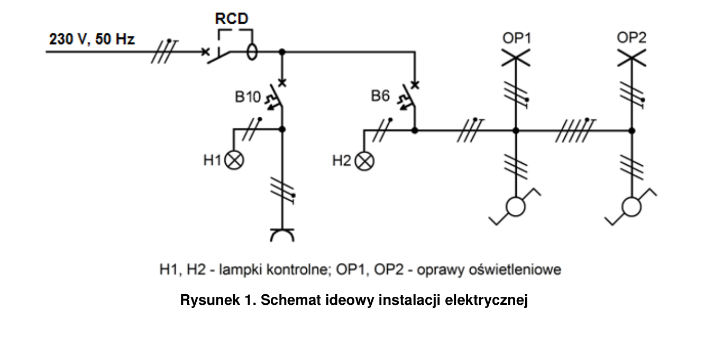
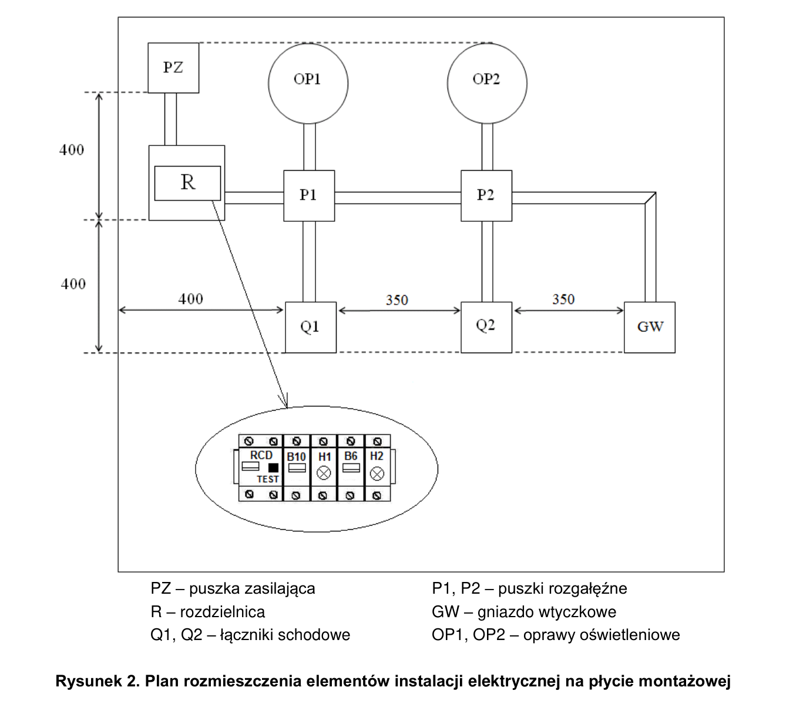

# ELE.02-101 — Dwie oprawy z dwóch miejsc i gniazdo

Wspólne sterowanie dwiema oprawami przez dwa łączniki schodowe; gniazdo ma oddzielny obwód B10. RCD 2P zasila oba obwody. Lampki DIN pokazują obecność zasilania odpowiednich gałęzi.

Źródło: `ele_02_101-4d8xp0x.pdf`. Strony PDF: 1, 2, 3, 5, 7. Numery liczone od początku pliku, a nie od drukowanego numeru arkusza.

## Schematy źródłowe

### ideowy — PDF 1

Oryginalny schemat / plan; nie zmieniono połączeń.

[Wersja SVG](../../../../public/knowledge/ele02/assets/schematy/ELE02_101_p1_ideowy.svg)

### rozmieszczenie — PDF 2

Oryginalny schemat / plan; nie zmieniono połączeń.

[Wersja SVG](../../../../public/knowledge/ele02/assets/schematy/ELE02_101_p2_rozmieszczenie.svg)

## Czego się nauczyć

- Rozwinąć schemat jednokreskowy na osobne żyły L, N, PE i przewody korespondencyjne.
- Rozpoznać COM obu łączników i dwie drogi korespondencyjne.
- Wyjaśnić, dlaczego dwie oprawy są połączone równolegle.

## Jak czytać ten schemat

1. Najpierw odszukaj RCD i oddziel B10 gniazda od B6 oświetlenia.
2. Śledź fazę od B6 do COM pierwszego łącznika, następnie wybraną żyłę korespondencyjną do drugiego COM i obu opraw.
3. N opraw wraca do listwy za RCD; PE prowadzi osobno do każdej oprawy i gniazda.
4. Lampka gałęzi oświetlenia jest przed łącznikami. Jej świecenie nie oznacza, że OP1/OP2 są włączone.

## Aparaty i osprzęt

| Element | Ilość | Parametry | Źródło / uwagi |
|---|---|---|---|
| RCD 2P | 1 | IΔn 30 mA; w schematach P302 25 A / 30 mA; napięcie 230 V | Tabela 2, PDF 5;  |
| Wyłącznik nadprądowy B6 1P | 1 | TH35, 6 A, charakterystyka B | Tabela 2, PDF 5;  |
| Wyłącznik nadprądowy B10 1P | 1 | TH35, 10 A, charakterystyka B | Tabela 2, PDF 5;  |
| Lampka sygnalizacyjna zielona DIN | 2 | 230 V AC | Tabela 2, PDF 5;  |
| Rozdzielnica natynkowa 8M | 1 | Szyna TH35, listwy N/PE i pokrywa odpowiednie do aparatury | Tabela 2, PDF 5;  |
| Oprawa klasy I E27 z żarówką | 2 | Zacisk PE, źródło światła 40 W / 230 V | Tabela 2, PDF 5;  |
| Puszka rozgałęźna natynkowa | 2 | 80×80 mm; pojemność dla aparatu, przewodów i złączek; pokrywa | Tabela 2, PDF 5;  |
| Łącznik schodowy natynkowy | 2 | Jeden COM + dwa przełączane tory | Tabela 2, PDF 5;  |
| Gniazdo natynkowe 1-fazowe | 1 | 230 V, styk ochronny; typ i obciążalność do stanowiska | Tabela 2, PDF 5;  |

## Przewody i materiały

| Materiał | Ilość | Jednostka | Źródło / uwagi |
|---|---|---|---|
| DY 2.5 mm² — czarny lub brązowy | 2 | m | Tabela materiałów / przygotowania, PDF 7; materiał zużywany;  |
| DY 2.5 mm² — niebieski | 2 | m | Tabela materiałów / przygotowania, PDF 7; materiał zużywany;  |
| DY 2.5 mm² — żółto-zielony | 2 | m | Tabela materiałów / przygotowania, PDF 7; materiał zużywany;  |
| DY 1.5 mm² — czarny lub brązowy | 6 | m | Tabela materiałów / przygotowania, PDF 7; materiał zużywany;  |
| DY 1.5 mm² — niebieski | 2 | m | Tabela materiałów / przygotowania, PDF 7; materiał zużywany;  |
| DY 1.5 mm² — żółto-zielony | 2 | m | Tabela materiałów / przygotowania, PDF 7; materiał zużywany;  |
| LgY 2.5 mm² — czarny lub brązowy | 2 | m | Tabela materiałów / przygotowania, PDF 7; materiał zużywany;  |
| LgY 2.5 mm² — niebieski | 1 | m | Tabela materiałów / przygotowania, PDF 7; materiał zużywany;  |
| LgY 2.5 mm² — żółto-zielony | 1 | m | Tabela materiałów / przygotowania, PDF 7; materiał zużywany;  |
| Tulejki 2,5/10 | 20 | szt. | Tabela materiałów / przygotowania, PDF 7; materiał zużywany; Tabela: 0,2 opakowania po 100 szt. = 20 szt. |
| Złączka 3-portowa do właściwego rodzaju żył | 3 | szt. | Tabela materiałów / przygotowania, PDF 7; materiał zużywany;  |
| Listwa 25×15 | 4 | m | Tabela materiałów / przygotowania, PDF 7; materiał zużywany; 2 odcinki po 2000 mm. |
| Wkręty do grubości płyty | 40 | szt. | Tabela materiałów / przygotowania, PDF 7; materiał zużywany;  |

## Próby działania i pomiary

| Próba | Oczekiwany wynik |
|---|---|
| Przełącz Q1 przy obu ustawieniach Q2. | Każde przełączenie Q1 odwraca stan obu opraw; oprawy zawsze działają razem. |
| Wyłącz B6, pozostaw B10. | Oprawy nie działają; gniazdo pozostaje zasilane. |
| Wyłącz B10, pozostaw B6. | Gniazdo bez napięcia; sterowanie opraw pozostaje możliwe. |
| Sprawdź ciągłość PE bez zasilania. | Istnieją połączenia PZ–PE rozdzielnicy–PE gniazda oraz obu opraw. |
| Użyj TEST RCD przy odpowiednim zasilaniu. | RCD wyłącza oba obwody; próbę traktować osobno od pełnego pomiaru RCD. |

Są to opracowane wnioski z treści i rysunku. Nie dysponujemy oficjalnym kluczem oceniania. Rzeczywiste wskazania pomiarów trzeba wykonać i zapisać; model nie dostarcza wyników rzeczywistego stanowiska.

## Typowe pomyłki

- Połączenie dwóch opraw szeregowo.
- Pomylenie COM z korespondencją.
- Połączenie N lamp do strony przed RCD.
- Traktowanie jednego kreskowego połączenia jako jednej żyły.

## Weryfikacja przed pełnym ćwiczeniem

- Przykład aplikacji ma geometrię dydaktyczną; długości żył i wymiary trzeba dopasować do realnej płyty.

## Przykład istniejący w aplikacji

[ELE02_101_stanowisko.json](../../../../examples/physical/ELE02_101_stanowisko.json) — kopia przykładu z repo, commit `9c4895a817b5f5869d17b3cf23a3e9695d49f6cf`. Walidacja bieżącego kontraktu: OK. Import: Moje projekty → Importuj JSON. Parametry dydaktyczne nie zastępują danych rzeczywistych urządzeń.
