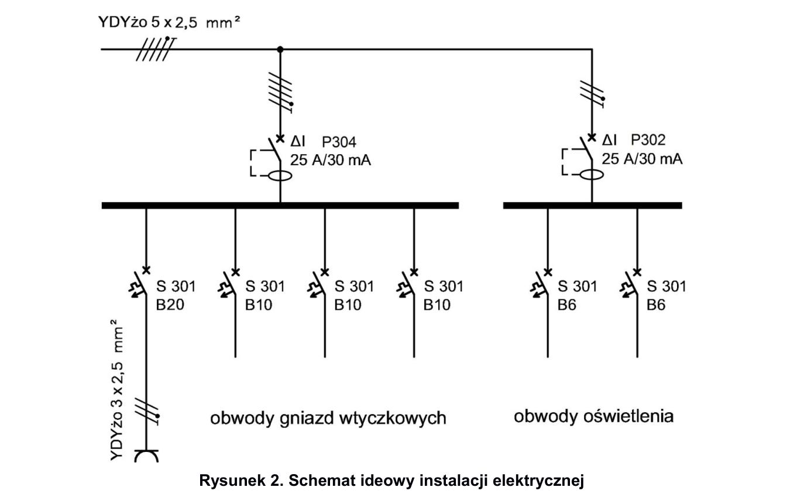
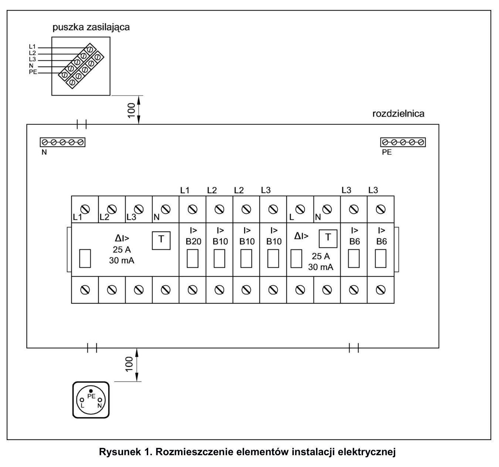

# ELE.02-103 — Rozdzielnica z dwoma RCD i rozdziałem faz

RCD 4P zasila gałęzie gniazdowe, RCD 2P gałęzie oświetleniowe. Arkusz wymaga równomiernego obciążenia faz. B20 jest elementem przygotowania stanowiska, a nie pozycją w głównej tabeli aparatów.

Źródło: `Zadanie-nr-3-2-wylaczniki-RCD-ele_02_103-utzoqdu.pdf`. Strony PDF: 1, 2, 3, 4, 6, 7, 8. Numery liczone od początku pliku, a nie od drukowanego numeru arkusza.

## Schematy źródłowe

### ideowy — PDF 3

Oryginalny schemat / plan; nie zmieniono połączeń.

[Wersja SVG](../../../../public/knowledge/ele02/assets/schematy/ELE02_103_p3_ideowy.svg)

### rozmieszczenie — PDF 2

Oryginalny schemat / plan; nie zmieniono połączeń.

[Wersja SVG](../../../../public/knowledge/ele02/assets/schematy/ELE02_103_p2_rozmieszczenie.svg)

## Czego się nauczyć

- Rozróżnić prąd znamionowy RCD od jego prądu różnicowego.
- Rozpoznać strony wejścia/wyjścia dwóch RCD i osobne tory N.
- Zaplanować przydział faz na podstawie odbiorników; liczba obwodów nie jest sama miarą obciążenia.

## Jak czytać ten schemat

1. Na schemacie zaznacz osobno źródło 3 faz + N + PE, RCD4 i RCD2.
2. Zbuduj dwa obszary N po stronie odbiorczej; każdy wraca wyłącznie przez swój RCD.
3. Prześledź obwód B20 do fizycznego gniazda i wybrany B6 do oprawki kontrolnej.
4. Pozostałe wyjścia B10/B6 są częścią rozdzielnicy; trzy B10 nie oznaczają trzech dodatkowych gniazd w wyposażeniu.

## Aparaty i osprzęt

| Element | Ilość | Parametry | Źródło / uwagi |
|---|---|---|---|
| RCD 2P | 1 | IΔn 30 mA; w schematach P302 25 A / 30 mA; napięcie 230 V | Tabela 2, PDF 6;  |
| RCD 4P | 1 | IΔn 30 mA; P304 25 A / 30 mA na schematach; 3 fazy + N | Tabela 2, PDF 6;  |
| Wyłącznik nadprądowy B6 1P | 2 | TH35, 6 A, charakterystyka B | Tabela 2, PDF 6;  |
| Wyłącznik nadprądowy B10 1P | 3 | TH35, 10 A, charakterystyka B | Tabela 2, PDF 6;  |
| Wyłącznik nadprądowy B20 1P | 1 | TH35, 20 A, charakterystyka B | Tabela 3b, PDF 8;  |
| Rozdzielnica natynkowa 12M | 1 | Szyna TH35; pojemność sprawdzona dla rzeczywistych szerokości urządzeń | Tabela 2, PDF 6;  |
| Gniazdo natynkowe 1-fazowe | 1 | 230 V, styk ochronny; typ i obciążalność do stanowiska | Tabela 3a, PDF 8;  |
| Oprawka E27 bez zacisku PE + żarówka | 1 | Żarówka do 40 W; wariant wskazany w 103 | Tabela 3a/3b, PDF 8;  |
| Listwa N | 2 | Co najmniej 6 zacisków do 4 mm², izolowana, TH35 lub dostarczona z rozdzielnicą | Rys. 2, PDF 3; Dwa niezależne potencjały N za RCD; liczba i forma listew nie są podane w tabeli. |
| Listwa PE | 1 | Co najmniej 6 zacisków do 4 mm²; prawidłowe oznaczenie | Rys. 2, PDF 3; Wspólny tor PE; listwa może być w komplecie z rozdzielnicą. |

## Przewody i materiały

| Materiał | Ilość | Jednostka | Źródło / uwagi |
|---|---|---|---|
| YDYżo 5×2.5 mm² | 1 | m | Tabela materiałów / przygotowania, PDF 7; materiał zużywany;  |
| YDYżo 3×2.5 mm² | 1 | m | Tabela materiałów / przygotowania, PDF 7; materiał zużywany;  |
| YDY 2×1.5 mm² | 1 | m | Tabela materiałów / przygotowania, PDF 7; materiał zużywany;  |
| LgY 2.5 mm² — czarny lub brązowy | 2 | m | Tabela materiałów / przygotowania, PDF 7; materiał zużywany;  |
| LgY 2.5 mm² — niebieski | 1 | m | Tabela materiałów / przygotowania, PDF 7; materiał zużywany;  |
| Tulejki 2,5/10 | 100 | szt. | Tabela materiałów / przygotowania, PDF 7; materiał zużywany;  |
| Wkręty do grubości płyty | 10 | szt. | Tabela materiałów / przygotowania, PDF 7; materiał zużywany;  |

## Próby działania i pomiary

| Próba | Oczekiwany wynik |
|---|---|
| Użyj TEST każdego RCD osobno. | Rozłączają się wyłącznie jego własne tory odbiorcze. |
| Zasil gniazdo z B20 według arkusza. | Odbiornik próbny działa przy poprawnym L/N/PE i doborze stanowiska. |
| Dołącz oprawkę do jednego B6. | Oprawka świeci po załączeniu właściwego RCD i B6. |
| Sprawdź przypisanie faz i torów N. | Brak wspólnego N za różnymi RCD; podział faz zapisany jawnie. |
| Sprawdź PE PZ–rozdzielnica–gniazdo. | Zachowana ciągłość; oprawka bez PE nie jest oprawą klasy I z odłączonym PE. |

Są to opracowane wnioski z treści i rysunku. Nie dysponujemy oficjalnym kluczem oceniania. Rzeczywiste wskazania pomiarów trzeba wykonać i zapisać; model nie dostarcza wyników rzeczywistego stanowiska.

## Typowe pomyłki

- Zmostkowanie obu listew N.
- Pominięcie B20, bo znajduje się w tabeli przygotowania.
- Zakup trzech dodatkowych gniazd na podstawie trzech B10.
- Przenoszenie B20 do instalacji domowej bez sprawdzenia gniazda, kabla i ochrony.

## Weryfikacja przed pełnym ćwiczeniem

- Brak mocy docelowych odbiorników: równomiernego obciążenia faz nie da się dowieść wyłącznie z liczby zabezpieczeń.
- Arkusz nie określa typu różnicowego A/AC.

## Braki aplikacji dla dokładnego wariantu

- RCD 4P
- Pełny model równoważenia obciążeń; dla nauki wystarcza jawny plan przydziału faz.

## Status projektu interaktywnego

Opis i schemat są przygotowane do bazy wiedzy. Nie wygenerowano niezweryfikowanego ProjectDocument dla tego zadania. Do uruchamiania potrzebny jest osobny projekt po uzupełnieniu wskazanych modeli i próbach działania.
