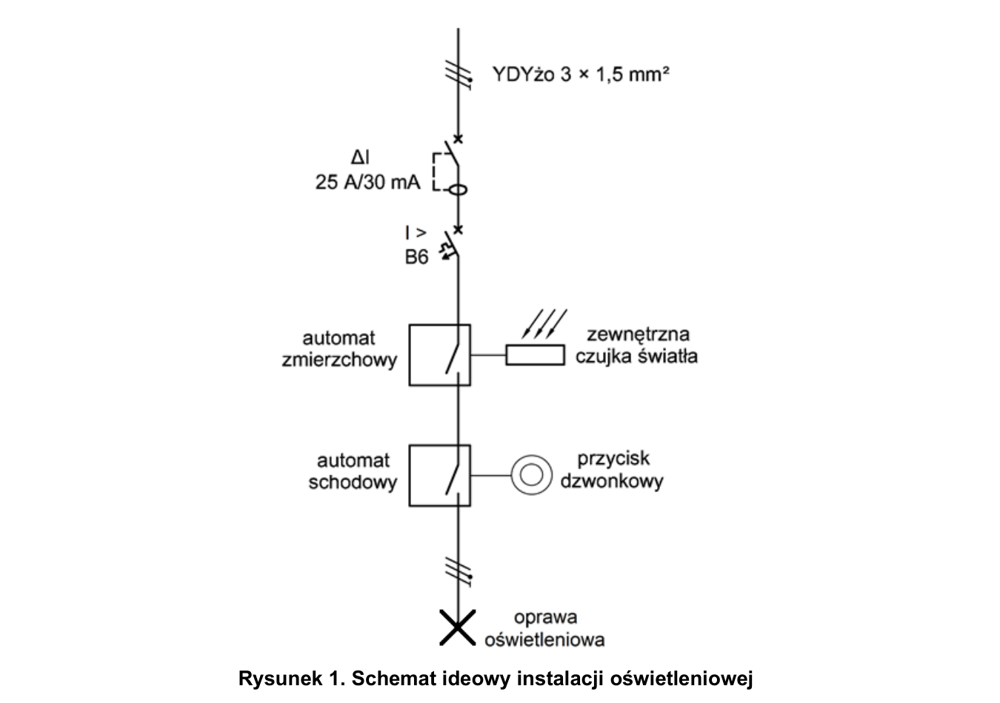
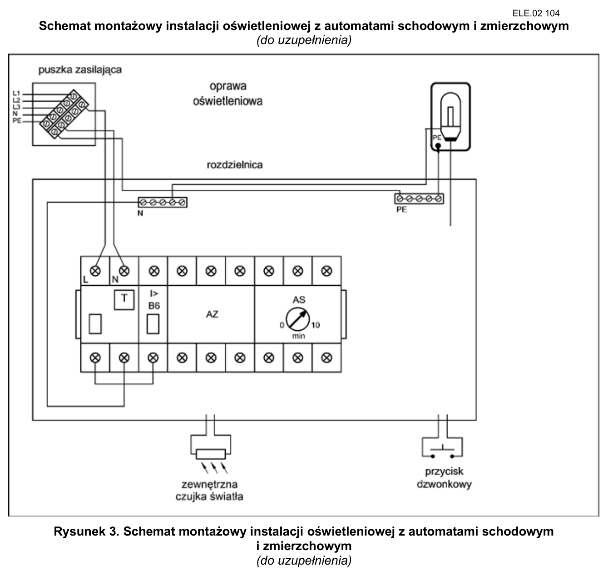
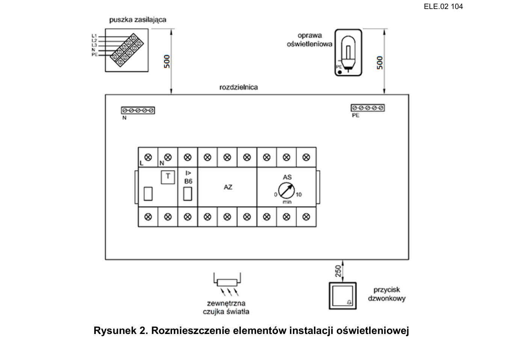

# ELE.02-104 — Automat schodowy sterowany warunkiem zmierzchu

Automat zmierzchowy AZ ze zewnętrzną sondą umożliwia zasilenie automatu schodowego AS po zasłonięciu czujki. AS po impulsie przycisku załącza oprawę na 1 minutę. Schemat montażowy należy uzupełnić z instrukcji dwóch konkretnych aparatów.

Źródło: `ele_02_104-e70oexx.pdf`. Strony PDF: 1, 2, 3, 4, 6, 7. Numery liczone od początku pliku, a nie od drukowanego numeru arkusza.

## Schematy źródłowe

### ideowy — PDF 1

Oryginalny schemat / plan; nie zmieniono połączeń.

[Wersja SVG](../../../../public/knowledge/ele02/assets/schematy/ELE02_104_p1_ideowy.svg)

### montazowy — PDF 3

**Oryginał do uzupełnienia. Nie jest to gotowe rozwiązanie.**

[Wersja SVG](../../../../public/knowledge/ele02/assets/schematy/ELE02_104_p3_montazowy.svg)

### rozmieszczenie — PDF 2

Oryginalny schemat / plan; nie zmieniono połączeń.

[Wersja SVG](../../../../public/knowledge/ele02/assets/schematy/ELE02_104_p2_rozmieszczenie.svg)

## Czego się nauczyć

- Oddzielić warunek zezwolenia od impulsu wyzwolenia i czasu świecenia.
- Odczytać L/N, wyjście i zaciski sondy z instrukcji właściwego modelu.
- Pokazać, że przy jasnej czujce AS nie ma zasilania w tym konkretnym układzie.

## Jak czytać ten schemat

1. Zaczynaj od RCD/B6 i oddzielnego toru PE.
2. Odszukaj wyjście AZ, które podaje fazę na zasilanie AS i obwód sterowania przyciskiem.
3. Prześledź impuls przycisku do wejścia AS i wyjście AS do L oprawy; N wraca oddzielnie.
4. Przy 60 s opisuj stan licznika czasu i rzeczywiste przełączenie wyjścia; sam obraz żarówki nie dowodzi odliczania.

## Aparaty i osprzęt

| Element | Ilość | Parametry | Źródło / uwagi |
|---|---|---|---|
| RCD 2P | 1 | IΔn 30 mA; w schematach P302 25 A / 30 mA; napięcie 230 V | Tabela 2, PDF 6;  |
| Wyłącznik nadprądowy B6 1P | 1 | TH35, 6 A, charakterystyka B | Tabela 2, PDF 6;  |
| Automat zmierzchowy z czujką | 1 | 230 V, TH35, ZEWNĘTRZNA czujka; wyjście zgodne z automatem schodowym | Tabela 2, PDF 6;  |
| Automat schodowy | 1 | 230 V, TH35, możliwość nastawy 60 s, wejście NO i odpowiednie wyjście do oprawy | Tabela 2, PDF 6;  |
| Rozdzielnica natynkowa 8M | 1 | Szyna TH35, listwy N/PE i pokrywa odpowiednie do aparatury | Tabela 2, PDF 6;  |
| Oprawa klasy I E27 z żarówką | 1 | Zacisk PE, źródło światła 40 W / 230 V | Tabela 2, PDF 6;  |
| Przycisk dzwonkowy natynkowy | 1 | NO chwilowy, bez podświetlenia jako wspólny wariant zakupowy | Tabela 2, PDF 6;  |

## Przewody i materiały

| Materiał | Ilość | Jednostka | Źródło / uwagi |
|---|---|---|---|
| YDYżo 3×1.5 mm² | 1 | m | Tabela materiałów / przygotowania, PDF 7; materiał zużywany;  |
| YDY 2×1.5 mm² | 1 | m | Tabela materiałów / przygotowania, PDF 7; materiał zużywany;  |
| LgY 1.5 mm² — czarny lub brązowy | 3 | m | Tabela materiałów / przygotowania, PDF 7; materiał zużywany;  |
| LgY 1.5 mm² — niebieski | 2 | m | Tabela materiałów / przygotowania, PDF 7; materiał zużywany;  |
| Tulejki 1,5/10 | 30 | szt. | Tabela materiałów / przygotowania, PDF 7; materiał zużywany;  |
| Uchwyty paskowe | 6 | szt. | Tabela materiałów / przygotowania, PDF 7; materiał zużywany;  |
| Wkręty do grubości płyty | 20 | szt. | Tabela materiałów / przygotowania, PDF 7; materiał zużywany;  |

## Próby działania i pomiary

| Próba | Oczekiwany wynik |
|---|---|
| Oświetl czujkę i naciśnij przycisk. | AS nie jest zasilony według wymagania arkusza; oprawa nie załącza się. |
| Zasłoń czujkę. | AZ dopuszcza zasilenie AS, z uwzględnieniem opóźnień konkretnego urządzenia. |
| Przy ciemnej czujce podaj krótki impuls. | Oprawa świeci i gaśnie po nastawionych 60 s. |
| Wyłącz B6 lub RCD. | Układ traci zasilanie; PE pozostaje ciągły. |

Są to opracowane wnioski z treści i rysunku. Nie dysponujemy oficjalnym kluczem oceniania. Rzeczywiste wskazania pomiarów trzeba wykonać i zapisać; model nie dostarcza wyników rzeczywistego stanowiska.

## Typowe pomyłki

- Pozostawienie AS stale pod napięciem mimo wymagania arkusza.
- Zamiana zacisków sondy i wejścia przycisku.
- Dopisanie numerów AZ/AS z innego modelu.

## Weryfikacja przed pełnym ćwiczeniem

- W przesłanym arkuszu nie wskazano modeli AZ i AS. Dokładne zaciski oraz restart/ponowne wyzwolenie wymagają instrukcji dobranych egzemplarzy.

## Braki aplikacji dla dokładnego wariantu

- Automat zmierzchowy i wejście natężenia światła
- Zweryfikowane powiązanie dwóch aparatów z ich instrukcjami

## Status projektu interaktywnego

Opis i schemat są przygotowane do bazy wiedzy. Nie wygenerowano niezweryfikowanego ProjectDocument dla tego zadania. Do uruchamiania potrzebny jest osobny projekt po uzupełnieniu wskazanych modeli i próbach działania.
