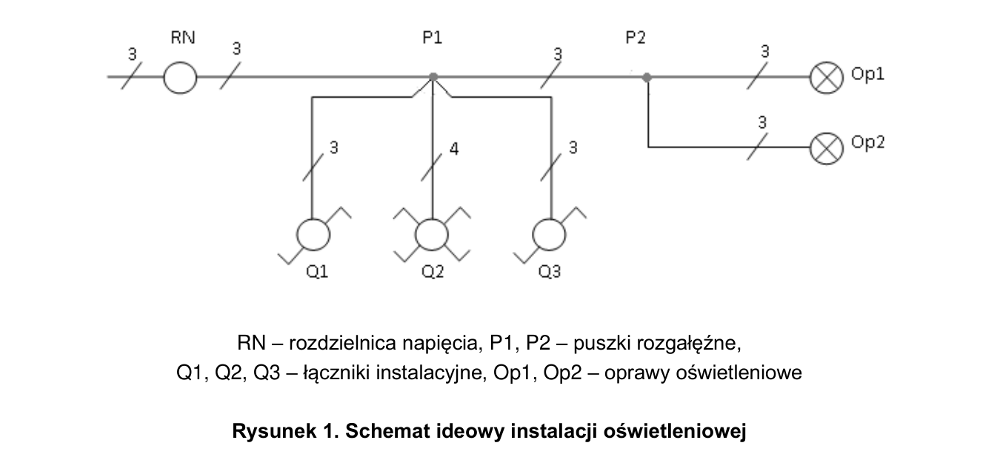
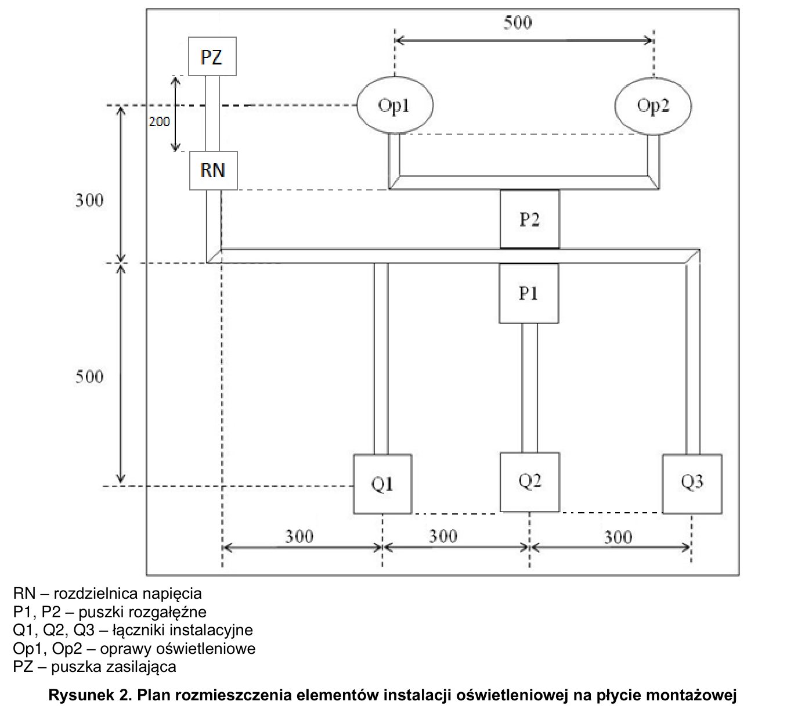

# ELE.02-105 — Dwie oprawy sterowane z trzech miejsc

Dwa łączniki schodowe na końcach oraz krzyżowy między nimi sterują dwiema oprawami równolegle. Zadanie obejmuje badanie styków łączników jeszcze przed montażem i ciągłość PE po montażu.

Źródło: `Zadanie-nr-5-2-schodowe-krzyzowy-ele_02_105-xf7wriq.pdf`. Strony PDF: 1, 2, 3, 5, 6. Numery liczone od początku pliku, a nie od drukowanego numeru arkusza.

## Schematy źródłowe

### ideowy — PDF 1

Oryginalny schemat / plan; nie zmieniono połączeń.

[Wersja SVG](../../../../public/knowledge/ele02/assets/schematy/ELE02_105_p1_ideowy.svg)

### rozmieszczenie — PDF 2

Oryginalny schemat / plan; nie zmieniono połączeń.

[Wersja SVG](../../../../public/knowledge/ele02/assets/schematy/ELE02_105_p2_rozmieszczenie.svg)

## Czego się nauczyć

- Rozpoznać pary wejściowe i wyjściowe krzyżowego w obu położeniach.
- Zidentyfikować COM schodowego miernikiem, bez zakładania położenia śruby.
- Rozróżnić badanie samego łącznika od pomiaru gotowej instalacji.

## Jak czytać ten schemat

1. Śledź L z B6 do pierwszego COM.
2. Dwie żyły korespondencyjne biegną przez dwa tory krzyżowego do drugiego schodowego.
3. Z drugiego COM zasila się L obu opraw; N oraz PE idą osobnymi drogami.
4. W tabeli styków wpisuj ciągłość albo przerwę na podstawie pomiaru, a nie nazwy aparatu.

## Aparaty i osprzęt

| Element | Ilość | Parametry | Źródło / uwagi |
|---|---|---|---|
| Wyłącznik nadprądowy B6 1P | 1 | TH35, 6 A, charakterystyka B | Tabela 2, PDF 5;  |
| Rozdzielnica natynkowa 8M | 1 | Szyna TH35, listwy N/PE i pokrywa odpowiednie do aparatury | Tabela 2, PDF 5;  |
| Oprawa klasy I E27 z żarówką | 2 | Zacisk PE, źródło światła 40 W / 230 V | Tabela 2, PDF 5;  |
| Łącznik schodowy natynkowy | 2 | Jeden COM + dwa przełączane tory | Tabela 3a, PDF 6;  |
| Łącznik krzyżowy natynkowy | 1 | Cztery zaciski; prosto / krzyżowo | Tabela 3a, PDF 6;  |
| Puszka rozgałęźna natynkowa | 2 | 80×80 mm; pojemność dla aparatu, przewodów i złączek; pokrywa | Tabela 3a, PDF 6;  |

## Przewody i materiały

| Materiał | Ilość | Jednostka | Źródło / uwagi |
|---|---|---|---|
| DY 1.5 mm² — czarny lub brązowy | 9 | m | Tabela materiałów / przygotowania, PDF 6; materiał zużywany;  |
| DY 1.5 mm² — niebieski | 3 | m | Tabela materiałów / przygotowania, PDF 6; materiał zużywany;  |
| DY 1.5 mm² — żółto-zielony | 3 | m | Tabela materiałów / przygotowania, PDF 6; materiał zużywany;  |
| Listwa 25×15 | 4 | m | Tabela materiałów / przygotowania, PDF 6; materiał zużywany;  |
| Wkręty do grubości płyty | 50 | szt. | Tabela materiałów / przygotowania, PDF 6; materiał zużywany;  |
| Złączka 3-portowa | 8 | szt. | Tabela materiałów / przygotowania, PDF 6; materiał zużywany;  |

## Próby działania i pomiary

| Próba | Oczekiwany wynik |
|---|---|
| Zbadaj schodowe i krzyżowy przed montażem. | Schodowy przełącza COM między dwoma torami; krzyżowy zmienia sparowanie torów. |
| Dla wszystkich 8 kombinacji trzech łączników zmień pojedynczą pozycję. | Każda taka zmiana odwraca stan obu opraw. |
| Zmierz RN:PE–PE każdej oprawy. | Ciągłość obu dróg PE przy wyłączonym zasilaniu. |
| Wyłącz B6. | Obie oprawy gasną niezależnie od łączników. |

Są to opracowane wnioski z treści i rysunku. Nie dysponujemy oficjalnym kluczem oceniania. Rzeczywiste wskazania pomiarów trzeba wykonać i zapisać; model nie dostarcza wyników rzeczywistego stanowiska.

## Typowe pomyłki

- Wstawienie trzeciego schodowego zamiast krzyżowego.
- Połączenie obu torów korespondencyjnych w jednej złączce.
- Wpisanie zmyślonej rezystancji jako wyniku rzeczywistego pomiaru.

## Weryfikacja przed pełnym ćwiczeniem

- Arkusz pokazuje tylko B6 w rozdzielnicy zadania; zasilanie stanowiska ma osobną ochronę opisaną w przygotowaniu. Nie usuwać kontekstu stanowiska.

## Status projektu interaktywnego

Opis i schemat są przygotowane do bazy wiedzy. Nie wygenerowano niezweryfikowanego ProjectDocument dla tego zadania. Do uruchamiania potrzebny jest osobny projekt po uzupełnieniu wskazanych modeli i próbach działania.
