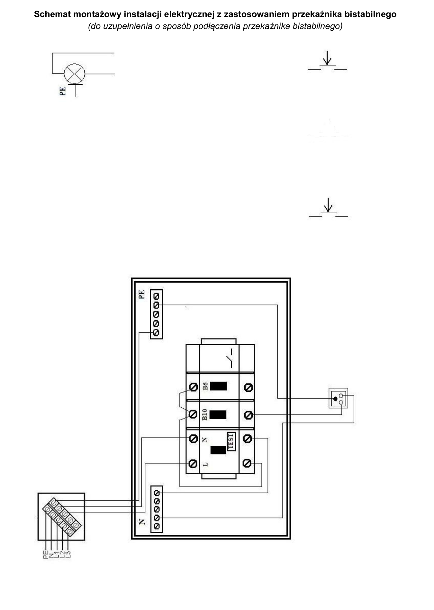
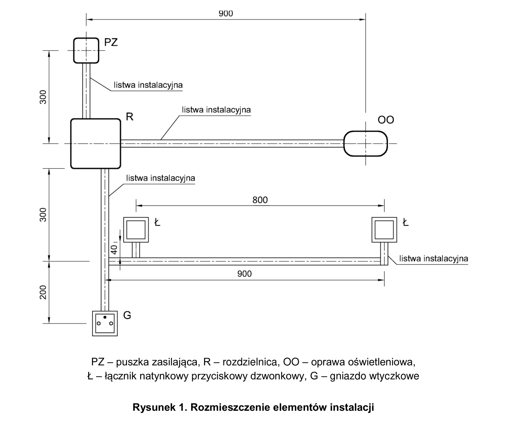

# ELE.02-106 — Przekaźnik bistabilny z dwóch miejsc i gniazdo

Dwa przyciski dzwonkowe sterują oświetleniem przez przekaźnik bistabilny; gniazdo ma oddzielny B10. Rysunek montażowy jest celowo niekompletny. W tabeli jako przykład podano BIS-413.

Źródło: `Zadanie-nr-6-bistabilny-gniazdo-ele_02_106-5qkp144.pdf`. Strony PDF: 1, 2, 3, 4, 6, 7, 8. Numery liczone od początku pliku, a nie od drukowanego numeru arkusza.

## Schematy źródłowe

### montazowy — PDF 3

**Oryginał do uzupełnienia. Nie jest to gotowe rozwiązanie.**

[Wersja SVG](../../../../public/knowledge/ele02/assets/schematy/ELE02_106_p3_montazowy.svg)

### rozmieszczenie — PDF 2

Oryginalny schemat / plan; nie zmieniono połączeń.

[Wersja SVG](../../../../public/knowledge/ele02/assets/schematy/ELE02_106_p2_rozmieszczenie.svg)

## Czego się nauczyć

- Oddzielić stałe zasilanie przekaźnika, wejście impulsu i separowany styk obciążenia.
- Połączyć przyciski równolegle, a nie szeregowo.
- Sprawdzić funkcje wybranego BIS-413 i różnice wobec modelu BIS-411.

## Jak czytać ten schemat

1. Rozpoznaj gotową gałąź B10–gniazdo; nie wykorzystuj jej N przed RCD.
2. Według instrukcji uzupełnij stałe L/N przekaźnika, wspólny styk i wyjście do oprawy.
3. Wariant BIS-413 z impulsem L: L na 3, N na 1, przyciski między L a 6, doprowadzenie L na COM 11 i wyjście 12 do oprawy.
4. Pozostaw NC 10 nieużyty, jeśli schemat danego wariantu go nie wymaga. PE oprawy pozostaje niezależny od styku.

## Aparaty i osprzęt

| Element | Ilość | Parametry | Źródło / uwagi |
|---|---|---|---|
| RCD 2P | 1 | IΔn 30 mA; w schematach P302 25 A / 30 mA; napięcie 230 V | Tabela 2, PDF 6;  |
| Wyłącznik nadprądowy B6 1P | 1 | TH35, 6 A, charakterystyka B | Tabela 2, PDF 6;  |
| Wyłącznik nadprądowy B10 1P | 1 | TH35, 10 A, charakterystyka B | Tabela 2, PDF 6;  |
| Rozdzielnica natynkowa 8M | 1 | Szyna TH35, listwy N/PE i pokrywa odpowiednie do aparatury | Tabela 2, PDF 6;  |
| Oprawa klasy I E27 z żarówką | 1 | Zacisk PE, źródło światła 40 W / 230 V | Tabela 2, PDF 6;  |
| Gniazdo natynkowe 1-fazowe | 1 | 230 V, styk ochronny; typ i obciążalność do stanowiska | Tabela 2, PDF 6;  |
| Przycisk dzwonkowy natynkowy | 2 | NO chwilowy, bez podświetlenia jako wspólny wariant zakupowy | Tabela 3a, PDF 8;  |
| Przekaźnik bistabilny DIN z czasem | 1 | 230 V, styk min. 10 A, regulacja czasu; przykład BIS-413 230 V | Tabela 3a, PDF 8;  |

## Przewody i materiały

| Materiał | Ilość | Jednostka | Źródło / uwagi |
|---|---|---|---|
| DY 1.5 mm² — czarny lub brązowy | 8 | m | Tabela materiałów / przygotowania, PDF 7; materiał zużywany;  |
| DY 1.5 mm² — niebieski | 3 | m | Tabela materiałów / przygotowania, PDF 7; materiał zużywany;  |
| DY 1.5 mm² — żółto-zielony | 3 | m | Tabela materiałów / przygotowania, PDF 7; materiał zużywany;  |
| Listwa 25×15 | 3 | m | Tabela materiałów / przygotowania, PDF 7; materiał zużywany;  |
| Wkręty do grubości płyty | 30 | szt. | Tabela materiałów / przygotowania, PDF 7; materiał zużywany;  |

## Próby działania i pomiary

| Próba | Oczekiwany wynik |
|---|---|
| Podaj krótki impuls z pierwszego, potem drugiego przycisku. | Oba mogą przełączać ten sam styk oświetlenia. |
| Sprawdź czas i długie przytrzymanie dla BIS-413. | Wyłączenie czasowe oraz tryb długiego naciśnięcia muszą zgadzać się z instrukcją tego modelu. |
| Wyłącz tylko B6. | Oświetlenie bez zasilania, gniazdo nadal działa przez B10. |
| Zmierz PE gniazda i oprawy. | Ciągłość do PZ przy wyłączonym zasilaniu. |

Są to opracowane wnioski z treści i rysunku. Nie dysponujemy oficjalnym kluczem oceniania. Rzeczywiste wskazania pomiarów trzeba wykonać i zapisać; model nie dostarcza wyników rzeczywistego stanowiska.

## Typowe pomyłki

- Sterowanie dwoma przyciskami szeregowymi.
- Nadanie BIS-413 zachowania samego BIS-411.
- Przeniesienie numeracji BIS-402 na aparat DIN.

## Weryfikacja przed pełnym ćwiczeniem

- Arkusz wymaga DY 1,5 mm² dla wszystkich połączeń, także gałęzi gniazda. Zachować to jako wymaganie tego stanowiska, nie ogólne zalecenie instalacji domowej.
- Wariant ćwiczenia exam-bistable w repo używa profilu BIS-411; to adaptacja, a nie dokładny model przykładowego BIS-413.

## Braki aplikacji dla dokładnego wariantu

- BIS-413: czas wyłączenia i obsługa długiego naciśnięcia

## Instrukcje wykorzystane w opisie

- [F&F BIS-413 230 V, instrukcja E220128](https://www.fif.com.pl/pl/index.php?controller=attachment&id_attachment=102) — Mapa 1/3 zasilanie, 6 impuls, 10 NC, 11 COM, 12 NO; wyłączenie czasowe i długie naciśnięcie.

## Status projektu interaktywnego

Opis i schemat są przygotowane do bazy wiedzy. Nie wygenerowano niezweryfikowanego ProjectDocument dla tego zadania. Do uruchamiania potrzebny jest osobny projekt po uzupełnieniu wskazanych modeli i próbach działania.
