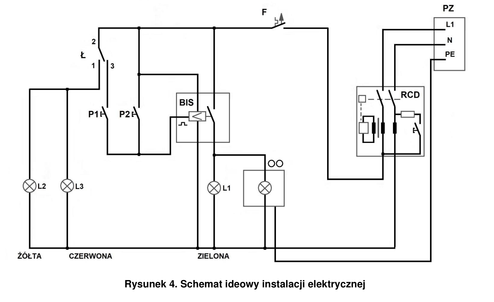
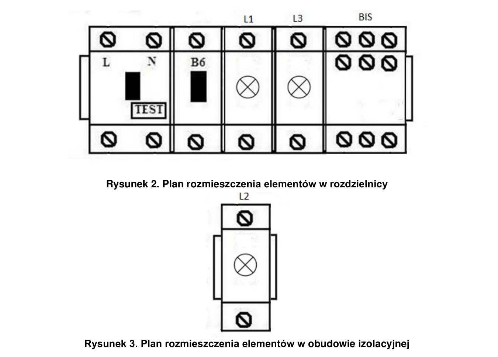
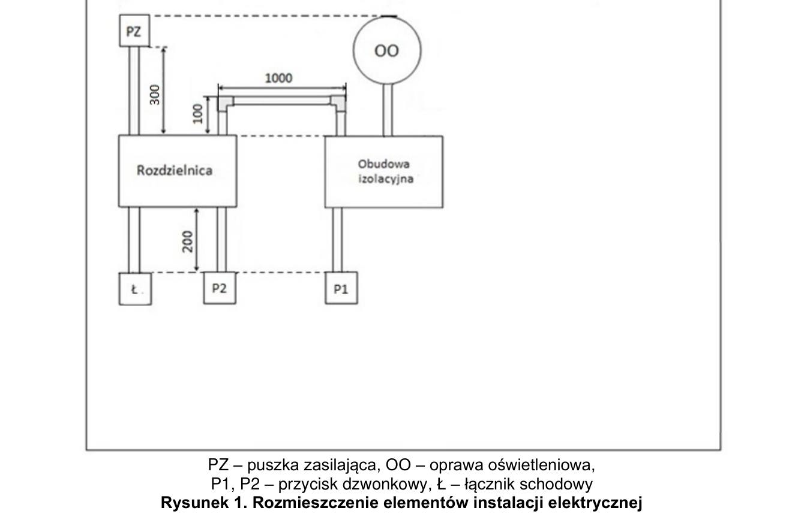

# ELE.02-107 — Bistabilny z przełączaniem aktywności przycisku

Łącznik schodowy Ł wybiera, czy P1 jest aktywny. P2 pozostaje aktywny. L1 świeci razem z oprawą, a L2 i L3 wskazują tryb z wyłączonym P1. Tabela wymienia przekaźnik bistabilny z regulacją czasu; treść opisuje przełączanie krótkimi impulsami.

Źródło: `Zadanie-nr-7-bistabilny-schodowy-ele_02_107-kmthtif.pdf`. Strony PDF: 1, 2, 3, 5, 6, 7. Numery liczone od początku pliku, a nie od drukowanego numeru arkusza.

## Schematy źródłowe

### ideowy — PDF 2

Oryginalny schemat / plan; nie zmieniono połączeń.

[Wersja SVG](../../../../public/knowledge/ele02/assets/schematy/ELE02_107_p2_ideowy.svg)

### rozdzielnice — PDF 2

Oryginalny schemat / plan; nie zmieniono połączeń.

[Wersja SVG](../../../../public/knowledge/ele02/assets/schematy/ELE02_107_p2_rozdzielnice.svg)

### rozmieszczenie — PDF 1

Oryginalny schemat / plan; nie zmieniono połączeń.

[Wersja SVG](../../../../public/knowledge/ele02/assets/schematy/ELE02_107_p1_rozmieszczenie.svg)

## Czego się nauczyć

- Odczytać COM Ł jako zacisk 2 na tym rysunku, nie domyślnie numer 1.
- Rozróżnić wskazanie trybu od wskazania włączonej oprawy.
- Wytłumaczyć wyłączenie wejścia P1 bez wyłączania całego przekaźnika.

## Jak czytać ten schemat

1. F zasila cały układ, w tym sterowanie i sygnalizację.
2. Przy Ł 2–3 doprowadzona jest faza do P1; P2 ma stałe doprowadzenie fazy.
3. Przy Ł 1–2 P1 traci fazę, a L2/L3 otrzymują zasilanie; P2 pozostaje dostępny.
4. Wyjście BIS zasila równolegle OO i L1. N sygnalizacji i oprawy wraca za właściwym RCD.

## Aparaty i osprzęt

| Element | Ilość | Parametry | Źródło / uwagi |
|---|---|---|---|
| RCD 2P | 1 | IΔn 30 mA; w schematach P302 25 A / 30 mA; napięcie 230 V | Tabela 2, PDF 5;  |
| Wyłącznik nadprądowy B6 1P | 1 | TH35, 6 A, charakterystyka B | Tabela 2, PDF 5;  |
| Przekaźnik bistabilny DIN z czasem | 1 | 230 V, styk min. 10 A, regulacja czasu; przykład BIS-413 230 V | Tabela 2, PDF 5;  |
| Lampka sygnalizacyjna czerwona DIN | 1 | 230 V AC | Tabela 2, PDF 5;  |
| Lampka sygnalizacyjna zielona DIN | 1 | 230 V AC | Tabela 2, PDF 5;  |
| Lampka sygnalizacyjna żółta DIN | 1 | 230 V AC | Tabela 2, PDF 5;  |
| Rozdzielnica natynkowa 8M | 1 | Szyna TH35, listwy N/PE i pokrywa odpowiednie do aparatury | Tabela 2, PDF 5;  |
| Obudowa izolacyjna 4M | 1 | Do dodatkowych aparatów 107; odpowiedni front | Tabela 2, PDF 5;  |
| Oprawa klasy I E27 z żarówką | 1 | Zacisk PE, źródło światła 40 W / 230 V | Tabela 2, PDF 6;  |
| Przycisk dzwonkowy natynkowy | 2 | NO chwilowy, bez podświetlenia jako wspólny wariant zakupowy | Tabela 2, PDF 6;  |
| Łącznik schodowy natynkowy | 1 | Jeden COM + dwa przełączane tory | Tabela 2, PDF 6;  |

## Przewody i materiały

| Materiał | Ilość | Jednostka | Źródło / uwagi |
|---|---|---|---|
| LgY 1.5 mm² — czarny lub brązowy | 11 | m | Tabela materiałów / przygotowania, PDF 6; materiał zużywany;  |
| LgY 1.5 mm² — niebieski | 4 | m | Tabela materiałów / przygotowania, PDF 6; materiał zużywany;  |
| LgY 1.5 mm² — żółto-zielony | 3 | m | Tabela materiałów / przygotowania, PDF 6; materiał zużywany;  |
| Tulejki 1,5/10 | 50 | szt. | Tabela materiałów / przygotowania, PDF 6; materiał zużywany;  |
| Listwa 25×15 | 4 | m | Tabela materiałów / przygotowania, PDF 6; materiał zużywany;  |
| Narożnik do listwy 25×15 | 2 | szt. | Tabela materiałów / przygotowania, PDF 6; materiał zużywany;  |
| Złączka 3-portowa do żył wielodrutowych | 4 | szt. | Tabela materiałów / przygotowania, PDF 7; osprzęt wielokrotny;  |
| Wkręty do grubości płyty | 40 | szt. | Tabela materiałów / przygotowania, PDF 6; materiał zużywany;  |

## Próby działania i pomiary

| Próba | Oczekiwany wynik |
|---|---|
| Ustaw Ł 2–3 i kolejno naciśnij P1/P2. | Każdy krótki impuls przełącza OO/L1; L2/L3 nie świecą. |
| Ustaw Ł 1–2 i naciśnij P1. | P1 nie zmienia OO/L1; L2/L3 świecą. |
| Pozostaw Ł 1–2 i naciśnij P2. | P2 nadal przełącza OO/L1. |
| Zmień pozycję Ł bez impulsu. | Sama zmiana trybu nie powinna udawać impulsu wejścia BIS; sprawdzić rzeczywisty stan toru. |
| Wyłącz F. | Gaśnie OO i cała sygnalizacja. |

Są to opracowane wnioski z treści i rysunku. Nie dysponujemy oficjalnym kluczem oceniania. Rzeczywiste wskazania pomiarów trzeba wykonać i zapisać; model nie dostarcza wyników rzeczywistego stanowiska.

## Typowe pomyłki

- Nazwanie aparatu automatem schodowym na podstawie nazwy pliku.
- Włączenie L2/L3 w szereg z OO.
- Założenie, że obie lampki trybu wskazują pracę oprawy.

## Weryfikacja przed pełnym ćwiczeniem

- Wymagany jest wybrany model BIS z regulacją czasu i jego instrukcja. Nie podano nastawy czasowej, więc nie dopisywać arbitralnego czasu do oceny zadania.

## Braki aplikacji dla dokładnego wariantu

- Kolory sygnalizacji czerwony/żółty
- Bistabilny z regulacją czasu

## Status projektu interaktywnego

Opis i schemat są przygotowane do bazy wiedzy. Nie wygenerowano niezweryfikowanego ProjectDocument dla tego zadania. Do uruchamiania potrzebny jest osobny projekt po uzupełnieniu wskazanych modeli i próbach działania.
