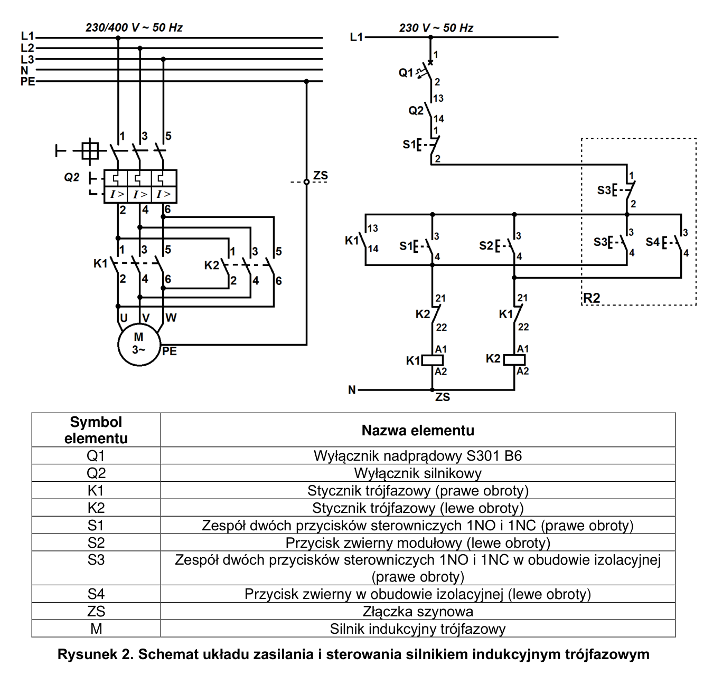
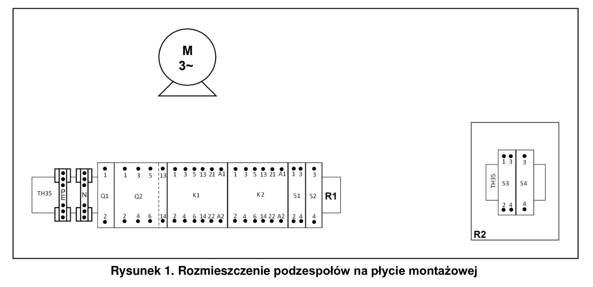

# ELE.02-108 — Prawo z podtrzymaniem, lewo chwilowe z dwóch miejsc

Dwa stanowiska sterowania: prawe obroty z podtrzymaniem K1, lewe wyłącznie podczas naciskania S2/S4. Q2 jest wyłącznikiem silnikowym ze stykiem pomocniczym NO, a Q1 B6 zabezpiecza sterowanie.

Źródło: `Zadanie-nr-8-silnik-3-fazowy-sterowany-z-2-miejsc-ele_02_108-shhsg9e(1).pdf`. Strony PDF: 1, 2. Numery liczone od początku pliku, a nie od drukowanego numeru arkusza.

## Schematy źródłowe

### moc-i-sterowanie — PDF 2

Oryginalny schemat / plan; nie zmieniono połączeń.

[Wersja SVG](../../../../public/knowledge/ele02/assets/schematy/ELE02_108_p2_moc-i-sterowanie.svg)

### rozmieszczenie — PDF 1

Oryginalny schemat / plan; nie zmieniono połączeń.

[Wersja SVG](../../../../public/knowledge/ele02/assets/schematy/ELE02_108_p1_rozmieszczenie.svg)

## Czego się nauczyć

- Pokazać różnicę pomiędzy podtrzymaniem a sterowaniem podczas trzymania.
- Rozpoznać niezależny STOP/START w S1 i S3.
- Powiązać NO Q2 z mechanizmem zabezpieczenia, bez fikcyjnej cewki Q2.

## Jak czytać ten schemat

1. Obwód główny: L1/L2/L3 przez Q2 do K1/K2 i M; K2 krzyżuje dwie fazy.
2. Sterowanie: Q1 → Q2 NO 13–14 → oba STOP-y NC w szeregu → wspólny punkt.
3. Gałąź K1: równolegle START S1, START S3 i NO K1; potem NC K2 i cewka K1.
4. Gałąź K2: równoległe S2/S4, potem NC K1 i cewka K2; nie ma własnego styku podtrzymania.
5. N obu cewek i PE silnika pozostają odrębnymi torami.

## Aparaty i osprzęt

| Element | Ilość | Parametry | Źródło / uwagi |
|---|---|---|---|
| Wyłącznik nadprądowy B6 1P | 1 | TH35, 6 A, charakterystyka B | Rys. 2, PDF 2;  |
| Wyłącznik silnikowy 3P | 1 | Regulowany zakres obejmujący potrzebne prądy silników; TH35; co najmniej jeden styk pomocniczy | Rys. 2, PDF 2;  |
| Styk pomocniczy wyłącznika silnikowego | 1 | NO co najmniej 1; zgodny mechanicznie z wyłącznikiem | Rys. 2, PDF 2;  |
| Stycznik trójfazowy | 2 | 3NO, co najmniej 8 A według arkuszy, cewka 230 V AC, TH35; właściwa kategoria pracy silnikowej | Rys. 2, PDF 2; Potrzebne NO 13–14 i NC 21–22; dobrać wyposażenie pomocnicze. |
| Zespół START/STOP na TH35 | 1 | DWA NIEZALEŻNE przyciski chwilowe: START NO i STOP NC; przykład źródłowy SVN391 | Rys. 2, PDF 2;  |
| Zespół START/STOP w obudowie R2 | 1 | DWA NIEZALEŻNE przyciski chwilowe NO i NC; odpowiednia obudowa / mocowanie | Rys. 2, PDF 2;  |
| Przycisk chwilowy NO na TH35 | 1 | Jeden niezależny NO, powrót sprężynowy | Rys. 2, PDF 2;  |
| Przycisk chwilowy NO w obudowie R2 | 1 | Jeden niezależny NO, powrót sprężynowy | Rys. 2, PDF 2;  |
| Obudowa przycisków R2 | 1 | Na niezależny START/STOP i osobny NO z zadania 108 | Rys. 1, PDF 1;  |
| Złączka szynowa toru N | 1 | Do 4 mm², dwie strony jednego toru, izolowana; TH35 | Rys. 2, PDF 2; Minimalny tor N odczytany z rysunku; liczba złączek do innych rozgałęzień zależy od realizacji. |
| Złączka szynowa PE | 1 | Do 4 mm², właściwe mocowanie i oznaczenie PE; TH35 | Rys. 2, PDF 2;  |
| Silnik trójfazowy 230/400 V | 1 | Źródło: brak mocy i tabliczki Y/Δ. Model: 3 kW, ukryta gwiazda, Q2 4,35 A — założenia. Zakup: odrębny wariant 230/400 V do 1,5 kW, bez potwierdzenia przez arkusz 108 | Rys. 2, PDF 2; W arkuszu nie ma tabliczki ani napięcia Y/Δ; 230/400 V w gwieździe to wariant zakupowy, nie wartość podana przez źródło. |

## Przewody i materiały

| Materiał | Ilość | Jednostka | Źródło / uwagi |
|---|---|---|---|
| OWY 5×2,5 mm² zasilania | nie podano | m | Treść / rys. 2, PDF 1–2; ilość nieznana; Brak długości w dostarczonym dwustronicowym PDF. Zmierzyć trasę i przewidzieć zapas. |
| OWY 4×2,5 mm² silnika | nie podano | m | Treść / rys. 2, PDF 1–2; ilość nieznana; Brak długości w dostarczonym dwustronicowym PDF. Zmierzyć trasę i przewidzieć zapas. |
| YLY 5×1,5 mm² do R2 | nie podano | m | Treść / rys. 2, PDF 1–2; ilość nieznana; Brak długości w dostarczonym dwustronicowym PDF. Zmierzyć trasę i przewidzieć zapas. |
| LgY 2,5 mm² — obwód główny | nie podano | m | Treść / rys. 2, PDF 1–2; ilość nieznana; Brak długości w dostarczonym dwustronicowym PDF. Zmierzyć trasę i przewidzieć zapas. |
| LgY 1,5 mm² — obwód sterowania | nie podano | m | Treść / rys. 2, PDF 1–2; ilość nieznana; Brak długości w dostarczonym dwustronicowym PDF. Zmierzyć trasę i przewidzieć zapas. |
| Szyna TH35 stanowiska R1 | nie podano | m | Treść, PDF 1; ilość nieznana; Szyna i zaciskanie żył wielodrutowych są wymagane; brak długości / liczby sztuk. Typ tulejki wynika z żyły i dopuszczeń zacisku. |
| Tulejki do żył 1,5 mm² — typ dopasować do zacisku | nie podano | szt. | Treść, PDF 1; ilość nieznana; Szyna i zaciskanie żył wielodrutowych są wymagane; brak długości / liczby sztuk. Typ tulejki wynika z żyły i dopuszczeń zacisku. |
| Tulejki do żył 2,5 mm² — typ dopasować do zacisku | nie podano | szt. | Treść, PDF 1; ilość nieznana; Szyna i zaciskanie żył wielodrutowych są wymagane; brak długości / liczby sztuk. Typ tulejki wynika z żyły i dopuszczeń zacisku. |

## Próby działania i pomiary

| Próba | Oczekiwany wynik |
|---|---|
| Naciśnij i zwolnij START S1 lub S3. | K1 pozostaje załączony dzięki własnemu NO; silnik pracuje w prawym kierunku. |
| Naciśnij dowolny STOP. | K1/K2 tracą zasilanie cewek. |
| Naciśnij S2 lub S4 przy spoczynku, a następnie zwolnij. | K2 pracuje tylko podczas trzymania przycisku. |
| Trzymaj oba lewe przyciski i zwolnij tylko jeden. | K2 pozostaje zasilany przez drugi; wyłącza się po zwolnieniu obu. |
| Podczas pracy K1 zażądaj K2 i odwrotnie. | NC przeciwnego stycznika blokuje drugą cewkę. |
| Wyłącz lub wyzwól Q2. | Wszystkie tory mocy i pomocniczy NO otwierają się; silnik staje. |
| Przy zwolnionych przyciskach odłącz i przywróć zasilanie. | Podtrzymanie nie odtwarza się samo; przy trzymanym żądaniu możliwy restart zgodnie z topologią. |

Są to opracowane wnioski z treści i rysunku. Nie dysponujemy oficjalnym kluczem oceniania. Rzeczywiste wskazania pomiarów trzeba wykonać i zapisać; model nie dostarcza wyników rzeczywistego stanowiska.

## Typowe pomyłki

- Dodanie podtrzymania K2, którego nie ma w zadaniu.
- Zamiana niezależnych STOP/START na jeden przycisk NO+NC.
- Użycie 6 A z Q1 jako nastawy Q2.
- Ukryte dodanie blokady mechanicznej zmieniającej wariant źródłowy.

## Weryfikacja przed pełnym ćwiczeniem

- Przesłany PDF ma tylko 2 strony: brak tabel wyposażenia, długości i tabliczki silnika. Ilości aparatów są odczytem rysunku; nastawy i długości nie są ustalonymi danymi egzaminu.
- W istniejącym JSON repo nastawa Q2 4,35 A i długości 0,4/1 m są jawnie dydaktycznymi założeniami.
- Rysunek nie definiuje kolejności zadziałania przy jednoczesnym żądaniu dwóch kierunków. Zachowanie solvera nie jest gwarancją rzeczywistych styczników.

## Przykład istniejący w aplikacji

[ELE02_108_stanowisko.json](../../../../examples/physical/ELE02_108_stanowisko.json) — kopia przykładu z repo, commit `9c4895a817b5f5869d17b3cf23a3e9695d49f6cf`. Walidacja bieżącego kontraktu: OK. Import: Moje projekty → Importuj JSON. Parametry dydaktyczne nie zastępują danych rzeczywistych urządzeń.
