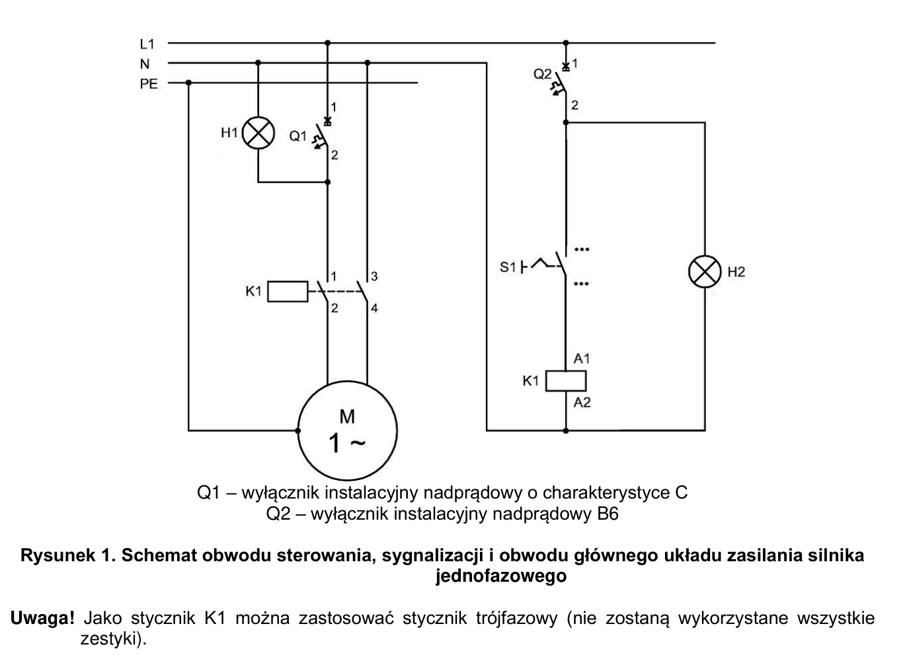
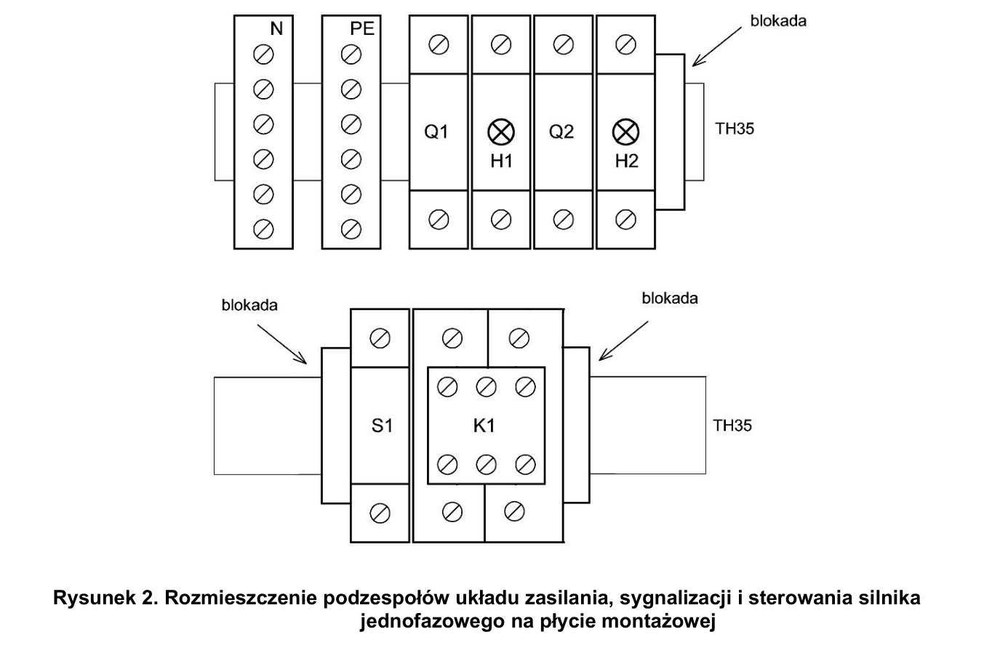

# ELE.02-109 — Silnik jednofazowy: pomiary i zmiana kierunku

Stycznik włącza jednofazowy silnik kondensatorowy; S1 utrzymuje pozycję. H1/H2 sygnalizują zasilanie gałęzi, nie oba stan obracania wału. Zmiana kierunku odbywa się przez przełączenie na tabliczce silnika zgodnie z jego instrukcją.

Źródło: `Zadanie-nr-9-silnik-1-fazowy-ele_02_109-mojxeoc.pdf`. Strony PDF: 1, 2, 3, 5, 6, 7, 8. Numery liczone od początku pliku, a nie od drukowanego numeru arkusza.

## Schematy źródłowe

### moc-i-sterowanie — PDF 2

**Oryginał do uzupełnienia. Nie jest to gotowe rozwiązanie.**

[Wersja SVG](../../../../public/knowledge/ele02/assets/schematy/ELE02_109_p2_moc-i-sterowanie.svg)

### rozmieszczenie — PDF 2

Oryginalny schemat / plan; nie zmieniono połączeń.

[Wersja SVG](../../../../public/knowledge/ele02/assets/schematy/ELE02_109_p2_rozmieszczenie.svg)

## Czego się nauczyć

- Rozpoznać uzwojenie główne U1/U2 i pomocnicze Z1/Z2.
- Oddzielić pomiar rezystancji uzwojeń od pomiaru izolacji.
- Wyjaśnić zmianę względnego podłączenia uzwojeń zamiast zamiany L/N.

## Jak czytać ten schemat

1. Q1 o charakterystyce C chroni obwód główny i zasila H1.
2. Q2 B6 zasila obwód sterowania oraz H2 przed S1.
3. S1 zasila cewkę K1; K1 przełącza dwa tory prowadzące do silnika.
4. Na tabliczce silnika numeracja i mostki wynikają z instrukcji konkretnego silnika; sam symbol M1 nie podaje konfiguracji kierunku.

## Aparaty i osprzęt

| Element | Ilość | Parametry | Źródło / uwagi |
|---|---|---|---|
| Silnik jednofazowy z kondensatorem | 1 | 230 V / 50 Hz, do 1,5 kW, faza pomocnicza kondensatorowa, dostępne U1/U2/Z1/Z2 | Tabela 2, PDF 5;  |
| Stycznik trójfazowy | 1 | 3NO, co najmniej 8 A według arkuszy, cewka 230 V AC, TH35; właściwa kategoria pracy silnikowej | Tabela 2, PDF 5; 3NO; wykorzystane dwa tory główne. |
| Wyłącznik nadprądowy B6 1P | 1 | TH35, 6 A, charakterystyka B | Tabela 2, PDF 5;  |
| Wyłącznik nadprądowy 1P, charakterystyka C | 1 | Prąd znamionowy odpowiedni do silnika jednofazowego 109 | Tabela 2, PDF 5;  |
| Przycisk / przełącznik bistabilny 1NO + 1NC | 1 | Dwa tory, jeden operator utrzymujący pozycję, TH35; przykład źródłowy SVN352 | Tabela 2, PDF 5;  |
| Lampka sygnalizacyjna zielona DIN | 2 | 230 V AC | Tabela 2, PDF 5; Źródło: dwie lampki 230 V, bez wskazania koloru; zielony jest propozycją wspólnego zakupu. |
| Blokada końcowa szyny | 3 | Do wybranej szyny TH35 | Tabela 2, PDF 5;  |
| Listwa N | 1 | Co najmniej 6 zacisków do 4 mm², izolowana, TH35 lub dostarczona z rozdzielnicą | Tabela 2, PDF 5;  |
| Listwa PE | 1 | Co najmniej 6 zacisków do 4 mm²; prawidłowe oznaczenie | Tabela 2, PDF 5;  |
| Wtyczka jednofazowa ze stykiem ochronnym | 1 | Do zasilania układu 109; odpowiednia do przewodu OWY 3×2,5 mm² | Tabela 3a, PDF 6;  |

## Przewody i materiały

| Materiał | Ilość | Jednostka | Źródło / uwagi |
|---|---|---|---|
| LY 0.75 mm² — czarny lub brązowy | 3 | m | Tabela materiałów / przygotowania, PDF 6; materiał zużywany;  |
| LY 0.75 mm² — niebieski | 2 | m | Tabela materiałów / przygotowania, PDF 6; materiał zużywany;  |
| LY 2.5 mm² — czarny lub brązowy | 1 | m | Tabela materiałów / przygotowania, PDF 6; materiał zużywany;  |
| LY 2.5 mm² — niebieski | 1 | m | Tabela materiałów / przygotowania, PDF 6; materiał zużywany;  |
| OWYżo 3×2.5 mm² | 3 | m | Tabela materiałów / przygotowania, PDF 6; materiał zużywany;  |
| Tulejki 0,75 | 20 | szt. | Tabela materiałów / przygotowania, PDF 6; materiał zużywany;  |
| Tulejki 2,5 | 20 | szt. | Tabela materiałów / przygotowania, PDF 6; materiał zużywany;  |
| Końcówki oczkowe dopasowane do śrub i przekroju | 3 | szt. | Tabela materiałów / przygotowania, PDF 6; materiał zużywany;  |
| Korytko grzebieniowe 25×25 | 2 | m | Tabela materiałów / przygotowania, PDF 7; przygotowanie stanowiska;  |
| Szyna TH35 | 0.4 | m | Tabela materiałów / przygotowania, PDF 7; przygotowanie stanowiska;  |
| Wkręty do grubości płyty | 16 | szt. | Tabela materiałów / przygotowania, PDF 7; przygotowanie stanowiska;  |

## Próby działania i pomiary

| Próba | Oczekiwany wynik |
|---|---|
| Załącz Q2 przy wyłączonym S1. | H2 może świecić mimo wyłączonego stycznika i nieruchomego silnika. |
| Przełącz S1 przy gotowym zasilaniu. | Cewka K1 i tory główne przechodzą w stan zgodny z pozycją S1. |
| Wykonaj pomiary U1–U2 i Z1–Z2 bez zasilania. | Wyniki wpisane osobno z jednostkami; nie zakładać równych rezystancji obu uzwojeń. |
| Zbadaj izolację według instrukcji przyrządu i przygotowania silnika. | Pomiar obejmuje U1–PE, Z1–PE i U1–Z1; nie zastępuje go zwykły test ciągłości. |
| Po odłączeniu napięcia wykonaj zmianę podłączenia według instrukcji silnika. | Po kolejnym uruchomieniu kierunek wału jest przeciwny, zapisany w tabeli. |

Są to opracowane wnioski z treści i rysunku. Nie dysponujemy oficjalnym kluczem oceniania. Rzeczywiste wskazania pomiarów trzeba wykonać i zapisać; model nie dostarcza wyników rzeczywistego stanowiska.

## Typowe pomyłki

- Zmiana kierunku przez zamianę L/N.
- Zamiana S1 na chwilowy START bez podtrzymania.
- Uznać H2 za lampkę pracy silnika.
- Pominięcie przygotowania kondensatora przed pomiarem izolacji.

## Weryfikacja przed pełnym ćwiczeniem

- Brak instrukcji konkretnego silnika i kondensatora. Nie przygotowano numerowanej tabeli mostków kierunku.
- Prąd zabezpieczenia C wynika z dobranego silnika, nie z wartości B6.
- Treść 109 wskazuje LgY, a tabela materiałów LY dla 0,75 i 2,5 mm². Zachowano nazwę LY w zestawieniu źródłowym; wybór przewodu do stanowiska trzeba uzgodnić z treścią i zaciskami, nie uznać obu typów za identyczne.

## Braki aplikacji dla dokładnego wariantu

- Silnik jednofazowy kondensatorowy z uzwojeniem pomocniczym
- Bistabilny przycisk 1NO+1NC
- Wyłącznik C 1P z dobranym prądem
- Pomiary uzwojeń i izolacji tego modelu

## Status projektu interaktywnego

Opis i schemat są przygotowane do bazy wiedzy. Nie wygenerowano niezweryfikowanego ProjectDocument dla tego zadania. Do uruchamiania potrzebny jest osobny projekt po uzupełnieniu wskazanych modeli i próbach działania.
