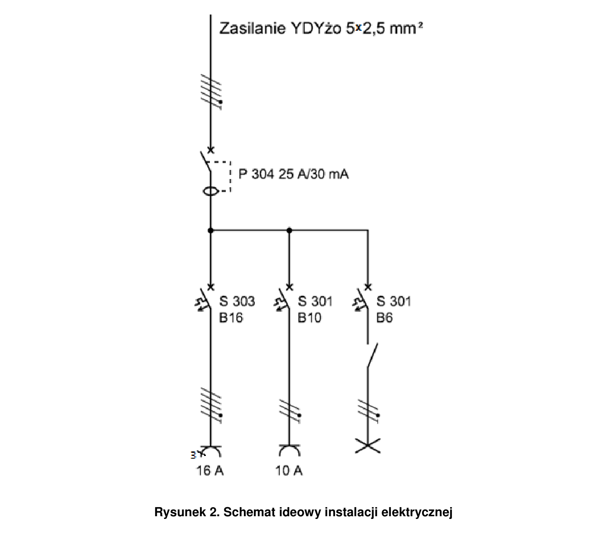
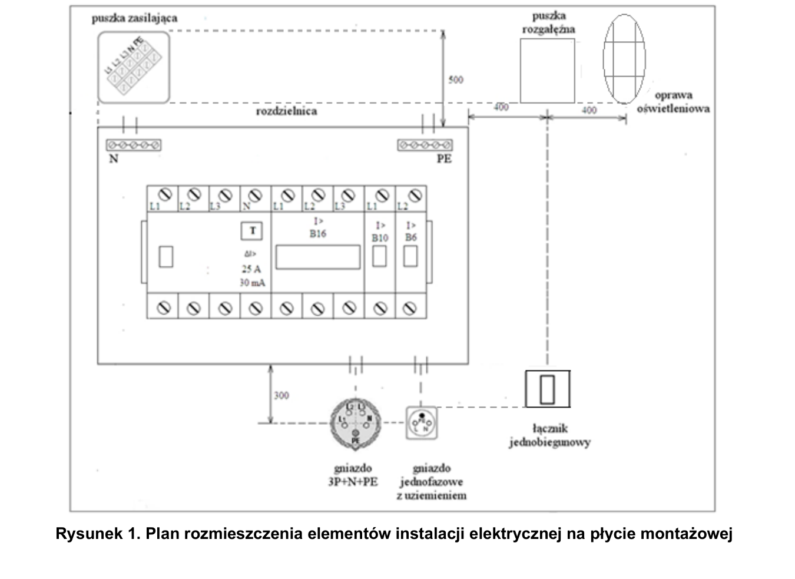

# ELE.02-110 — Gniazdo 3-fazowe, 1-fazowe i oświetlenie

Za RCD 4P są trzy niezależnie załączane gałęzie: B16 3P do gniazda CEE, B10 do gniazda jednofazowego i B6 z łącznikiem do oprawy. Pomiar rozróżnia napięcia fazowe i międzyfazowe.

Źródło: `Zadanie-nr-10-obwod-z-gniazdem-3-fazowym-1-fazowe-lampa-ele_02_110-pfucniz.pdf`. Strony PDF: 1, 2, 3, 5, 6, 8. Numery liczone od początku pliku, a nie od drukowanego numeru arkusza.

## Schematy źródłowe

### ideowy — PDF 2

Oryginalny schemat / plan; nie zmieniono połączeń.

[Wersja SVG](../../../../public/knowledge/ele02/assets/schematy/ELE02_110_p2_ideowy.svg)

### rozmieszczenie — PDF 1

Oryginalny schemat / plan; nie zmieniono połączeń.

[Wersja SVG](../../../../public/knowledge/ele02/assets/schematy/ELE02_110_p1_rozmieszczenie.svg)

## Czego się nauczyć

- Rozwinąć kreskę 5-żyłową do L1/L2/L3/N/PE.
- Rozróżnić 3P wyłącznika od 3P+N+PE gniazda.
- Wyjaśnić odczyty L–N i L–L w tym samym źródle.

## Jak czytać ten schemat

1. RCD4 obejmuje L1/L2/L3 i N; PE nie jest przełączany przez RCD.
2. Za B16 3P prowadź trzy fazy do CEE, N od listwy za RCD i PE od listwy ochronnej.
3. Gniazdo 1-fazowe i lampę przypisz do własnych MCB i zachowaj wspólny właściwy N.
4. Karta pomiarów dotyczy rzeczywistych par zacisków gniazda, nie tylko koloru przewodu na rysunku.

## Aparaty i osprzęt

| Element | Ilość | Parametry | Źródło / uwagi |
|---|---|---|---|
| RCD 4P | 1 | IΔn 30 mA; P304 25 A / 30 mA na schematach; 3 fazy + N | Tabela 2, PDF 5;  |
| Wyłącznik nadprądowy B6 1P | 1 | TH35, 6 A, charakterystyka B | Tabela 2, PDF 5;  |
| Wyłącznik nadprądowy B10 1P | 1 | TH35, 10 A, charakterystyka B | Tabela 2, PDF 5;  |
| Wyłącznik nadprądowy B16 3P | 1 | TH35, 16 A, 3 sprzężone tory, charakterystyka B | Tabela 2, PDF 5;  |
| Rozdzielnica natynkowa 12M | 1 | Szyna TH35; pojemność sprawdzona dla rzeczywistych szerokości urządzeń | Tabela 2, PDF 5;  |
| Gniazdo trójfazowe natynkowe CEE | 1 | 16 A, 3P+N+PE, napięcie do sieci 400 V | Tabela 2, PDF 6;  |
| Oprawa klasy I E27 z żarówką | 1 | Zacisk PE, źródło światła 40 W / 230 V | Tabela 2, PDF 6;  |
| Łącznik jednobiegunowy natynkowy | 1 | Utrzymywane ON/OFF, jeden tor | Tabela 3a, PDF 8;  |
| Gniazdo natynkowe 1-fazowe | 1 | 230 V, styk ochronny; typ i obciążalność do stanowiska | Tabela 3a, PDF 8;  |
| Dławnica do kabla 5×2,5 mm² | 2 | Zakres zacisku zgodny z rzeczywistą średnicą kabla i otworem obudowy | Tabela 3a, PDF 8;  |
| Dławnica do kabla 3×2,5 mm² | 1 | Zakres zgodny z rzeczywistą średnicą | Tabela 3a, PDF 8;  |
| Dławnica do kabla 3×1,5 mm² | 1 | Zakres zgodny z rzeczywistą średnicą | Tabela 3a, PDF 8;  |
| Puszka rozgałęźna natynkowa | 1 | Co najmniej 4 wyloty; do 110 | Tabela 3, PDF 8;  |

## Przewody i materiały

| Materiał | Ilość | Jednostka | Źródło / uwagi |
|---|---|---|---|
| YDYżo 5×2.5 mm² | 2 | m | Tabela materiałów / przygotowania, PDF 8; materiał zużywany;  |
| YDYżo 3×2.5 mm² | 1 | m | Tabela materiałów / przygotowania, PDF 8; materiał zużywany;  |
| YDYżo 3×1.5 mm² | 2 | m | Tabela materiałów / przygotowania, PDF 8; materiał zużywany;  |
| YDY 2×1.5 mm² | 1.5 | m | Tabela materiałów / przygotowania, PDF 8; materiał zużywany;  |
| LgY 2.5 mm² — czarny lub brązowy | 2 | m | Tabela materiałów / przygotowania, PDF 8; materiał zużywany;  |
| LgY 2.5 mm² — niebieski | 1 | m | Tabela materiałów / przygotowania, PDF 8; materiał zużywany;  |
| Tulejki 2,5/10 | 100 | szt. | Tabela materiałów / przygotowania, PDF 8; materiał zużywany;  |
| Uchwyty paskowe UP-22 | 20 | szt. | Tabela materiałów / przygotowania, PDF 8; materiał zużywany;  |
| Złączki 3-portowe do właściwego rodzaju żył | 5 | szt. | Tabela materiałów / przygotowania, PDF 8; materiał zużywany;  |
| Wkręty do grubości płyty | 40 | szt. | Tabela materiałów / przygotowania, PDF 8; materiał zużywany;  |

## Próby działania i pomiary

| Próba | Oczekiwany wynik |
|---|---|
| Wyłącz kolejno B16 3P, B10 i B6. | Znika zasilanie odpowiedniej gałęzi, pozostałe mogą pracować. |
| Zmierz L1/L2/L3 względem N oraz pary faz CEE. | Nominalnie około 230 V L–N i 400 V L–L; w obecnym modelu źródła 230 V fazowego około 398,4 V międzyfazowego. |
| Przełącz łącznik oświetlenia. | Zmienia się stan tylko oprawy. |
| Sprawdź PE wszystkich odbiorników. | Ciągłość PZ–PE rozdzielnicy–PE obu gniazd i oprawy. |

Są to opracowane wnioski z treści i rysunku. Nie dysponujemy oficjalnym kluczem oceniania. Rzeczywiste wskazania pomiarów trzeba wykonać i zapisać; model nie dostarcza wyników rzeczywistego stanowiska.

## Typowe pomyłki

- Pominięcie N w 5-pinowym gnieździe.
- Nazwanie C16 B16 przez samo oznaczenie urządzenia.
- Wpięcie PE przez RCD lub MCB.
- Zakup dławnic tylko po rozmiarze otworu, bez zakresu średnicy kabla.

## Weryfikacja przed pełnym ćwiczeniem

- Jedno gniazdo CEE może służyć także 116, o ile jest zgodne z przygotowaniem stanowiska.

## Braki aplikacji dla dokładnego wariantu

- RCD 4P
- MCB 3P o charakterystyce B
- Gniazdo CEE 3P+N+PE i jego punkty pomiarowe

## Status projektu interaktywnego

Opis i schemat są przygotowane do bazy wiedzy. Nie wygenerowano niezweryfikowanego ProjectDocument dla tego zadania. Do uruchamiania potrzebny jest osobny projekt po uzupełnieniu wskazanych modeli i próbach działania.
