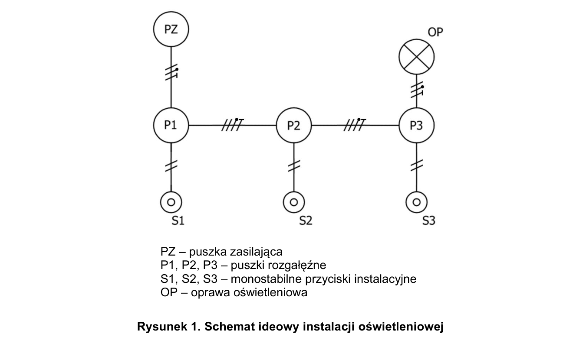
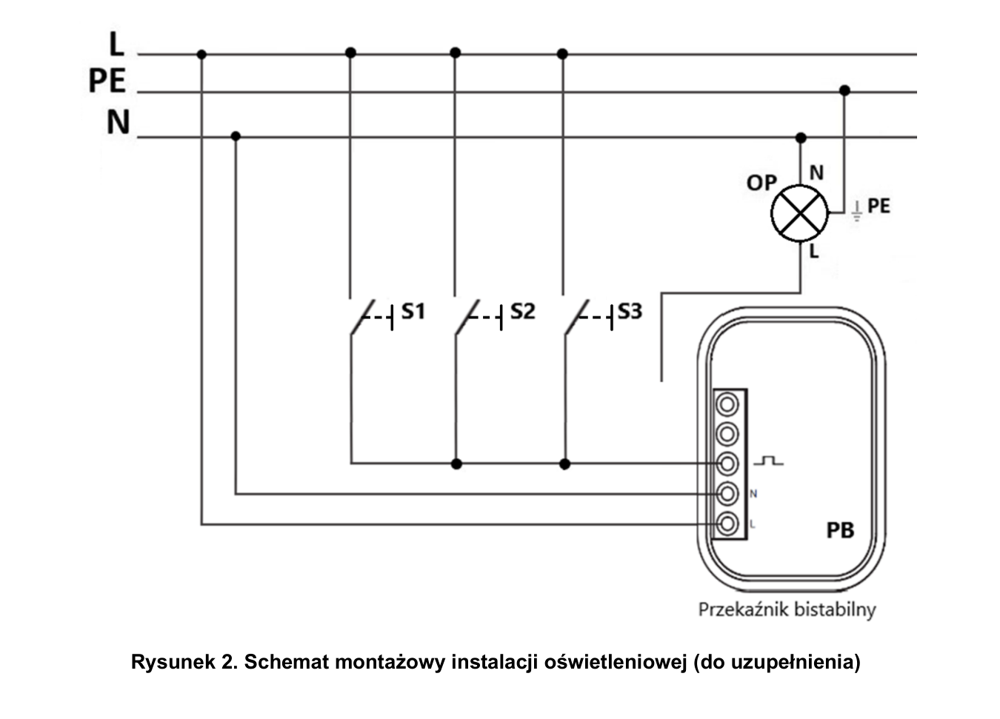
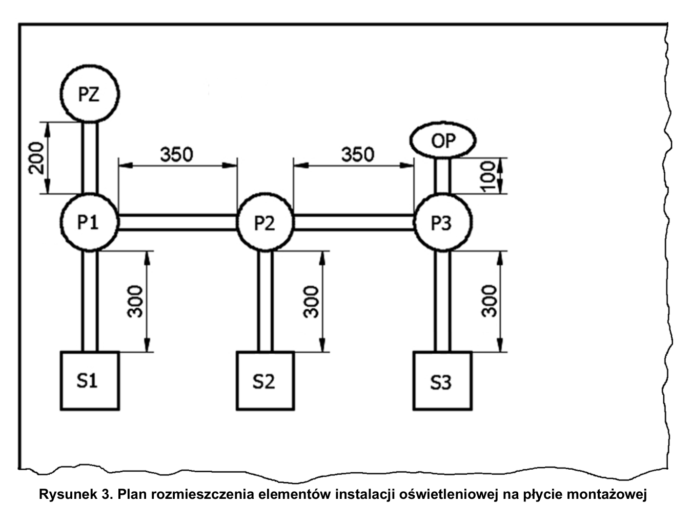

# ELE.02-112 — Bistabilny w puszce, trzy przyciski

Trzy przyciski równoległe sterują oprawą przez dopuszkowy przekaźnik PB umieszczony w P3. Schemat wymaga uzupełnienia z instrukcji; tabela podaje BIS-402 jako przykład.

Źródło: `ele_02_112-c7eifoe.pdf`. Strony PDF: 1, 2, 3, 4, 6, 7. Numery liczone od początku pliku, a nie od drukowanego numeru arkusza.

## Schematy źródłowe

### ideowy — PDF 1

Oryginalny schemat / plan; nie zmieniono połączeń.

[Wersja SVG](../../../../public/knowledge/ele02/assets/schematy/ELE02_112_p1_ideowy.svg)

### montazowy — PDF 2

**Oryginał do uzupełnienia. Nie jest to gotowe rozwiązanie.**

[Wersja SVG](../../../../public/knowledge/ele02/assets/schematy/ELE02_112_p2_montazowy.svg)

### rozmieszczenie — PDF 3

Oryginalny schemat / plan; nie zmieniono połączeń.

[Wersja SVG](../../../../public/knowledge/ele02/assets/schematy/ELE02_112_p3_rozmieszczenie.svg)

## Czego się nauczyć

- Rozpoznać różnicę pomiędzy puszką jako obudową a elektrycznym węzłem.
- Odczytać oddzielne L/N zasilania, wejście przycisku i styk COM/NO.
- Zinterpretować spodziewaną przerwę jako poprawny wynik w punktach kontrolnych.

## Jak czytać ten schemat

1. L idzie do wszystkich przycisków i stałego zasilania PB.
2. Wspólny powrót wszystkich NO trafia do wejścia wyzwalającego PB.
3. Dla BIS-402 E240610: L 6, N 5, wejście 4, COM 1, NO 2, NC 3; do oświetlenia używane COM i NO.
4. N lampy i PE lampy pozostają własnymi torami. Nie łącz wszystkich pięciu niezależnych torów płytki w jeden potencjał.

## Aparaty i osprzęt

| Element | Ilość | Parametry | Źródło / uwagi |
|---|---|---|---|
| Przekaźnik bistabilny dopuszkowy | 1 | 230 V, co najmniej 10 A, mieści się w zamkniętej puszce; przykład BIS-402 | Tabela 2, PDF 6;  |
| Płytka rozgałęźna | 1 | 5 niezależnych torów do 4 mm²; mieści się w zamkniętej puszce | Tabela 2, PDF 6;  |
| Oprawa klasy I E27 z żarówką | 1 | Zacisk PE, źródło światła 40 W / 230 V | Tabela 2, PDF 6;  |
| Przycisk dzwonkowy natynkowy | 3 | NO chwilowy, bez podświetlenia jako wspólny wariant zakupowy | Tabela 2, PDF 6;  |
| Puszka rozgałęźna natynkowa | 3 | 80×80 mm; pojemność dla aparatu, przewodów i złączek; pokrywa | Tabela 2, PDF 6;  |

## Przewody i materiały

| Materiał | Ilość | Jednostka | Źródło / uwagi |
|---|---|---|---|
| DY 1.5 mm² — czarny | 9 | m | Tabela materiałów / przygotowania, PDF 7; materiał zużywany;  |
| DY 1.5 mm² — niebieski | 3 | m | Tabela materiałów / przygotowania, PDF 7; materiał zużywany;  |
| DY 1.5 mm² — żółto-zielony | 2 | m | Tabela materiałów / przygotowania, PDF 7; materiał zużywany;  |
| Listwa 25×25 | 4 | m | Tabela materiałów / przygotowania, PDF 7; materiał zużywany;  |
| Wkręty do grubości płyty | 30 | szt. | Tabela materiałów / przygotowania, PDF 7; materiał zużywany;  |
| Złączka 2-portowa | 4 | szt. | Tabela materiałów / przygotowania, PDF 7; materiał zużywany;  |
| Złączka 3-portowa | 4 | szt. | Tabela materiałów / przygotowania, PDF 7; materiał zużywany;  |
| Złączka 4-portowa | 1 | szt. | Tabela materiałów / przygotowania, PDF 7; materiał zużywany;  |

## Próby działania i pomiary

| Próba | Oczekiwany wynik |
|---|---|
| Podaj impuls kolejno z S1, S2 i S3. | Każdy przycisk przełącza tę samą oprawę. |
| Sprawdź PZ:L–S1/S2/S3:L i zasilanie PB. | Ciągłość do właściwych zacisków zgodnie z tabelą. |
| Bez żarówki sprawdź PZ:L–OP:N oraz PZ:PE–OP:L. | Spodziewana przerwa przy prawidłowej instalacji; nie każdy pomiar ma wykazać ciągłość. |
| Sprawdź PZ:PE–OP:PE. | Ciągłość ochronna. |
| Zamknij puszkę P3. | Aparat i złączki mieszczą się bez zgniatania przewodów; ocena gabarytowa poza samą siecią połączeń. |

Są to opracowane wnioski z treści i rysunku. Nie dysponujemy oficjalnym kluczem oceniania. Rzeczywiste wskazania pomiarów trzeba wykonać i zapisać; model nie dostarcza wyników rzeczywistego stanowiska.

## Typowe pomyłki

- Użycie BIS-411 DIN zamiast dopuszkowego bez oznaczenia adaptacji.
- Brak fazy na COM separowanego styku.
- Przyciski podświetlane z BIS-402.
- Zwarcie niezależnych torów płytki.

## Weryfikacja przed pełnym ćwiczeniem

- Jeśli płytka nie mieści się w puszce, arkusz dopuszcza dodatkowe 2 złączki podwójne i 2 potrójne. To wariant zamiast płytki, nie obowiązkowy dodatkowy zakup.

## Braki aplikacji dla dokładnego wariantu

- BIS-402: dopuszkowy obrys i topologia
- Złączki 4-portowe / płytka niezależnych torów

## Instrukcje wykorzystane w opisie

- [F&F BIS-402, instrukcja E240610](https://www.fif.com.pl/pl/index.php?controller=attachment&id_attachment=68) — L 6, N 5, impuls 4, COM 1, NO 2, NC 3; brak przycisków podświetlanych.

## Status projektu interaktywnego

Opis i schemat są przygotowane do bazy wiedzy. Nie wygenerowano niezweryfikowanego ProjectDocument dla tego zadania. Do uruchamiania potrzebny jest osobny projekt po uzupełnieniu wskazanych modeli i próbach działania.
