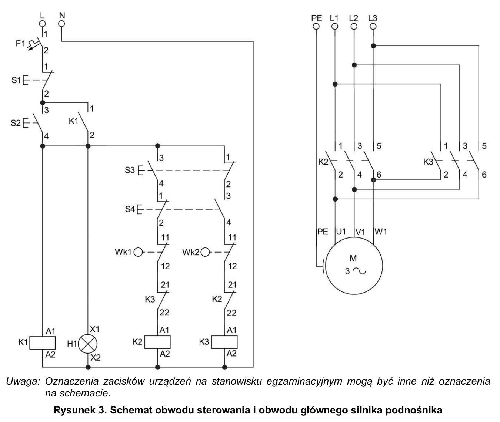
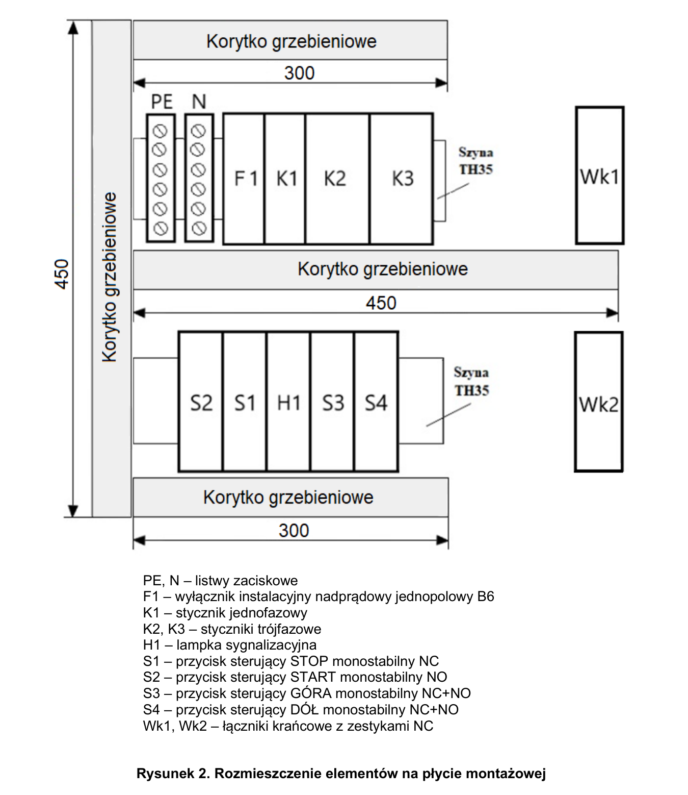

# ELE.02-113 — Podnośnik: gotowość, kierunki i krańcówki

K1 podtrzymuje gotowość po S2. K2 i K3 realizują dwa kierunki tylko podczas trzymania S3/S4. Każdy kierunek ma własną krańcówkę NC i blokadę NC przeciwnego stycznika. S3/S4 to pojedyncze przyciski ze wspólnym mechanizmem NO+NC.

Źródło: `ele_02_113-1n1aoek.pdf`. Strony PDF: 1, 2, 3, 4, 6, 7, 8. Numery liczone od początku pliku, a nie od drukowanego numeru arkusza.

## Schematy źródłowe

### moc-i-sterowanie — PDF 3

Oryginalny schemat / plan; nie zmieniono połączeń.

[Wersja SVG](../../../../public/knowledge/ele02/assets/schematy/ELE02_113_p3_moc-i-sterowanie.svg)

### rozmieszczenie — PDF 2

Oryginalny schemat / plan; nie zmieniono połączeń.

[Wersja SVG](../../../../public/knowledge/ele02/assets/schematy/ELE02_113_p2_rozmieszczenie.svg)

## Czego się nauczyć

- Oddzielić podtrzymanie gotowości K1 od braku podtrzymania kierunków K2/K3.
- Prześledzić zarówno NO własnego żądania, jak i NC drugiego przycisku.
- Odczytać funkcję krańcówki jako blokadę tylko odpowiedniego kierunku.

## Jak czytać ten schemat

1. S1 NC jest przed całym sterowaniem. S2 NO i styk podtrzymania K1 są równoległe.
2. Po gotowości K1/H1 gałąź K2 przechodzi przez NO S3, NC S4, NC Wk1 i NC K3.
3. Gałąź K3 przechodzi przez NC S3, NO S4, NC Wk2 i NC K2.
4. W obwodzie mocy K3 zamienia dwie fazy. Uzwojenia silnika 230/400 V są przygotowane w gwiazdę.
5. Cewki i styk K1 na rysunku to elementy jednego mechanizmu, nie trzy niezależne aparaty o nazwie K1.

## Aparaty i osprzęt

| Element | Ilość | Parametry | Źródło / uwagi |
|---|---|---|---|
| Silnik trójfazowy 230/400 V | 1 | Do 1,5 kW; tabliczka Δ230/Y400; w 113 fabrycznie przygotowany w gwiazdę | Tabela 2, PDF 6;  |
| Stycznik trójfazowy | 2 | 3NO, co najmniej 8 A według arkuszy, cewka 230 V AC, TH35; właściwa kategoria pracy silnikowej | Tabela 2, PDF 6;  |
| Blok pomocniczy do stycznika | 2 | 2NO + 2NC, pasujący do wybranego stycznika | Tabela 2, PDF 6;  |
| Stycznik pomocniczy / przekaźnik instalacyjny | 1 | 1NO + 1NC, min. 8 A według arkuszy, cewka 230 V AC, TH35 | Tabela 2, PDF 6;  |
| Wyłącznik nadprądowy B6 1P | 1 | TH35, 6 A, charakterystyka B | Tabela 2, PDF 6;  |
| Przycisk chwilowy NO na TH35 | 1 | Jeden niezależny NO, powrót sprężynowy | Tabela 2, PDF 6;  |
| Przycisk chwilowy NC na TH35 | 1 | Jeden NC, otwiera przy naciśnięciu | Tabela 2, PDF 6;  |
| Pojedynczy przycisk chwilowy 1NO + 1NC | 2 | Oba tory sterowane TYM SAMYM przyciskiem; TH35; przykład źródłowy SVN351 | Tabela 2, PDF 6;  |
| Łącznik krańcowy | 2 | 1NO + 1NC; 230 V; zaciski do żył 1,5 mm² | Tabela 2, PDF 6;  |
| Lampka sygnalizacyjna żółta DIN | 1 | 230 V AC | Tabela 2, PDF 6;  |
| Listwa N | 1 | Co najmniej 6 zacisków do 4 mm², izolowana, TH35 lub dostarczona z rozdzielnicą | Tabela 2, PDF 6;  |
| Listwa PE | 1 | Co najmniej 6 zacisków do 4 mm²; prawidłowe oznaczenie | Tabela 2, PDF 6;  |
| Wtyczka trójfazowa CEE | 1 | 16 A, 3P+N+PE, pasująca do gniazda | Tabela 2, PDF 6;  |

## Przewody i materiały

| Materiał | Ilość | Jednostka | Źródło / uwagi |
|---|---|---|---|
| DY 1.5 mm² — czarny | 18 | m | Tabela materiałów / przygotowania, PDF 7; materiał zużywany;  |
| DY 1.5 mm² — niebieski | 3 | m | Tabela materiałów / przygotowania, PDF 7; materiał zużywany;  |
| Korytko grzebieniowe 25×40 | 1.5 | m | Tabela materiałów / przygotowania, PDF 8; materiał zużywany; Długość obliczona z instrukcji cięcia: 2×300 + 2×450 mm. Tabela na PDF 7 podaje 1 szt. 25×40×200 — rozbieżność pozostaje w rejestrze; 1,5 m nie jest odpisem ilości z tabeli. |
| Wkręty do grubości płyty | 30 | szt. | Tabela materiałów / przygotowania, PDF 7; materiał zużywany;  |
| Wkręty szyn przygotowania | 4 | szt. | Tabela materiałów / przygotowania, PDF 7; przygotowanie stanowiska;  |
| OWYżo 4×1.5 mm² | 2 | m | Tabela materiałów / przygotowania, PDF 7; przygotowanie stanowiska;  |
| OWYżo 5×1.5 mm² | 2 | m | Tabela materiałów / przygotowania, PDF 7; przygotowanie stanowiska;  |
| Szyna TH35 | 0.6 | m | Tabela materiałów / przygotowania, PDF 7; przygotowanie stanowiska;  |
| Tulejki 1,5/12 | 14 | szt. | Tabela materiałów / przygotowania, PDF 7; przygotowanie stanowiska;  |
| Końcówki oczkowe dopasowane do silnika | 4 | szt. | Tabela materiałów / przygotowania, PDF 7; przygotowanie stanowiska;  |

## Próby działania i pomiary

| Próba | Oczekiwany wynik |
|---|---|
| Naciśnij S2 i zwolnij. | K1 utrzymuje gotowość, H1 świeci, silnik nie musi pracować. |
| Naciśnij i zwolnij S3, potem S4. | K2/K3 pracują tylko podczas trzymania właściwego przycisku. |
| Zadziałaj Wk1 podczas podnoszenia. | K2 odpadnie; przeciwny kierunek może być dostępny. |
| Zadziałaj Wk2 podczas opuszczania. | K3 odpadnie; sama krańcówka nie zrywa podtrzymania K1 według schematu. |
| Naciśnij jednocześnie S3 i S4 od spoczynku. | NC każdego przycisku blokuje żądanie drugiego; schemat nie nakazuje natychmiastowego uruchomienia. |
| Naciśnij S1. | Gaśnie gotowość i wyłączają się cewki kierunków; ponowne S2 jest potrzebne do gotowości. |

Są to opracowane wnioski z treści i rysunku. Nie dysponujemy oficjalnym kluczem oceniania. Rzeczywiste wskazania pomiarów trzeba wykonać i zapisać; model nie dostarcza wyników rzeczywistego stanowiska.

## Typowe pomyłki

- Dodanie podtrzymania K2/K3.
- Zamiana S3/S4 na przyciski wyłącznie NO.
- Wpisanie TAK w każdą linijkę protokołu: niektóre zdania testują błędne zachowanie.
- Uznanie, że Wk2 kasuje K1, mimo że nie leży w torze jego cewki.

## Weryfikacja przed pełnym ćwiczeniem

- Tabela materiałów podaje korytko 25×40×200, ale instrukcja cięcia wymaga łącznie 1500 mm. Zachować rozbieżność, przy zakupie odnieść się do rzeczywistych odcinków.
- Płyta 300×300 mm ma 0,09 m², lecz tabela wpisuje 0,9 m². Nie przenosić tej wartości do zakupów bez korekty jednostek.
- K1 ma cewkę 230 V; dostępny edu-relay jest 24 V DC i nie jest zamiennikiem 1:1.

## Braki aplikacji dla dokładnego wariantu

- Krańcówka 1NO+1NC
- Stycznik pomocniczy 230 V
- Blok 2NO+2NC
- Przyciski NO+NC chwilowe na DIN w źródłowym wariancie

## Status projektu interaktywnego

Opis i schemat są przygotowane do bazy wiedzy. Nie wygenerowano niezweryfikowanego ProjectDocument dla tego zadania. Do uruchamiania potrzebny jest osobny projekt po uzupełnieniu wskazanych modeli i próbach działania.
