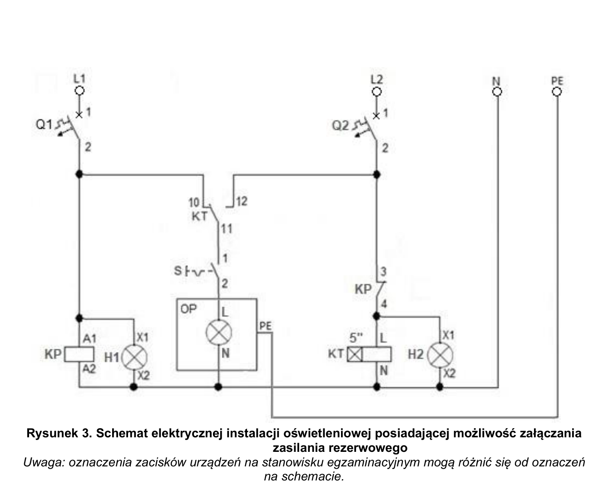
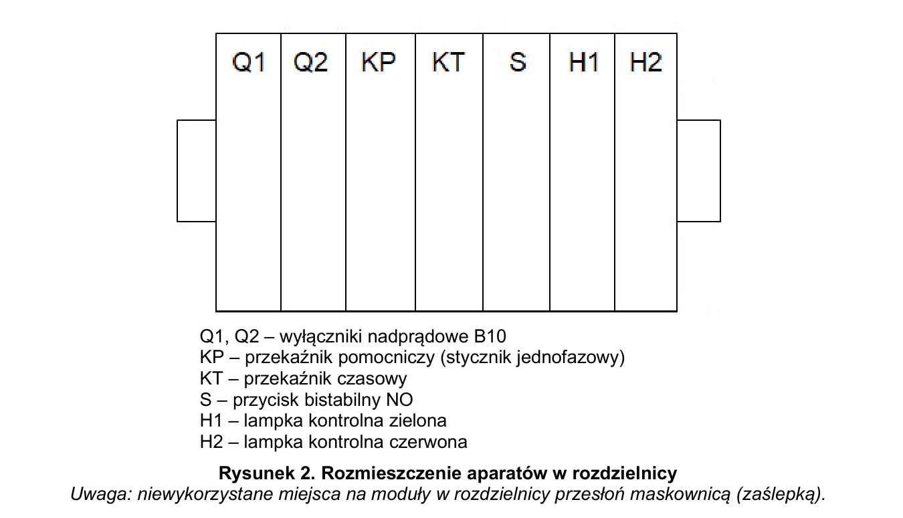

# ELE.02-114 — Oświetlenie: faza podstawowa i rezerwowa po 5 s

KP nadzoruje zasilanie L1; po jego zaniku tor NC dopuszcza zasilanie KT z L2. KT po 5 s przełącza tor oprawy na L2. Schemat, wymagany tryb czasowy i część kryteriów w karcie są niespójne — treść do publikacji z widocznym opisem, oceniane ćwiczenie zablokowane do rozstrzygnięcia.

Źródło: `ele_02_114-6qpfu03.pdf`. Strony PDF: 1, 2, 3, 4, 6, 7. Numery liczone od początku pliku, a nie od drukowanego numeru arkusza.

## Schematy źródłowe

### ideowy — PDF 2

Oryginalny schemat / plan; nie zmieniono połączeń.

[Wersja SVG](../../../../public/knowledge/ele02/assets/schematy/ELE02_114_p2_ideowy.svg)

### rozdzielnica — PDF 2

Oryginalny schemat / plan; nie zmieniono połączeń.

[Wersja SVG](../../../../public/knowledge/ele02/assets/schematy/ELE02_114_p2_rozdzielnica.svg)

## Czego się nauczyć

- Prześledzić separowane przełączenie COM między fazami bez zwarcia L1–L2.
- Rozpoznać tor NC KP mimo opisanych numerów 3/4.
- Porównać rysunek, tryb przekaźnika i kartę działania zamiast założyć ich zgodność.

## Jak czytać ten schemat

1. Przy L1 obecnej KP jest zasilony, H1 świeci, tor NC KP odcina KT oraz H2.
2. L1 dochodzi do spoczynkowego toru KT; po zamknięciu S oprawa ma zasilanie podstawowe.
3. Po zaniku L1 KP odpadnie; z L2 przez Q2 i NC KP zasilane są KT oraz H2.
4. Po 5 s opóźnionego załączenia KT przełącza COM na L2.
5. Powrót na L1 trzeba ustalić według instrukcji konkretnego KT; zwykłe opóźnienie załączenia nie definiuje opóźnienia powrotu.

## Aparaty i osprzęt

| Element | Ilość | Parametry | Źródło / uwagi |
|---|---|---|---|
| Stycznik pomocniczy / przekaźnik instalacyjny | 1 | 1NO + 1NC, min. 8 A według arkuszy, cewka 230 V AC, TH35 | Tabela 2, PDF 6;  |
| Wyłącznik nadprądowy B10 1P | 2 | TH35, 10 A, charakterystyka B | Tabela 2, PDF 6;  |
| Przycisk / przełącznik bistabilny 1NO + 1NC | 1 | Dwa tory, jeden operator utrzymujący pozycję, TH35; przykład źródłowy SVN352 | Tabela 2, PDF 6;  |
| Przekaźnik czasowy | 1 | 230 V AC, jeden separowany styk przełączny, opóźnione załączenie, nastawa 5 s | Tabela 2, PDF 6;  |
| Rozdzielnica natynkowa 12M | 1 | Szyna TH35; pojemność sprawdzona dla rzeczywistych szerokości urządzeń | Tabela 2, PDF 6;  |
| Oprawa klasy I E27 z żarówką | 1 | Zacisk PE, źródło światła 40 W / 230 V | Tabela 2, PDF 6;  |
| Lampka sygnalizacyjna zielona DIN | 1 | 230 V AC | Rys. 2/3, PDF 2; Lampka na schemacie; pominięta w tabeli urządzeń. |
| Lampka sygnalizacyjna czerwona DIN | 1 | 230 V AC | Rys. 2/3, PDF 2; Lampka na schemacie; pominięta w tabeli urządzeń. |

## Przewody i materiały

| Materiał | Ilość | Jednostka | Źródło / uwagi |
|---|---|---|---|
| LgY 1.5 mm² — czarny | 6 | m | Tabela materiałów / przygotowania, PDF 7; materiał zużywany;  |
| LgY 1.5 mm² — niebieski | 4 | m | Tabela materiałów / przygotowania, PDF 7; materiał zużywany;  |
| LgY 1.5 mm² — żółto-zielony | 3 | m | Tabela materiałów / przygotowania, PDF 7; materiał zużywany;  |
| Tulejki 1,5/10 | 40 | szt. | Tabela materiałów / przygotowania, PDF 7; materiał zużywany;  |
| Listwa 25×25 | 2 | m | Tabela materiałów / przygotowania, PDF 7; materiał zużywany;  |
| Wkręty do grubości płyty | 20 | szt. | Tabela materiałów / przygotowania, PDF 7; materiał zużywany;  |
| Zaślepka rozdzielnicy na 6 modułów | 1 | szt. | Tabela materiałów / przygotowania, PDF 7; materiał zużywany;  |

## Próby działania i pomiary

| Próba | Oczekiwany wynik |
|---|---|
| Sprawdź źródłowy rysunek z KP zasilonym z L1. | NC KP otwarty: KT/H2 bez zasilania. To jest sprzeczne z kryterium 2 karty. |
| Wyłącz Q1 przy gotowym Q2 i zamkniętym S. | KT/H2 dostają zasilanie; po 5 s pojawia się zasilanie oprawy z L2. |
| Przywróć Q1. | Wynik powrotu zależy od zweryfikowanego KT; nie przypisywać automatycznie 5 s. |
| Przełącz S. | Zgodnie ze schematem S przełącza oprawę, nie zasilanie H1/H2; porównać z kryterium 8. |
| Sprawdź brak wspólnego połączenia obu faz. | L1 i L2 nie są zwarte przez COM/styki KT w żadnym stanie. |

Są to opracowane wnioski z treści i rysunku. Nie dysponujemy oficjalnym kluczem oceniania. Rzeczywiste wskazania pomiarów trzeba wykonać i zapisać; model nie dostarcza wyników rzeczywistego stanowiska.

## Typowe pomyłki

- Zastosowanie NO KP zamiast NC na podstawie numerów 3/4.
- Zwieranie L1 i L2 w złączce.
- Uznanie wszystkich zdań karty za opis poprawnego układu.
- Symulowanie dwóch faz jako dwóch niezależnych źródeł bez wspólnego N i przesunięcia fazowego.

## Weryfikacja przed pełnym ćwiczeniem

- Kryterium 2 mówi o czerwonej lampce przy obu Q1/Q2 ON; rysunek umieszcza H2 za NC KP, więc przy aktywnej cewce KP H2 jest wyłączona.
- Kryterium 6 wymaga powrotu po 5 s; tabela sprzętu wymaga tylko opóźnionego załączania. Brak instrukcji KT rozstrzygającej funkcję powrotu.
- Kryterium 8 wiąże wciskanie S ze zmianą lampek kontrolnych; H1/H2 są przed S.
- Nie wiadomo, które linie są celowo fałszywymi zdaniami TAK/NIE, a które rozbieżnością źródła. Brak oficjalnego klucza.

## Braki aplikacji dla dokładnego wariantu

- Przekaźnik pomocniczy 230 V ze stykiem NC
- Zweryfikowany profil czasowy przełączenia/powrotu
- Kolorowa sygnalizacja

## Status projektu interaktywnego

Opis i schemat są przygotowane do bazy wiedzy. Nie wygenerowano niezweryfikowanego ProjectDocument dla tego zadania. Do uruchamiania potrzebny jest osobny projekt po uzupełnieniu wskazanych modeli i próbach działania.
