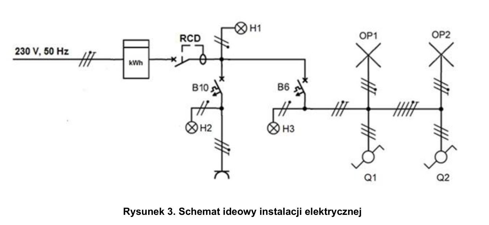
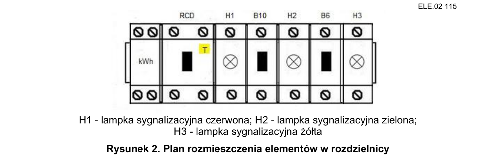
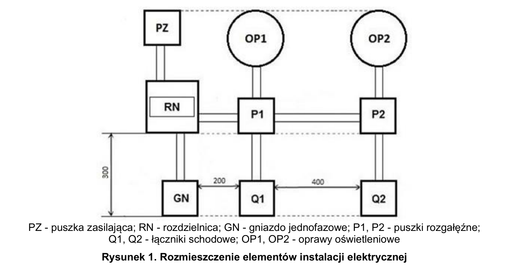

# ELE.02-115 — Licznik energii, schodowe, dwie oprawy i gniazdo

Licznik przed RCD mierzy cały układ. B10 zasila gniazdo, B6 dwie oprawy sterowane schodowo. Trzy lampki wskazują zasilanie za RCD oraz obu MCB. Instrukcja licznika jest dostarczana na stanowisku.

Źródło: `ele_02_115-iv3dsc5.pdf`. Strony PDF: 1, 2, 3, 5, 6, 7. Numery liczone od początku pliku, a nie od drukowanego numeru arkusza.

## Schematy źródłowe

### ideowy — PDF 2

Oryginalny schemat / plan; nie zmieniono połączeń.

[Wersja SVG](../../../../public/knowledge/ele02/assets/schematy/ELE02_115_p2_ideowy.svg)

### rozdzielnica — PDF 2

Oryginalny schemat / plan; nie zmieniono połączeń.

[Wersja SVG](../../../../public/knowledge/ele02/assets/schematy/ELE02_115_p2_rozdzielnica.svg)

### rozmieszczenie — PDF 1

Oryginalny schemat / plan; nie zmieniono połączeń.

[Wersja SVG](../../../../public/knowledge/ele02/assets/schematy/ELE02_115_p1_rozmieszczenie.svg)

## Czego się nauczyć

- Rozróżnić energię kWh, moc W i napięcie V.
- Wskazać mierzoną część instalacji na podstawie pozycji licznika.
- Wyjaśnić, dlaczego H3 świeci także przy wyłączonych oprawach.

## Jak czytać ten schemat

1. Najpierw odczytaj zaciski wejścia i wyjścia licznika z jego instrukcji.
2. Licznik jest przed RCD i dwiema gałęziami, więc przepływa przez niego energia obu odbiorów.
3. H1 czerwona jest za RCD, H2 zielona za B10, H3 żółta za B6 przed schodowymi.
4. Sterowanie opraw i drogi N/PE są takie jak w 101; nowy element to pomiar energii i dodatkowa sygnalizacja.

## Aparaty i osprzęt

| Element | Ilość | Parametry | Źródło / uwagi |
|---|---|---|---|
| RCD 2P | 1 | IΔn 30 mA; w schematach P302 25 A / 30 mA; napięcie 230 V | Tabela 2, PDF 5;  |
| Wyłącznik nadprądowy B6 1P | 1 | TH35, 6 A, charakterystyka B | Tabela 2, PDF 5;  |
| Wyłącznik nadprądowy B10 1P | 1 | TH35, 10 A, charakterystyka B | Tabela 2, PDF 5;  |
| Jednofazowy licznik energii | 1 | 230 V, montaż TH35, bezpośredni pomiar energii układu; instrukcja podłączenia | Tabela 2, PDF 5;  |
| Lampka sygnalizacyjna czerwona DIN | 1 | 230 V AC | Tabela 2, PDF 5;  |
| Lampka sygnalizacyjna zielona DIN | 1 | 230 V AC | Tabela 2, PDF 5;  |
| Lampka sygnalizacyjna żółta DIN | 1 | 230 V AC | Tabela 2, PDF 5;  |
| Rozdzielnica natynkowa 12M | 1 | Szyna TH35; pojemność sprawdzona dla rzeczywistych szerokości urządzeń | Tabela 2, PDF 5;  |
| Listwa N | 1 | Co najmniej 6 zacisków do 4 mm², izolowana, TH35 lub dostarczona z rozdzielnicą | Tabela 2, PDF 5; Niepotrzebna jako osobny zakup, jeśli jest w rozdzielnicy. |
| Listwa PE | 1 | Co najmniej 6 zacisków do 4 mm²; prawidłowe oznaczenie | Tabela 2, PDF 5; Jak wyżej. |
| Oprawa klasy I E27 z żarówką | 2 | Zacisk PE, źródło światła 40 W / 230 V | Tabela 2, PDF 5;  |
| Łącznik schodowy natynkowy | 2 | Jeden COM + dwa przełączane tory | Tabela 2, PDF 5;  |
| Gniazdo natynkowe 1-fazowe | 1 | 230 V, styk ochronny; typ i obciążalność do stanowiska | Tabela 2, PDF 6;  |
| Puszka rozgałęźna natynkowa | 2 | 80×80 mm; pojemność dla aparatu, przewodów i złączek; pokrywa | Tabela 2, PDF 6;  |

## Przewody i materiały

| Materiał | Ilość | Jednostka | Źródło / uwagi |
|---|---|---|---|
| DY 2.5 mm² — czarny lub brązowy | 1 | m | Tabela materiałów / przygotowania, PDF 6; materiał zużywany;  |
| DY 2.5 mm² — niebieski | 1 | m | Tabela materiałów / przygotowania, PDF 6; materiał zużywany;  |
| DY 2.5 mm² — żółto-zielony | 1 | m | Tabela materiałów / przygotowania, PDF 6; materiał zużywany;  |
| DY 1.5 mm² — czarny lub brązowy | 6 | m | Tabela materiałów / przygotowania, PDF 6; materiał zużywany;  |
| DY 1.5 mm² — niebieski | 2 | m | Tabela materiałów / przygotowania, PDF 6; materiał zużywany;  |
| DY 1.5 mm² — żółto-zielony | 2 | m | Tabela materiałów / przygotowania, PDF 6; materiał zużywany;  |
| LgY 2.5 mm² — czarny lub brązowy | 2 | m | Tabela materiałów / przygotowania, PDF 6; materiał zużywany;  |
| LgY 2.5 mm² — niebieski | 2 | m | Tabela materiałów / przygotowania, PDF 6; materiał zużywany;  |
| LgY 2.5 mm² — żółto-zielony | 1 | m | Tabela materiałów / przygotowania, PDF 6; materiał zużywany;  |
| Tulejki 2,5/10 | 35 | szt. | Tabela materiałów / przygotowania, PDF 6; materiał zużywany;  |
| Listwa 25×25 | 2 | m | Tabela materiałów / przygotowania, PDF 6; materiał zużywany;  |
| Wkręty do grubości płyty | 40 | szt. | Tabela materiałów / przygotowania, PDF 6; materiał zużywany;  |
| Złączka 3-portowa do żył wielodrutowych | 5 | szt. | Tabela materiałów / przygotowania, PDF 7; osprzęt wielokrotny;  |

## Próby działania i pomiary

| Próba | Oczekiwany wynik |
|---|---|
| Włącz RCD i użyj TEST. | H1 świeci po ON i gaśnie po wyzwoleniu RCD. |
| Wyłącz B10 przy włączonym B6. | H2 gaśnie, H3 i sterowanie opraw pozostają dostępne. |
| Przełącz dowolny schodowy w każdym stanie drugiego. | Obie oprawy przełączają się razem. |
| Zasil odbiornik próbny w gnieździe. | Licznik rejestruje przyrost energii; przy znanej mocy i czasie można porównać przyrost. |
| Zmierz drogi PE do gniazda i obu opraw. | Wyniki zapisane z jednostką przy wyłączonym zasilaniu. |

Są to opracowane wnioski z treści i rysunku. Nie dysponujemy oficjalnym kluczem oceniania. Rzeczywiste wskazania pomiarów trzeba wykonać i zapisać; model nie dostarcza wyników rzeczywistego stanowiska.

## Typowe pomyłki

- Podłączenie licznika tylko jako woltomierza równolegle.
- Pominięcie jednej gałęzi w mierzonym torze.
- Pomieszanie kolorów H1/H2/H3.
- Przyrost kWh liczony bez uwzględnienia czasu.

## Weryfikacja przed pełnym ćwiczeniem

- Brak modelu licznika; jego numery zacisków, liczba modułów i dopuszczalny prąd nie są ustalone przez ten arkusz.

## Braki aplikacji dla dokładnego wariantu

- Licznik energii i kumulowanie energii w czasie
- Czerwona/żółta lampka z odpowiednim opisem

## Status projektu interaktywnego

Opis i schemat są przygotowane do bazy wiedzy. Nie wygenerowano niezweryfikowanego ProjectDocument dla tego zadania. Do uruchamiania potrzebny jest osobny projekt po uzupełnieniu wskazanych modeli i próbach działania.
