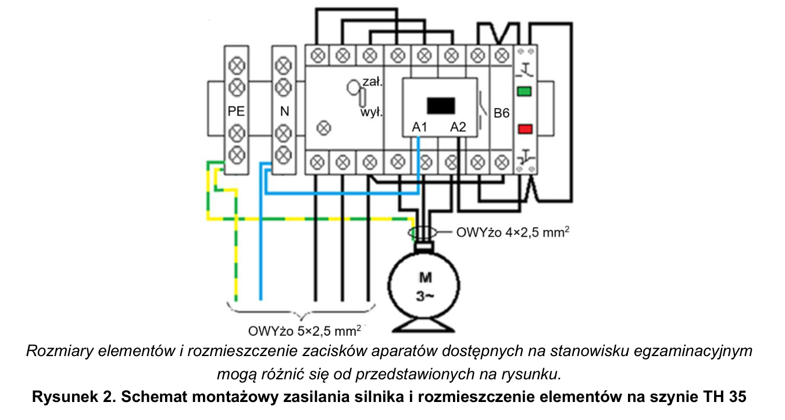
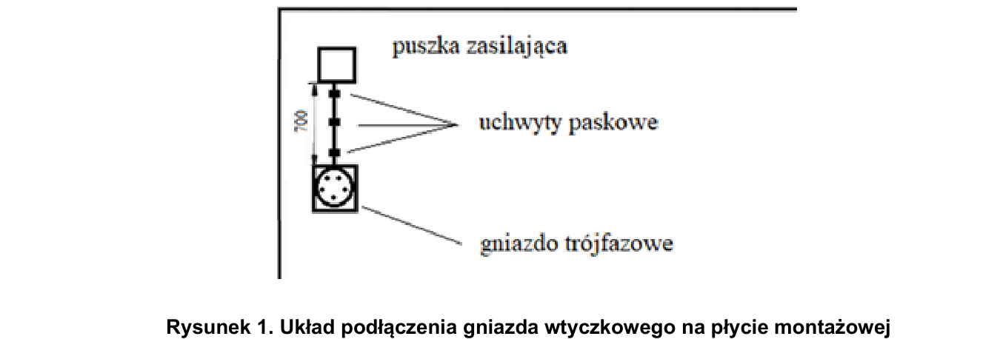

# ELE.02-116 — Pomiary silnika i zasilanie w trójkącie

Silnik 400/690 V jest łączony w trójkąt i sterowany przez wyłącznik silnikowy, stycznik oraz niezależny START/STOP. Zadanie wymaga pomiarów trzech uzwojeń i izolacji, odczytu prądów z tabliczki oraz zapisania nastaw ochrony.

Źródło: `ele_02_116-mmi4qgk.pdf`. Strony PDF: 1, 2, 4, 5, 6, 7. Numery liczone od początku pliku, a nie od drukowanego numeru arkusza.

## Schematy źródłowe

### montazowy — PDF 1

Oryginalny schemat / plan; nie zmieniono połączeń.

[Wersja SVG](../../../../public/knowledge/ele02/assets/schematy/ELE02_116_p1_montazowy.svg)

### gniazdo — PDF 1

Oryginalny schemat / plan; nie zmieniono połączeń.

[Wersja SVG](../../../../public/knowledge/ele02/assets/schematy/ELE02_116_p1_gniazdo.svg)

## Czego się nauczyć

- Odczytać Δ400/Y690 i prawidłową konfigurację przy zasilaniu 400 V.
- Rozpoznać każdą parę U1/U2, V1/V2, W1/W2 oraz oddzielić rezystancję uzwojeń od izolacji.
- Powiązać nastawę ochrony z rzeczywistą tabliczką i instrukcją zabezpieczenia.

## Jak czytać ten schemat

1. Rysunek montażowy pokazuje rzeczywiste prowadzenie przewodów, lecz zaznacza możliwość innego układu zacisków.
2. Trójkąt wymaga połączeń końca każdego uzwojenia z początkiem następnego zgodnie z tabliczką; nie kopiować pozycji śrub z innego motoru.
3. Układ sterowania ma osobny B6, mechanizm zabezpieczenia i podtrzymanie stycznika; niezależny STOP nie jest NC tego samego klawisza START.
4. A1/A2 cewki AC na rysunku nie należy traktować jako stałej polaryzacji plus/minus cewki DC.

## Aparaty i osprzęt

| Element | Ilość | Parametry | Źródło / uwagi |
|---|---|---|---|
| Silnik trójfazowy 400/690 V | 1 | Do 2,2 kW; tabliczka Δ400/Y690; sześć zacisków; montaż na łapach | Tabela 2, PDF 4;  |
| Stycznik trójfazowy | 1 | 3NO, co najmniej 8 A według arkuszy, cewka 230 V AC, TH35; właściwa kategoria pracy silnikowej | Tabela 2, PDF 4;  |
| Blok pomocniczy do stycznika | 1 | 2NO + 2NC, pasujący do wybranego stycznika | Tabela 2, PDF 4;  |
| Wyłącznik silnikowy 3P | 1 | Regulowany zakres obejmujący potrzebne prądy silników; TH35; co najmniej jeden styk pomocniczy | Tabela 2, PDF 4;  |
| Styk pomocniczy wyłącznika silnikowego | 1 | NO co najmniej 1; zgodny mechanicznie z wyłącznikiem | Tabela 2, PDF 4; Co najmniej jeden zestyk pomocniczy; może być w komplecie. |
| Wyłącznik nadprądowy B6 1P | 1 | TH35, 6 A, charakterystyka B | Tabela 2, PDF 4;  |
| Zespół START/STOP na TH35 | 1 | DWA NIEZALEŻNE przyciski chwilowe: START NO i STOP NC; przykład źródłowy SVN391 | Tabela 2, PDF 4;  |
| Listwa N | 1 | Co najmniej 6 zacisków do 4 mm², izolowana, TH35 lub dostarczona z rozdzielnicą | Tabela 2, PDF 5;  |
| Listwa PE | 1 | Co najmniej 6 zacisków do 4 mm²; prawidłowe oznaczenie | Tabela 2, PDF 5;  |
| Gniazdo trójfazowe natynkowe CEE | 1 | 16 A, 3P+N+PE, napięcie do sieci 400 V | Tabela 2, PDF 5;  |
| Wtyczka trójfazowa CEE | 1 | 16 A, 3P+N+PE, pasująca do gniazda | Tabela 2, PDF 5;  |

## Przewody i materiały

| Materiał | Ilość | Jednostka | Źródło / uwagi |
|---|---|---|---|
| YDYżo 5×2.5 mm² | 1 | m | Tabela materiałów / przygotowania, PDF 6; materiał zużywany;  |
| OWYżo 4×2.5 mm² | 1 | m | Tabela materiałów / przygotowania, PDF 6; materiał zużywany;  |
| LgY 2.5 mm² — czarny lub brązowy | 1.5 | m | Tabela materiałów / przygotowania, PDF 6; materiał zużywany;  |
| LgY 1 mm² — niebieski | 0.5 | m | Tabela materiałów / przygotowania, PDF 6; materiał zużywany;  |
| LgY 1 mm² — czarny lub brązowy | 1.5 | m | Tabela materiałów / przygotowania, PDF 6; materiał zużywany;  |
| Tulejki 2,5/10 | 15 | szt. | Tabela materiałów / przygotowania, PDF 6; materiał zużywany;  |
| Tulejki podwójne 2×2,5/10 | 2 | szt. | Tabela materiałów / przygotowania, PDF 6; materiał zużywany;  |
| Tulejki podwójne 2×1/10 | 3 | szt. | Tabela materiałów / przygotowania, PDF 6; materiał zużywany;  |
| Tulejki 1/10 | 15 | szt. | Tabela materiałów / przygotowania, PDF 6; materiał zużywany;  |
| Uchwyty UP-22 | 3 | szt. | Tabela materiałów / przygotowania, PDF 6; materiał zużywany;  |
| Końcówki oczkowe do zacisków silnika | 5 | szt. | Tabela materiałów / przygotowania, PDF 6; materiał zużywany;  |
| Wkręty do grubości płyty | 7 | szt. | Tabela materiałów / przygotowania, PDF 6; materiał zużywany;  |
| Szyna TH35 | 0.25 | m | Tabela materiałów / przygotowania, PDF 6; przygotowanie stanowiska;  |
| Wkręty szyny | 2 | szt. | Tabela materiałów / przygotowania, PDF 6; przygotowanie stanowiska;  |
| Tulejki 2,5/10 przygotowania | 10 | szt. | Tabela materiałów / przygotowania, PDF 6; przygotowanie stanowiska;  |
| OWYżo 5×2.5 mm² | 2 | m | Tabela materiałów / przygotowania, PDF 6; przygotowanie stanowiska;  |

## Próby działania i pomiary

| Próba | Oczekiwany wynik |
|---|---|
| Przed połączeniem uzwojeń zmierz trzy pary uzwojeń. | Wyniki osobno z jednostkami, bez zmyślonej wartości wspólnej. |
| Wykonaj badanie izolacji odpowiednio przygotowanego silnika. | Sprawdzane uzwojenia względem PE oraz między uzwojeniami; napięcie próby zgodne z wymaganiem/instrukcją. |
| Odczytaj tabliczkę i nastawy Y/Δ. | Wartości z konkretnej tabliczki, a nie z mocy ani fikcyjnej stałej 6 A. |
| Zmontuj Δ i sprawdź START/STOP. | Silnik startuje i daje się zatrzymać; zgodność mechanizmu pomocniczego z zabezpieczeniem. |
| Sprawdź prawy kierunek; w razie potrzeby korekta po odłączeniu. | Zmiana dwóch faz daje przeciwny kierunek w silniku trójfazowym. |

Są to opracowane wnioski z treści i rysunku. Nie dysponujemy oficjalnym kluczem oceniania. Rzeczywiste wskazania pomiarów trzeba wykonać i zapisać; model nie dostarcza wyników rzeczywistego stanowiska.

## Typowe pomyłki

- Użycie 230/400 V w trójkącie przy 400 V.
- Nastawa wyłącznika z przykładowego symulatora.
- Pomiary izolacji z pozostawionymi mostkami bez planu badania.
- Zamiana niezależnego START/STOP na wspólny przycisk NO+NC.

## Weryfikacja przed pełnym ćwiczeniem

- Wskazanie wyposażenia wymaga zakresu obejmującego 1,1 In. Nie jest to samodzielna uniwersalna reguła ustawiania rzeczywistego zabezpieczenia; potrzebne tabliczka, lokalizacja ochrony i instrukcja.
- Obecny edu-motor-six nosi profil 230Δ/400Y; do dokładnego wariantu trzeba dodać nowy profil 400Δ/690Y, nie zmieniać po cichu starej rewizji.

## Braki aplikacji dla dokładnego wariantu

- Silnik 400Δ/690Y: odrębny profil
- Blok 2NO+2NC
- Napięcia znamionowe i pomiary izolacji zgodne z nowym profilem

## Status projektu interaktywnego

Opis i schemat są przygotowane do bazy wiedzy. Nie wygenerowano niezweryfikowanego ProjectDocument dla tego zadania. Do uruchamiania potrzebny jest osobny projekt po uzupełnieniu wskazanych modeli i próbach działania.
