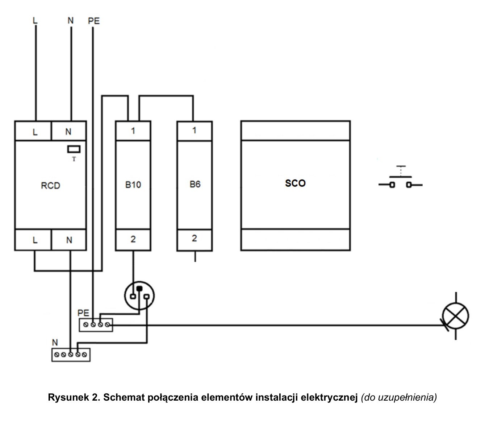
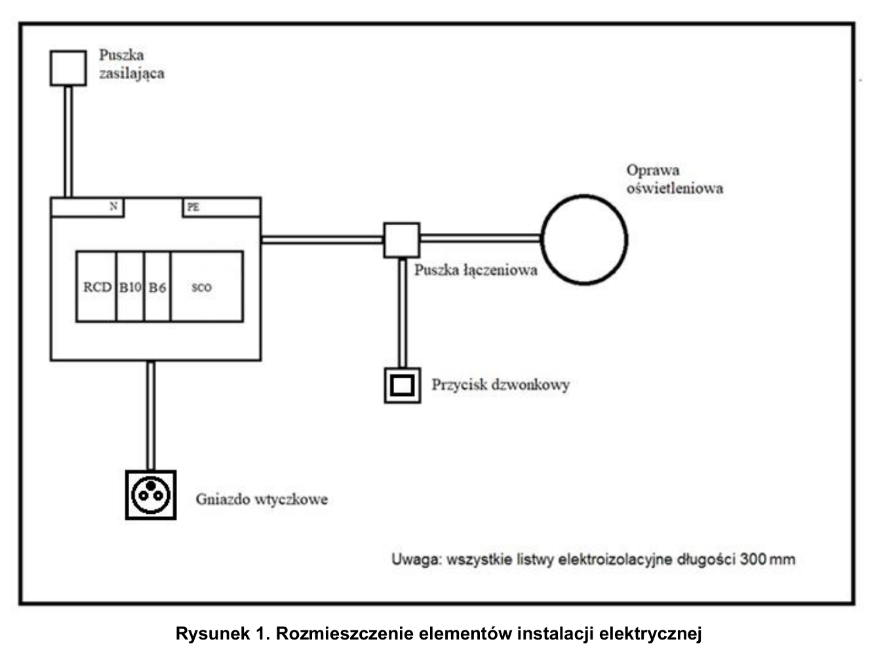

# ELE.02-117 — Ściemniacz sterowany przyciskiem i gniazdo

B6 chroni gałąź regulatora SCO i oprawy; B10 zasila osobne gniazdo. Krótki impuls przycisku przełącza oświetlenie, długie naciśnięcie reguluje jasność według instrukcji SCO-815 lub innego wybranego modelu.

Źródło: `ele_02_117-a45ks2p.pdf`. Strony PDF: 1, 2, 3, 5, 6, 7. Numery liczone od początku pliku, a nie od drukowanego numeru arkusza.

## Schematy źródłowe

### montazowy — PDF 2

**Oryginał do uzupełnienia. Nie jest to gotowe rozwiązanie.**

[Wersja SVG](../../../../public/knowledge/ele02/assets/schematy/ELE02_117_p2_montazowy.svg)

### rozmieszczenie — PDF 1

Oryginalny schemat / plan; nie zmieniono połączeń.

[Wersja SVG](../../../../public/knowledge/ele02/assets/schematy/ELE02_117_p1_rozmieszczenie.svg)

## Czego się nauczyć

- Rozróżnić przełączanie ON/OFF od regulacji mocy i jasności.
- Odczytać stałe zasilanie SCO, oddzielone wejście sterujące i wyjście do oprawy.
- Wybrać źródło światła zgodne z wybranym ściemniaczem.

## Jak czytać ten schemat

1. Niekompletny rysunek ma już gotową gałąź RCD–B10–gniazdo i tor PE.
2. Dla SCO-815 E230329: L z B6 do 10, N do 8 (7/9 są wspólnym N), wyjście 12 do L lampy.
3. Wariant sterowania 230 V: przycisk między L a 1, powrót wejścia 3 do N. To wejście jest odrębnym obwodem, nie stykiem wyjściowym.
4. N lampy wraca do N za RCD, PE lampy pozostaje ciągły niezależnie od jasności.

## Aparaty i osprzęt

| Element | Ilość | Parametry | Źródło / uwagi |
|---|---|---|---|
| RCD 2P | 1 | IΔn 30 mA; w schematach P302 25 A / 30 mA; napięcie 230 V | Tabela 2, PDF 5;  |
| Wyłącznik nadprądowy B6 1P | 1 | TH35, 6 A, charakterystyka B | Tabela 2, PDF 5;  |
| Wyłącznik nadprądowy B10 1P | 1 | TH35, 10 A, charakterystyka B | Tabela 2, PDF 5;  |
| Rozdzielnica natynkowa 8M | 1 | Szyna TH35, listwy N/PE i pokrywa odpowiednie do aparatury | Tabela 2, PDF 5;  |
| Oprawa klasy I E27 z żarówką | 1 | Zacisk PE, źródło światła 40 W / 230 V | Tabela 2, PDF 5;  |
| Przycisk dzwonkowy natynkowy | 1 | NO chwilowy, bez podświetlenia jako wspólny wariant zakupowy | Tabela 2, PDF 5;  |
| Ściemniacz DIN sterowany przyciskiem | 1 | 230 V, TH35, wejście przycisku chwilowego; przykład SCO-815 | Tabela 2, PDF 5;  |
| Gniazdo natynkowe 1-fazowe | 1 | 230 V, styk ochronny; typ i obciążalność do stanowiska | Tabela 2, PDF 5;  |
| Puszka rozgałęźna natynkowa | 1 | 80×80 mm; pojemność dla aparatu, przewodów i złączek; pokrywa | Tabela 2, PDF 5;  |

## Przewody i materiały

| Materiał | Ilość | Jednostka | Źródło / uwagi |
|---|---|---|---|
| LgY 2.5 mm² — czarny lub brązowy | 2 | m | Tabela materiałów / przygotowania, PDF 6; materiał zużywany;  |
| LgY 2.5 mm² — niebieski | 2 | m | Tabela materiałów / przygotowania, PDF 6; materiał zużywany;  |
| LgY 2.5 mm² — żółto-zielony | 2 | m | Tabela materiałów / przygotowania, PDF 6; materiał zużywany;  |
| DY 1.5 mm² — czarny lub brązowy | 4 | m | Tabela materiałów / przygotowania, PDF 6; materiał zużywany;  |
| DY 1.5 mm² — niebieski | 2 | m | Tabela materiałów / przygotowania, PDF 6; materiał zużywany;  |
| DY 1.5 mm² — żółto-zielony | 2 | m | Tabela materiałów / przygotowania, PDF 6; materiał zużywany;  |
| Tulejki na żyłę 2,5 | 25 | szt. | Tabela materiałów / przygotowania, PDF 6; materiał zużywany;  |
| Tulejki podwójne 2×2,5 | 2 | szt. | Tabela materiałów / przygotowania, PDF 6; materiał zużywany;  |
| Listwa 25×25 | 2 | m | Tabela materiałów / przygotowania, PDF 6; materiał zużywany;  |
| Wkręty do grubości płyty | 30 | szt. | Tabela materiałów / przygotowania, PDF 6; materiał zużywany;  |

## Próby działania i pomiary

| Próba | Oczekiwany wynik |
|---|---|
| Podaj kolejne krótkie naciśnięcia. | Lampa włącza się i wyłącza. |
| Przytrzymaj przycisk zgodnie z instrukcją SCO. | Jasność zmienia się; sprawdzić zmianę kierunku regulacji przy kolejnych przytrzymaniach według wybranej rewizji instrukcji. |
| Wyłącz tylko B6. | SCO i oprawa bez zasilania; gniazdo może działać przez B10. |
| Wyłącz tylko B10. | Gaśnie zasilanie gniazda, regulator działa przez B6. |
| Zmierz ciągłość PE oprawy i gniazda. | Dwie prawidłowe drogi ochronne. |

Są to opracowane wnioski z treści i rysunku. Nie dysponujemy oficjalnym kluczem oceniania. Rzeczywiste wskazania pomiarów trzeba wykonać i zapisać; model nie dostarcza wyników rzeczywistego stanowiska.

## Typowe pomyłki

- Przekaźnik zwykły opisany jako ściemniacz.
- Regulacja jasności samą zmianą powerW lampy zamiast modelem wyjścia SCO.
- LED bez potwierdzonej możliwości ściemniania.
- Pominięcie przewodu powrotnego izolowanego wejścia 3.

## Weryfikacja przed pełnym ćwiczeniem

- Strona produktu opisuje regulację w pętli; instrukcja E230329 precyzuje zmianę kierunku kolejnych długich naciśnięć. Dla modelu aplikacji przyjąć i zacytować konkretną instrukcję, zamiast łączyć opisy różnych wersji.

## Braki aplikacji dla dokładnego wariantu

- Ściemniacz z krótkim/długim naciśnięciem
- Model jasności i obciążenia; odpowiedni zakres pomiarów

## Instrukcje wykorzystane w opisie

- [F&F SCO-815, instrukcja E230329](https://www.fif.com.pl/pl/index.php?controller=attachment&id_attachment=121) — L 10, N 7/8/9, wyjście 12, wejście sterujące 1–3; krótkie i długie naciśnięcie.

## Status projektu interaktywnego

Opis i schemat są przygotowane do bazy wiedzy. Nie wygenerowano niezweryfikowanego ProjectDocument dla tego zadania. Do uruchamiania potrzebny jest osobny projekt po uzupełnieniu wskazanych modeli i próbach działania.
