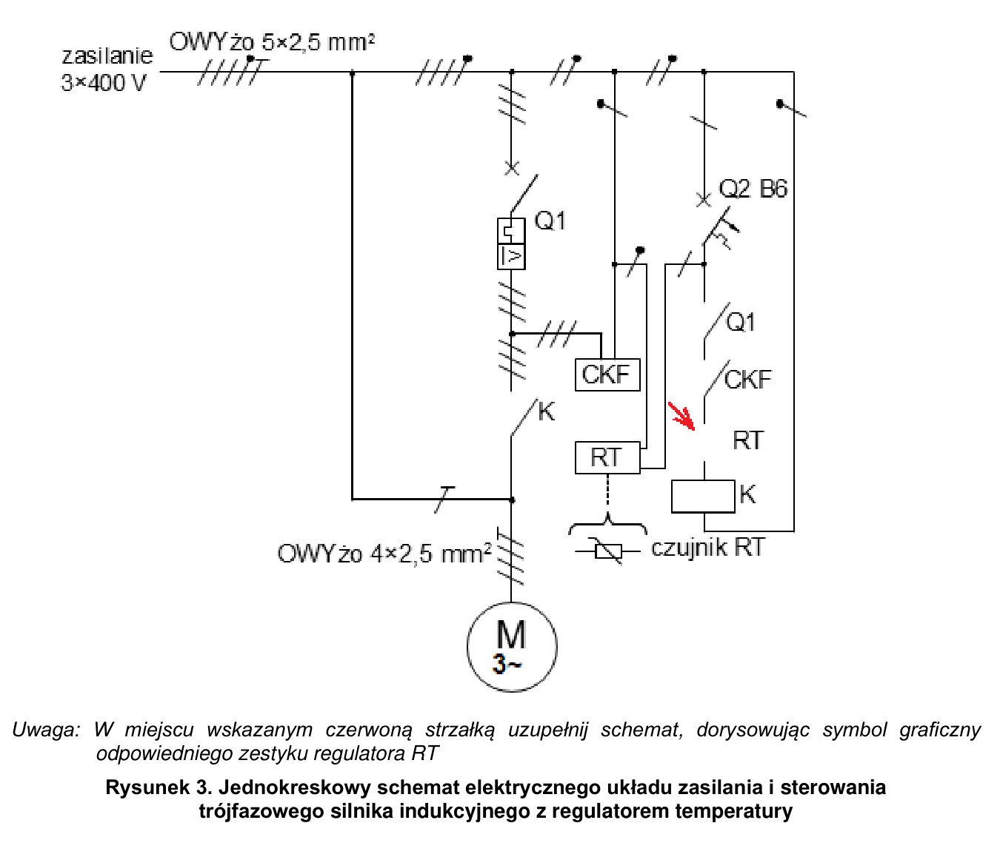
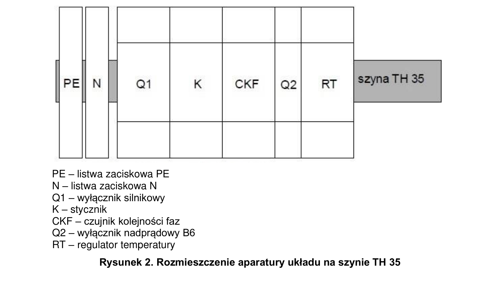
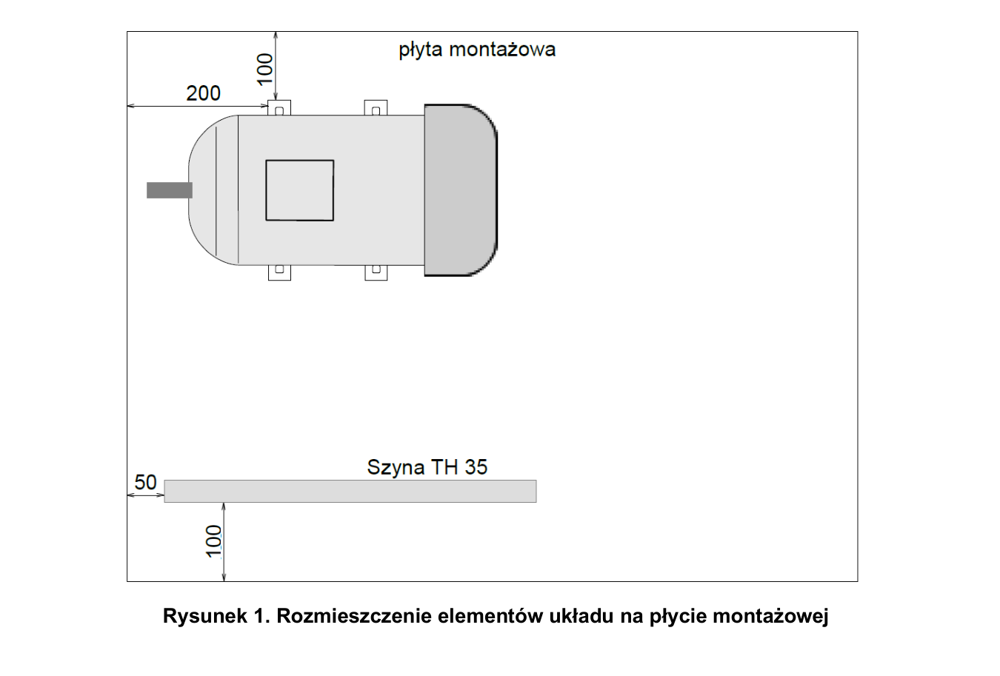

# ELE.02-L01 — Silnik z regulatorem temperatury i kontrolą faz

Silnik 400/690 V połączony w trójkąt załącza się dla temperatury powyżej nastawy 28°C. Sterowanie przechodzi przez styk wyłącznika silnikowego, pozwolenie czujnika kolejności faz CKF i właściwy styk regulatora RT.

Źródło: `ele_02_L01-61435kp.pdf`. Strony PDF: 1, 2, 3, 4, 6, 7, 8. Numery liczone od początku pliku, a nie od drukowanego numeru arkusza.

## Schematy źródłowe

### jednokreskowy — PDF 3

**Oryginał do uzupełnienia. Nie jest to gotowe rozwiązanie.**

[Wersja SVG](../../../../public/knowledge/ele02/assets/schematy/ELE02_L01_p3_jednokreskowy.svg)

### rozdzielnica — PDF 2

Oryginalny schemat / plan; nie zmieniono połączeń.

[Wersja SVG](../../../../public/knowledge/ele02/assets/schematy/ELE02_L01_p2_rozdzielnica.svg)

### rozmieszczenie — PDF 2

Oryginalny schemat / plan; nie zmieniono połączeń.

[Wersja SVG](../../../../public/knowledge/ele02/assets/schematy/ELE02_L01_p2_rozmieszczenie.svg)

## Czego się nauczyć

- Odczytać układ jednokreskowy z rozdzielonymi funkcjami mocy, zabezpieczenia, kontroli faz i temperatury.
- Wybrać styk wentylacji zamiast ogrzewania na podstawie instrukcji RT.
- Rozumieć histerezę i stan odniesienia NO/NC niezależnie od progu temperatury.

## Jak czytać ten schemat

1. Obwód mocy: trzy fazy przez Q1 i stycznik K do M; PE pozostaje bezpośredni.
2. Tor cewki K ma szeregowo Q1, CKF i styk RT uzupełniany w miejscu czerwonej strzałki.
3. Dla RT-820 E211220 COM to 2; powyżej progu tor 2–8 jest zamknięty. Producent opisuje 8 jako NC w stanie biernym; nie zgadywać tylko z hasła „temperatura wyższa = NO”.
4. Zasilanie i sondę RT podłącz zgodnie z instrukcją wybranego modelu; do silnika idą trzy fazy i PE, nie N.

## Aparaty i osprzęt

| Element | Ilość | Parametry | Źródło / uwagi |
|---|---|---|---|
| Silnik trójfazowy 400/690 V | 1 | Do 2,2 kW; tabliczka Δ400/Y690; sześć zacisków; montaż na łapach | Tabela 2, PDF 6;  |
| Stycznik trójfazowy | 1 | 3NO, co najmniej 8 A według arkuszy, cewka 230 V AC, TH35; właściwa kategoria pracy silnikowej | Tabela 2, PDF 6;  |
| Wyłącznik silnikowy 3P | 1 | Regulowany zakres obejmujący potrzebne prądy silników; TH35; co najmniej jeden styk pomocniczy | Tabela 2, PDF 6;  |
| Styk pomocniczy wyłącznika silnikowego | 1 | NO co najmniej 1; zgodny mechanicznie z wyłącznikiem | Tabela 2, PDF 6; Co najmniej jeden styk może być w komplecie. |
| Wyłącznik nadprądowy B6 1P | 1 | TH35, 6 A, charakterystyka B | Tabela 2, PDF 6;  |
| Czujnik kolejności faz | 1 | TH35; napięcie odpowiednie do 3×400 V; styk pozwolenia w obwodzie sterowania | Tabela 2, PDF 6;  |
| Regulator temperatury z sondą | 1 | 230 V, TH35, styk przełączny, zakres obejmuje 4–30°C; nastawa 28°C; przykład RT-820 | Tabela 2, PDF 6; Regulator i pasująca sonda tworzą jeden komplet zakupowy; w źródle to pozycje 6 i 7. |
| Listwa N | 1 | Co najmniej 6 zacisków do 4 mm², izolowana, TH35 lub dostarczona z rozdzielnicą | Tabela 2, PDF 6;  |
| Listwa PE | 1 | Co najmniej 6 zacisków do 4 mm²; prawidłowe oznaczenie | Tabela 2, PDF 6;  |
| Wtyczka trójfazowa CEE | 1 | 16 A, 3P+N+PE, pasująca do gniazda | Tabela 2, PDF 6;  |

## Przewody i materiały

| Materiał | Ilość | Jednostka | Źródło / uwagi |
|---|---|---|---|
| LgY 1.5 mm² — czarny, szary lub brązowy | 2.5 | m | Tabela materiałów / przygotowania, PDF 7; materiał zużywany;  |
| LgY 1.5 mm² — niebieski | 1 | m | Tabela materiałów / przygotowania, PDF 7; materiał zużywany;  |
| LgY 2.5 mm² — czarny, szary lub brązowy | 1 | m | Tabela materiałów / przygotowania, PDF 7; materiał zużywany;  |
| OWYżo 4×2.5 mm² | 1 | m | Tabela materiałów / przygotowania, PDF 7; materiał zużywany; Bez niebieskiej żyły według tabeli źródła. |
| Tulejki 1,5 | 30 | szt. | Tabela materiałów / przygotowania, PDF 7; materiał zużywany;  |
| Tulejki 2,5 | 15 | szt. | Tabela materiałów / przygotowania, PDF 7; materiał zużywany;  |
| Tulejki podwójne 2×2,5 | 5 | szt. | Tabela materiałów / przygotowania, PDF 7; materiał zużywany;  |
| Tulejki podwójne 2×1,5 | 2 | szt. | Tabela materiałów / przygotowania, PDF 7; materiał zużywany;  |
| Końcówki oczkowe 2,5 do silnika | 5 | szt. | Tabela materiałów / przygotowania, PDF 7; materiał zużywany;  |
| Wkręty szyny | 2 | szt. | Tabela materiałów / przygotowania, PDF 7; materiał zużywany;  |
| OWYżo 5×2.5 mm² | 1.5 | m | Tabela materiałów / przygotowania, PDF 7; przygotowanie stanowiska;  |
| Tulejki 2,5 przygotowania | 10 | szt. | Tabela materiałów / przygotowania, PDF 7; przygotowanie stanowiska;  |
| Szyna TH35 | 0.5 | m | Tabela materiałów / przygotowania, PDF 6; przygotowanie stanowiska;  |

## Próby działania i pomiary

| Próba | Oczekiwany wynik |
|---|---|
| Ustaw 28°C i prawidłową kolejność faz; ogrzej sondę ponad próg. | Styk wentylacyjny RT dopuszcza cewkę K i silnik rusza. |
| Ochłodź sondę poniżej progu przełączenia uwzględniającego histerezę. | K odpadnie i silnik się zatrzyma. |
| Otwórz Q1 lub odbierz pozwolenie CKF. | Żądanie temperatury nie wystarcza do uruchomienia. |
| Sprawdź kierunek i ciągłość PE wtyczka–silnik. | Prawy kierunek i pomiar ochronny zapisany z jednostką i modelem przyrządu. |

Są to opracowane wnioski z treści i rysunku. Nie dysponujemy oficjalnym kluczem oceniania. Rzeczywiste wskazania pomiarów trzeba wykonać i zapisać; model nie dostarcza wyników rzeczywistego stanowiska.

## Typowe pomyłki

- Wybór toru grzania 2–1 zamiast toru wentylacji 2–8 dla wskazanego RT-820.
- Pomijanie CKF lub styku ochrony, aby przykład się uruchomił.
- Trójkąt przy 400 V na silniku 230/400 V.
- Porównanie temperatury do dokładnie 28,000°C bez histerezy i tolerancji.

## Weryfikacja przed pełnym ćwiczeniem

- Brak modelu CKF w źródle; jego zaciski i dodatkowe warunki kontroli muszą wynikać z dobranej instrukcji.
- Instrukcja regulatora i tabliczka silnika pozostają obowiązkowym kontekstem dokładnego wykonania.

## Braki aplikacji dla dokładnego wariantu

- Regulator temperatury z sondą i histerezą
- Czujnik kolejności faz ze stykiem pozwolenia
- Profil silnika 400Δ/690Y

## Instrukcje wykorzystane w opisie

- [F&F RT-820, instrukcja E211220](https://www.fif.com.pl/pl/index.php?controller=attachment&id_attachment=767) — L 3, N 4, sonda 5–6, COM 2, NO 1, NC 8; dla wentylacji powyżej progu zamknięty tor 2–8.

## Status projektu interaktywnego

Opis i schemat są przygotowane do bazy wiedzy. Nie wygenerowano niezweryfikowanego ProjectDocument dla tego zadania. Do uruchamiania potrzebny jest osobny projekt po uzupełnieniu wskazanych modeli i próbach działania.
