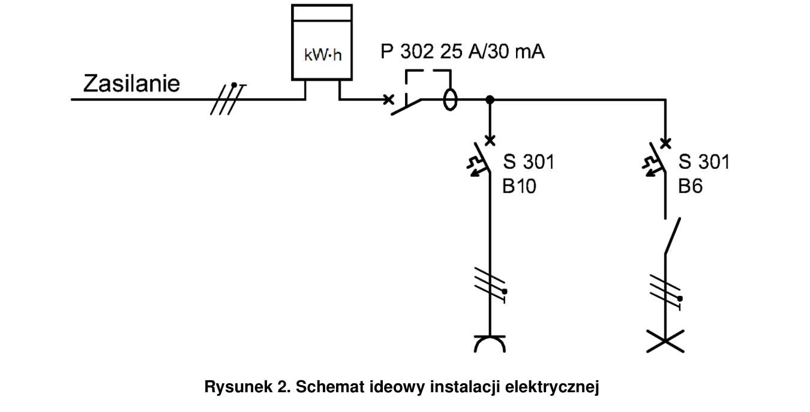
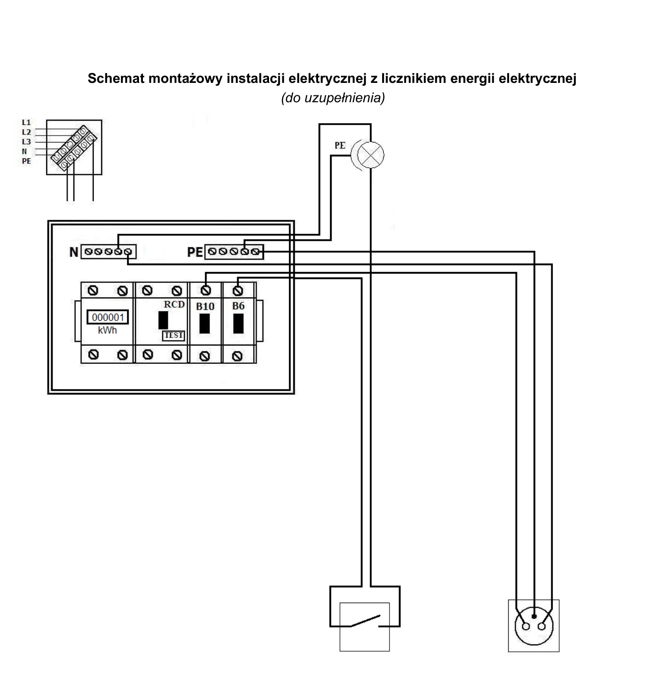
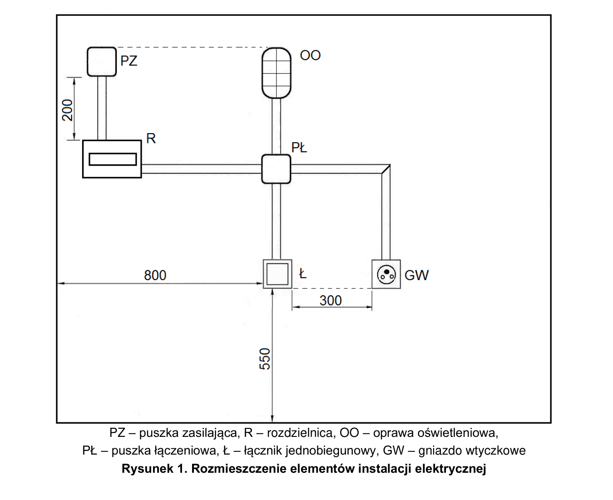

# ELE.02-L02 — Licznik energii, gniazdo i jeden łącznik

Licznik jednofazowy przed RCD mierzy energię obwodu gniazda B10 i oprawy B6 sterowanej jednym łącznikiem. Schemat montażowy należy uzupełnić o podłączenie i oznaczenia zacisków dobranego licznika.

Źródło: `ele_02_L02-gmbx8jw.pdf`. Strony PDF: 1, 2, 3, 4, 6, 7, 8. Numery liczone od początku pliku, a nie od drukowanego numeru arkusza.

## Schematy źródłowe

### ideowy — PDF 2

Oryginalny schemat / plan; nie zmieniono połączeń.

[Wersja SVG](../../../../public/knowledge/ele02/assets/schematy/ELE02_L02_p2_ideowy.svg)

### montazowy — PDF 3

**Oryginał do uzupełnienia. Nie jest to gotowe rozwiązanie.**

[Wersja SVG](../../../../public/knowledge/ele02/assets/schematy/ELE02_L02_p3_montazowy.svg)

### rozmieszczenie — PDF 2

Oryginalny schemat / plan; nie zmieniono połączeń.

[Wersja SVG](../../../../public/knowledge/ele02/assets/schematy/ELE02_L02_p2_rozmieszczenie.svg)

## Czego się nauczyć

- Rozpoznać fizyczne wejście i wyjście licznika na podstawie instrukcji.
- Wyjaśnić, dlaczego pomiar obejmuje oba odbiory.
- Porównać energię z mocą i czasem obserwacji.

## Jak czytać ten schemat

1. Na rysunku ideowym licznik jest przed RCD i obiema gałęziami.
2. Uzupełnij brakujące tory licznika dopiero po odczycie jego instrukcji i numerów zacisków.
3. Wyłącznik B10 zasila gniazdo, B6 zasila łącznik i oprawę; powroty N są za właściwym RCD.
4. Do sprawdzania licznika źródło przewiduje odbiornik rezystancyjny około 1000 W; jego prąd i czas wchodzą do interpretacji wyniku.

## Aparaty i osprzęt

| Element | Ilość | Parametry | Źródło / uwagi |
|---|---|---|---|
| RCD 2P | 1 | IΔn 30 mA; w schematach P302 25 A / 30 mA; napięcie 230 V | Tabela 2, PDF 6;  |
| Wyłącznik nadprądowy B6 1P | 1 | TH35, 6 A, charakterystyka B | Tabela 2, PDF 6;  |
| Wyłącznik nadprądowy B10 1P | 1 | TH35, 10 A, charakterystyka B | Tabela 2, PDF 6;  |
| Jednofazowy licznik energii | 1 | 230 V, montaż TH35, bezpośredni pomiar energii układu; instrukcja podłączenia | Tabela 2, PDF 6;  |
| Rozdzielnica natynkowa 8M | 1 | Szyna TH35, listwy N/PE i pokrywa odpowiednie do aparatury | Tabela 2, PDF 6;  |
| Oprawa klasy I E27 z żarówką | 1 | Zacisk PE, źródło światła 40 W / 230 V | Tabela 2, PDF 6;  |
| Puszka rozgałęźna natynkowa | 1 | 80×80 mm; pojemność dla aparatu, przewodów i złączek; pokrywa | Tabela 2, PDF 6;  |
| Łącznik jednobiegunowy natynkowy | 1 | Utrzymywane ON/OFF, jeden tor | Tabela 3a, PDF 8;  |
| Gniazdo natynkowe 1-fazowe | 1 | 230 V, styk ochronny; typ i obciążalność do stanowiska | Tabela 3a, PDF 8;  |

## Przewody i materiały

| Materiał | Ilość | Jednostka | Źródło / uwagi |
|---|---|---|---|
| DY 2.5 mm² — czarny lub brązowy | 2 | m | Tabela materiałów / przygotowania, PDF 7; materiał zużywany;  |
| DY 2.5 mm² — niebieski | 2 | m | Tabela materiałów / przygotowania, PDF 7; materiał zużywany;  |
| DY 2.5 mm² — żółto-zielony | 2 | m | Tabela materiałów / przygotowania, PDF 7; materiał zużywany;  |
| DY 1.5 mm² — czarny lub brązowy | 3 | m | Tabela materiałów / przygotowania, PDF 7; materiał zużywany;  |
| DY 1.5 mm² — niebieski | 2 | m | Tabela materiałów / przygotowania, PDF 7; materiał zużywany;  |
| DY 1.5 mm² — żółto-zielony | 2 | m | Tabela materiałów / przygotowania, PDF 7; materiał zużywany;  |
| LgY 2.5 mm² — czarny lub brązowy | 2 | m | Tabela materiałów / przygotowania, PDF 7; materiał zużywany;  |
| LgY 2.5 mm² — niebieski | 1 | m | Tabela materiałów / przygotowania, PDF 7; materiał zużywany;  |
| LgY 2.5 mm² — żółto-zielony | 1 | m | Tabela materiałów / przygotowania, PDF 7; materiał zużywany;  |
| Tulejki 2,5/10 | 30 | szt. | Tabela materiałów / przygotowania, PDF 7; materiał zużywany;  |
| Listwa 25×15 | 4 | m | Tabela materiałów / przygotowania, PDF 7; materiał zużywany;  |
| Wkręty do grubości płyty | 30 | szt. | Tabela materiałów / przygotowania, PDF 7; materiał zużywany;  |

## Próby działania i pomiary

| Próba | Oczekiwany wynik |
|---|---|
| Włącz łącznik przy aktywnym B6. | Oprawa świeci, B10 nie jest warunkiem pracy oprawy. |
| Dołącz i uruchom odbiornik w gnieździe. | Licznik wykazuje przyrost energii. |
| Wyłącz B10, następnie B6 osobno. | Wyłącza się tylko odpowiednia gałąź; licznik pozostaje przed RCD. |
| Sprawdź TEST RCD i drogi PE. | Zasilanie obu gałęzi znika po TEST, ciągłość PE sprawdzana bez napięcia. |

Są to opracowane wnioski z treści i rysunku. Nie dysponujemy oficjalnym kluczem oceniania. Rzeczywiste wskazania pomiarów trzeba wykonać i zapisać; model nie dostarcza wyników rzeczywistego stanowiska.

## Typowe pomyłki

- Wymyślenie uniwersalnych numerów 1–4 licznika.
- Pominięcie N wskutek odczytania jednokreskowego jako jednej żyły.
- Zliczanie kWh niezależnie od aktualnego prądu odbiorników.

## Weryfikacja przed pełnym ćwiczeniem

- Model licznika nie jest wskazany w arkuszu. Pełna mapa zacisków wymaga wybranej instrukcji.

## Braki aplikacji dla dokładnego wariantu

- Licznik energii jednofazowy

## Status projektu interaktywnego

Opis i schemat są przygotowane do bazy wiedzy. Nie wygenerowano niezweryfikowanego ProjectDocument dla tego zadania. Do uruchamiania potrzebny jest osobny projekt po uzupełnieniu wskazanych modeli i próbach działania.
